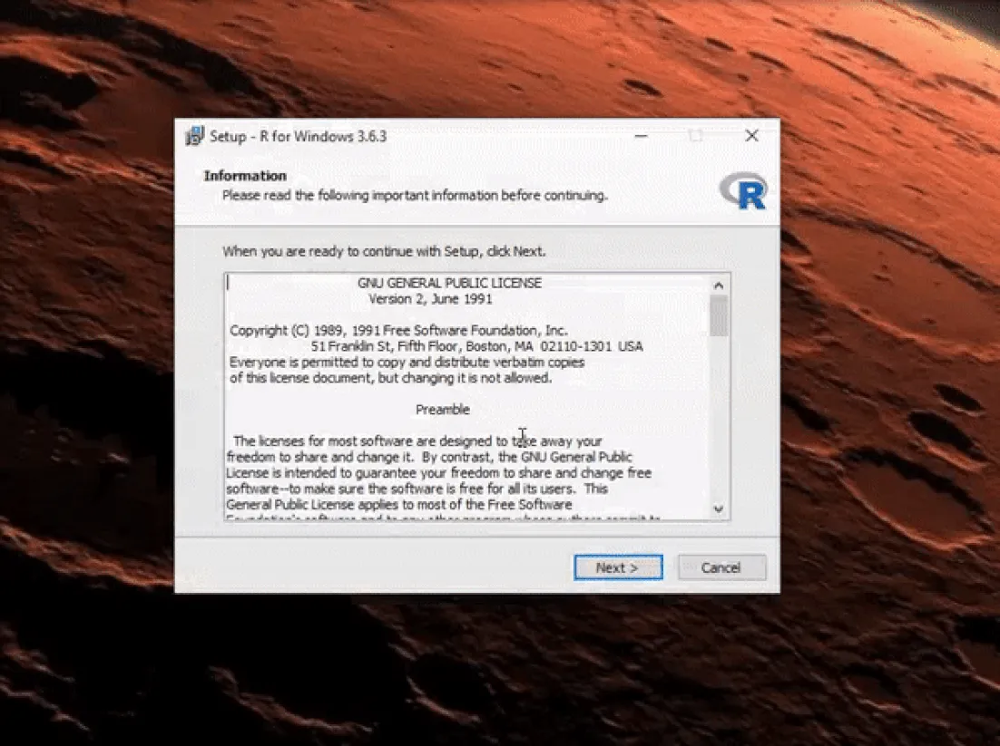
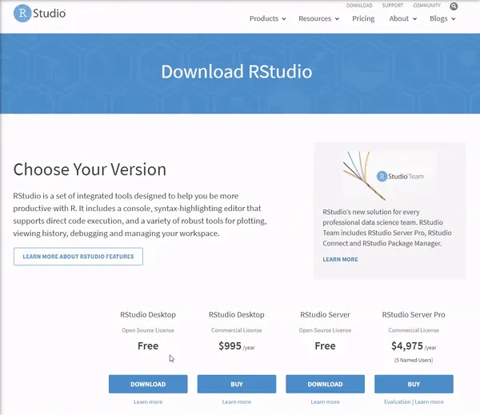

```{r setup, include=FALSE, eval = FALSE}
knitr::opts_chunk$set(echo = TRUE)
```

O inicio deste documento se dedicará a explicar os objetivos e motivos curso, bem como o porquê de estarmos utilizando o **R** enquanto linguagem. Se você não se interessa por isto, pode pular para a parte "Onde eu Começo". Se você já tem o **R**, **RStudio** e o **Rtools** (opcional) instalado, pode pular a parte das instalações.


## Apresentação do Curso


Este curso de **R** nasceu de uma demanda derivada. A tradição do Instituto de Economia da UFRJ no que tange às técnicas de Insumo-Produto gerou a demanda pela oferta de uma disciplina no PPGE que abrangesse o tópico. Por consequência a necessidade de um curso que desse um ferramental básico de programação se fez presente.

Neste sentido, o curso **NÃO** tem como escopo fornecer uma formação completa em **R** ou em programação. Vamos nos manter ao básico neste curso. Também **NÃO** serão trabalhadas a aplicação do **R** à áreas da economia, como a econometria. Este curso **é** voltado para a aplicação do **R** em técnicas Insumo-Produto. No entanto, se espera que o aprendizado adquirido neste curso, combinado com outros materiais que indicaremos mais a frente, abra as portas para outros conhecimentos em termos do **R** e de programação.

Dito isso, existe muito material disponível na Internet sobre a programação e **R**. Livros, vídeo-aulas, tutoriais, cursos online e mais importante pessoas tendo as suas dúvidas e seus problemas sendo resolvidos. É todo um universo de pessoas que assim como eu e você não nasceram sabendo e nem sabem tudo. E para além de todos os problemas da internet, **as pessoas se ajudam**. No entanto, há um **porém**! Precisamos de algum conhecimento mínimo até mesmo para a nossa pesquisa do Google nos responda o que estamos procurando. Em última instância, programação é saber se virar. E é exatamente **como se virar** que queremos ensinar neste curso.

Explicados, minimamente, a motivação, o escopo e o objetivo deste curso, cabe no entanto expressar a sua justificativa. Por que simplesmente não usar programas como o **Excel**, que são mais visuais e inegavelmente mais simples de manejar (clicar e arrastar com o mouse)?

## Por que usar programação?

O uso de uma linguagem de programação para realizar trabalhos quantitativos tem vantagens em relação aos trabalhos feitos em programas a base de planilhas ou cliques como o Excel:

### Clareza

Um problema comum quando realizamos trabalhos mais complexos em programas como o Excel é que se torna fácil nos desorientarmos ao longo do processo. Não raro se confunde a aba, a célula ou mesmo o arquivo onde estavamos trabalhando ou que deveriamos usar. Muitas vezes, achamos que selecionamos mais de uma aba e não o fizemos. Ou desconfiguramos uma célula que era dependente de outra. Na maioria das vezes, percebemos o que ocorreu e conseguimos resolver isto na base de múltiplos apertos no `ctrl z`. No entanto, um erro deste que passa desapercebido pode nos custar caro em termos do resultado final de trabalho que dispendemos muito tempo.

Neste sentido um código (ou conjunto deles) é um texto com começo, meio e fim. Desse modo, ele nos possibilita estruturar com facilidade o que iremos fazer e compreender o que já fizemos. Com alguma prática e leitura, conseguimos escreve-lo de tal forma que resolver problemas facilmente.

Para exemplificar: imagine, usando EXCEL, que erramos *apenas* uma coisa no inicio do projeto em que estamos trabalhando. Uma coluna que somamos a mais (ou a menos) que seja. E numa transposição aqui, uns bons `ctrl c + ctrl v` ali, e não temos certeza que ao mudarmos apenas aqueles dados já resolveremos o problema. Para termos 100% de certeza, teriamos que ir refazer todo o trabalho de clicar e arrastar. Algo nada agradável. Por outro lado, ao fazermos o mesmo erro só que usando **R**, podemos simplesmente executar o código novamente do inicio ao fim e temos o nosso resultado correto. Se o seu computador for demorar para executar tudo de novo, você pode até ir no banheiro ou ir tomar aquele cafézinho batendo um papo enquanto espera.

### Exigência computacional 

No entanto, alguém pode argumentar que se pode conectar várias planilhas, abas e pastas do Excel de modo que ao alterarmos uma planilha, faremos por efeito cascata o resultado final mudarmos para o correto. Sim, isso é verdade. No entanto, quanto mais fizermos multiplas conexões no Excel, mais este irá requerer do seu processador e da sua memória RAM. Abra um arquivo de excel em que todas das suas muitas abas estão conectadas e você entenderá o que eu quero dizer. Neste caso você ficará com um empasse entre perder a conexão rápida ou ter de enfrentar corriqueiramente o seu computador travando.

Ao usarmos a programação, podemos remover variaveis que não nos servirão mais e, ao termos escrito o código, manter a conexão. 

Além disso, ao trabalhar com bases de dados muito grandes o Excel se torna extremamente ineficiente. 

### Generalização e Automação

Existe uma outra questão relevante quando tratamos da dimensão do nosso projeto: se vamos fazer uma mesma tarefa multiplas vezes, o processo de arrastar e clicar se torna por si só um castigo dantesco. Por outro lado, ao programarmos podemos facilmente generalizar uma rotina que antes era para apenas um ano ou país.

Outro aspecto interessante é que ao estabelecer um código para um trabalho que você faz recorrentemente, você pode muitas vezes apenas mudar uma ou duas linhas e pronto. Trabalho feito, pode ir tomar o cafézinho enquanto espera.

### Replicação e transparência

Todos os motivos expostos até aqui dizem respeito a problemas relacionados ao trabalho de modo geral. Por outro lado, quando se pensa na academia e na ciência, uma questão merece atenção especial: a replicabilidade e transparência da forma como você atingiu o seu resultado. O método científico pressupõe que você dê ao seu interlocutor  condições deste acompanhar a forma como os seus resultados foram alcançados. Deste modo, para além de simplesmente mostrar a metodologia no paper, a boa prática cientifica deveria ser também apresentar o código em que você executou a metodologia, de modo que possíveis erros possam ser apontados e corrigidos.

Podemos aqui relembrar o embaraçoso caso do artigo de Reinhart e Rogoff (2010), em que os autores deixaram de fora 5 dos 20 países da sua amostra por um erro de Excel. Poucos se atentam no entanto ao fato de que [Thomas Herdon](https://en.wikipedia.org/wiki/Thomas_Herndon) pretendia apenas replicar os resultados do paper original para um trabalho de uma displina[^1]. O erro de Reinhart e Rogoff só foi descoberto pois Herdon passou um semestre tentando replicar os resultados e de modo algum conseguia.

[^1]: A crítica no artigo de [Herdon, Ash e Pollin (2013)](http://www.peri.umass.edu/fileadmin/pdf/working_papers/working_papers_301-350/WP322.pdf) não se resume a essa questão apenas, porém foi o que deu notoriedade ao caso.

## Por que R?

Podemos dizer que algumas das qualidades do **R** que mais nos interessam neste momento são[^2] :

[^2]: A lista de qualidades e defeitos abaixo é em muito baseada na lista *Why R?* apresentada por [Hadley Wickham (2019)](https://adv-r.hadley.nz/introduction.html). Porém eu selecionei apenas alguns dos itens, uma vez que esta apostila não se trata de uma introdução ás caracteristicas do **R** à programadores intermediários. Eu também adicionei algumas outras também que eu achei pertinente.

- Ele é *Open Source* e gratuíto, o que lhe garante acessabilidade. Você pode rodar **R** em qualquer sistema operacional e de graça.

- O **R** tem uma comunidade fantástica e ativa. Ao longo de foruns pela internet, há uma comunidade sempre ativa para ajudar e explicar.

- **R** é uma linguagem que carrega consigo 20 anos de desenvolvimento. Isso faz com que se você tem um problema, muito provavelmente alguém também já teve, perguntou na internet e teve sua dúvida respondida. 

- Dada a natureza colaborativa do programa, muitos pacotes já foram feitos para ajudar o programador nos seus objetivos. Isso é um vantagem do **R** em relação ao **Python**, que *ainda* não tem a mesma quantidade de pacotes.

- No geral, uma linguagem de programação tem um software de apoio com o objetivo de agilizar o processo. É o chamado "Ambiente de Desenvolvimento Integrado", muitas vezes referido pela sigla IDE[^3]. Uma das grandes qualidades do **R** é o **RStudio**. Não há em linguagens similares nenhum IDE que chegue ao nível de praticidade, apoio e interatividade que o **RStudio** proporciona. Você consegue inclusive escrever arquivos em `.PDF`, `.tex` e `.html` nele! 

- Apesar dos pesares **R** é extremamente consistente entre as suas versões ao longo do tempo. Um código que roda na versão 3 de **R** (lançada em 2013) muito provavelmente rodará na versão 4.0.0 (a ser lançada em abril de 2020). Há via de regra uma transição "lenta, gradual e segura" entre as versões, ao contrário do que foi do Python 2 para o 3.

[^3]: Do inglês *Integrated Development Environment*

- O **RStudio** tem uma conexão **git** direta, o que permite à você trabalhar remotamente.

Obviamente **R** não é perfeito, então podemos dizer que o **R** tem algumas desvantagens:

- Existem linguagens mais rápidas para certas coisas, como é o caso do Python. No entanto, em niveis mais avançados, há a possibilidade de você integrar o **R** com linguagens mais rápidas como `Fortran`, `C` e o `C++`

- A comunidade do **R** tem uma tendência a ser muito mais focada no resultado em relação à forma. Com prazos apertados, muitas vezes se faz um código feio e confuso que não tem muito padrão. Apesar de que *"Código feio também roda"*, a falta de um padrão universal em meio a toda a comunidade do **R** sobre como seria a forma de escrita ideal, faz com que os códigos possam não ser tão claros assim para outras pessoas.

## Onde eu começo?

A esta altura, se as seções anteriores não foram puladas, você deve estar pensando "ok, você me venceu. Irei programar e usar **R**, só me diz o que eu tenho que fazer! E por favor para de blábláblá!"

Assim sendo, precisamos agora de duas coisas. Primeiro, você deve installar o **R**, **RStudio** e, se você usa Windows, o **Rtools**. 

Vale dar uma olhada no manual em inglês do [DataCamp](https://www.datacamp.com/community/tutorials/installing-R-windows-mac-ubuntu) que é bem explicado para o **R** e o **RStudio**. As partes abaixo (bem como as imagens), foram tiradas de lá:

## Instalações

### Instalando o **R**

Vá em https://cran.r-project.org/ e siga o procedimento da imagem abaixo:


A versão da tela é a 3.6.3, mas pode baixar qualquer uma que aparecer. Depois siga os procedimentos abaixo para a instalação:



### Instalando o **RStudio**

Baixe o **RStudio** na página deste link: https://rstudio.com/products/rstudio/download/#download  



Depois de baixado, apenas vá clicando `NEXT` tal qual no exemplo do R e o serviço estará feito. 

### Instalando o **Rtools**

**Importante: Se por algum motivo você não conseguir instalar o Rtools, não tem problema para os exercicios que iremos fazer neste momento. Porém algumas funcionalidades de certos pacotes do R pressupõe o Rtools.**

Se você usa Windows, para algumas das funcionalidades do **R** e do **RStudio** será necessário **Rtools**. Se você não tem baixe o Java neste link https://www.java.com/pt_BR/download/ e o instale.

Depois disso, clique no link a seguir https://cran.r-project.org/bin/windows/Rtools/ e baixe e instale a versão recomendada.

# Sua primeira vez no **R**!

*Ou melhor dizendo*: no **RStudio**! Se você abrir o programa que vem escrito apenas **R**, você não irá se sentir muito convidado. Por outro lado, como já dissemos antes, o **RStudio** por ser um IDE foi feito para ser intuitivo, simples e interativo.

Com o **RStudio** ligado, se você apertar ``ctrl + shift + n`` irá abrir um novo `R Script`, chamado "Untitled1" (ou 2 se já havia um Untitled1 aberto). O `R Script` é o arquivo que serve para escrevermos e salvarmos o nosso código. No caso do **R**, todos os arquivos com o sufixo `.R` no final são um `R Script`.

Vamos explicar agora três conceitos básicos da programação, que valem para o **R**: valor, variável e função. Leia o quadro abaixo com os comentários (No **R** os comentários do código vêm após um `#`.):

```{r eval=FALSE}
2 # 2 é um valor
a <- 3 # "a" é um variável 3 é um valor. "<-" associa um objeto à um valor ou operação.

b <- 4
d <- c(a,b, 5) #"d" é uma variável. c() é uma função que combina elementos num mesmo vetor.
 sum(d) # sum() é uma função que retorna a soma de todos os valores de uma variável
```

Se você não usar `<-` na programação, a conta será feita, o valor estabelecido não será associado à nenhum objeto, e deste modo não poderá ser recuperado depois, lhe obrigando a fazer todas as contas no futuro.

**R** é em sua base uma linguagem multiparadigma . Ou seja, você pode usar ela tanto como [orientada à objetos](https://pt.wikipedia.org/wiki/Orienta%C3%A7%C3%A3o_a_objetos), quanto no [modo funcional](https://pt.wikipedia.org/wiki/Programa%C3%A7%C3%A3o_funcional), com o uso de  pacotes tal qual o `purrr`. Desse modo, para usar o pacote `purrr` no **R** por exemplo,  devemos instala-lo, usando a função `install.packages()`, e depois carrega-lo, com a função `library()`. O código no **R** pode ser escrito de duas formas, veja abaixo:

```{r eval=FALSE}
install.packages("purrr")
library(purrr)

#"Nested function call" (usando o R básico):
a <-  sum(c(1:4)) 

#Pipe (usando o R com magrittr)
a <- 1:4 %>% c() %>% sum

#Perceba, que podemos escrever 1,2,3,4 como 1:4
```

O pacote `magrittr`, que estabelece o *pipe*, é automaticamente carregado por todos os pacotes que compõem  o `tidyverse`, que são pacotes que facilitam muito a sua vida. Neste curso não iremos usar o *pipe*, `%>%`, mas explicita-lo ajuda a entender como a escrita tradicional (*nested*) do R funciona. Nesta forma, nós temos do lado direito a seguinte estrutura `função_2(função_1(objeto))`, enquanto no modo *pipe* nós temos `objeto %>% função_1 %>% função_2`. Desse modo, podemos perceber que no caso do modo *nested* uma `função()` sempre irá atuar sobre o objeto que esta entre o seu parênteses. Assim sendo, num mesmo comando do script podemos escrever multiplas funções.

```{r eval=FALSE}

objeto <- 1:4
novo_objeto <- sum(objeto)
novo_objeto_2 <- solve(novo_objeto)

# Podemos reescrever tudo isso como:
objeto <- solve(sum(1:4))

# Descubra para o que serve a função solve() digitando ?solve no console.
?solve


```


Se vamos escrever tudo na mesma linha ou em linhas diferentes fica a cargo da comodidade e praticidade. Poupar linhas faz o seu código ficar mais direto ao ponto, o que sem dúvidas é bom. Por outro lado, uma linha de comando muito longa, especialmente com o código escrito do modo *nested*, pode se tornar confusa demais. Além disso, muitas vezes podemos querer no futuro o `novo_objeto` e o `novo_objeto_2`.

Uma interrogação `?` acessa os documentos de help, baixados no seu computador. Ao digitarmos duas interrogações, `??`, o *RStudio* procura via internet os documentos presentes no CRAN.  

Até agora falamos muitas vezes sobre os *pacotes*, então vamos agora deixar claro o que é um pacote. O **R** e o **RStudio** que você baixou e instalou na sua casa, vem com uma serie de funções. Os pacotes nos dá funções, e também base de dados em alguns casos, adicionais criadas por outros usuários de **R**. Criar uma função nos permite realizar uma cadeia de comandos de uma vez, como podemos ver no quadro abaixo. Além disso, vamos ver como realizar as operações matemáticas básicas no **R**:

```{r}
a <- c(1,3,2,4)
d <- c(0,-2,3,1)

b <- sum(((((a+d)*4)^(2))-2)/3)

# + é o comando da soma 
# - é o comando da subtração 
# * é o comando da multiplicação
# / é o comando da divisão
# ^ é o comando da exponencial. Para raizes a n°, faça ^(1/n).
# c() é uma função. Falaremos mais dela a frente.
## Detalhe: solve() é o mesmo que ^(-1)

# Podemos escrever uma função que tome a e d como insumos e devolva b.

#Estabelecendo uma função
soma_doida <- function(objeto_1,objeto_2){ #function estabelece que soma_doida() será uma função. Colocar x,y estabelece que ela precisa de dois insumos para funcionar. Já "{" estabelece o inicio de tudo que está dentro de uma função.
 temp_b <- objeto_1 + objeto_2
 temp_b <- temp_b+4
 temp_b <- temp_b^2
 temp_b <- temp_b-2
 temp_b <- temp_b/3
 final_b <- sum(temp_b)
 return(final_b) # return() explicita qual objeto deve ser retornado. Por via de regra, não coloque nada mais de uma função depois de return()
   } # "}" estabelece que a função terminou 

b <- soma_doida(a,b) # Deste modo, dizemos que "a" é o "objeto_1" e "b" é o "objeto_2". Ou seja: A ORDEM IMPORTA!
```


Podemos numa função escrever de forma mais passo a passo ao mesmo tempo que deixamos o seu código mais fluido. Temos também que mesmo que não seja o caso de `soma_doida`, você poderia deixar claro em uma parte do código que você esta fazendo uma `decomposicao_leontief` por exemplo.
Além disso, fazer suas próprias funções tem ao menos [três vantagens](https://r4ds.had.co.nz/iteration.html#introduction-14) em relação a duplicar seu código muitas vezes:

- É mais fácil ver qual é a intenção do nosso código, uma vez que seu foco será atraído pelo que é diferente e não pelo que permanece igual.

- É mais fácil realizar mudanças no seu código. Imagine que você está ampliando o número de anos de um determinado artigo que você fez antes, com uma função você precisa mexer em menos lugares ao invés de ter que lembrar de todos os lugares em que você tem que fazer mudanças.

- Você tem menos problemas para resolver, uma vez que cada linha do código é usada em mais lugares: se você consertou em um lugar, consertou em todos.


# Tipo de objetos.

Existem diferentes tipos (`types`) de objetos no `R`. Uma função básica (como `sum` ou `+`) é do tipo `builtin`, enquanto a nossa função `soma_doida` será do tipo `closure`. Porém o que nos interessa neste momento é tratar dos tipos dos objetos que irão guardar dados e resultados. Podemos descobrir o tipo de um objeto ao usarmos a função `typeof`. Abaixo vamos descobrir rapidamente os quatro principais:

```{r}
#character: texto
a <- c("sss", "ddd", "ccc", "ddd") #precisamos de colocar ""
typeof(a)

# double: números reais
d <- c(1, 2, 3)
typeof(d)

# integer: números inteiros que são acompanhados por L no final
e <- c(-1L,1L, 2L, 3L) 
typeof(e)

# logical: valores lógicos, verdadeiro ou falso.
b <- c(TRUE, FALSE, T, F) # Podemos escrever TRUE ou FALSE apenas como T ou F.
typeof(b)

 
```


Não trataremos aqui de outros dois tipos `complex` (para números complexos) and `raw` (para valores binários).

# Estrutura básica dos dados no **R**

A estrutura básica de estruturar os dados no **R** são os vetores, que podem ser subdivididos em duas categorias: Vetores Atómicos e Listas. Vetores Atómicos obrigam que todos os seus elementos sejam de mesmo tipo, enquanto uma lista permite que eles possam variar. Para criar um vetor atómico usamos `c()`, enquanto para criarmos uma lista usamos `list()`. Além disso, ao contrário dos vetores atómicos, uma lista pode ser *recursiva*, ou seja podemos ter listas de listas que estão contidas em uma lista (e assim por diante).

Existem 3 propriedades fundamentais que tanto listas quanto vetores atómicos possuem:

- Tipo: o que ele é e pode ser descoberto a partir de `typeof()`, como podemos ver.

- Comprimento: a sua quantidade de elementos `length()`

- Atributos: metadados adicionais arbitrarios `attributes()`


## Vetores Atómicos

Algumas funcionalidades que podemos fazer com vetores:

```{r eval=FALSE}
vetor_exemplo <- c(5,3, 1:5, 3, 4:6)

vetor_exemplo[2] #retorna apenas o segundo valor do vetor_exemplo

vetor_exemplo[3:5] # retorna apenas os valores 3,4 e 5.

vetor_exemplo[c(1,3)] # retorna apenas os valores 1 e 3 apenas

vetor_exemplo[-c(1,3)] # retorna todos os valores menos 1 e 3.

str(vetor_exemplo) # retorna as informações básicas sobre o objeto 


length(vetor_exemplo) # retorna a quantidade de elementos do vetor atómico


names(vetor_exemplo) <- letters[1:11] # names(vetor)<- associa os objetos a direita de "<-" aos nomes de cada elemento do vetor

names(vetor_exemplo) # retorna os nomes dos elementos do vetor 

attributes(vetor_exemplo) # retorna todos os metadados do objeto, neste caso os nomes apenas.

str(vetor_exemplo) # veja como str() mudou agora.


#Podemos testar se um vetor é de um certo tipo especifico

is.character(vetor_exemplo) #confere se o vetor é do tipo character

is.double(vetor_exemplo) #confere se o vetor é do tipo double
# o mesmo vale para is.integer e is.logical.

as.character(vetor_exemplo) # transforma o vetor em tipo character.

```

É relevante dizer que nem toda coerção é possível (ou desejável). Se tentarmos coergir um vetor `character` que contenha letras num vetor `double`, teremos como resultado valores `NA`s (missing values). Desse modo, devemos tomar cuidado ao trasnformarmos um tipo de dado em outro. Por consequência, devemos também ficar atento ao tipo de dados que estaremos combinando com `c()`. Isso porque `c()` sempre irá obrigar os valores a serem de um mesmo tipo.

## Listas

Ao contrario dos vetores atómicos, as listas não forçam que seus elementos sejam do mesmo tipo. Além disso, uma lista pode ser recursiva  indefinidamente. Vejamos o que isso quer dizer:

```{r}
lista_1 <- list("aaaa", 2, "ssss", 1L, TRUE)
vetor_1 <- c("aaaa", 2, "ssss", 1L, TRUE)
lista_1[4] # TRUE continua como lógico.

vetor_1[[4]] # TRUE se tornou character.

unlist(lista_1) # Você pode tornar uma lista em um vetor atómico a partir da função unlist.

# Da mesma forma, você pode usar as.list() para transformar um objeto numa lista.

#Recursividade
lista_2 <-list(list(list(list(list()))), list())

str(lista_2)

```

**Importante:** A depender da situação é necessário usar `[]` ou `[[]]` para acessar elementos de uma lista. Não trataremos disso aqui, mas saiba que com `[[]]` você conseguirá acessar apenas um elemento da lista por vez, mas quase sempre funcionará. Enquanto com `[]` você conseguirá acessar multiplos elementos da lista, porém nem sempre irá funcionar (especialmente com elementos como matrizes e dataframes). Via de regra, vale usar `[[]]` como o padrão.

# Dataframes e matrizes

A maioria dos dados em **R** estão por sua vez salvos em tabelas da classe `data.frame`. Tabelas também podem ser da classe `matrix`. A diferença entre ambas é que `data.frame` pode conter vetores de diferentes tipos, enquanto `matrix` não. Pense em `data.frame` como uma lista de vetores e `matrix` como um vetor atómico que foi dividido em multiplas colunas. Vale notar que cada coluna de um `data.frame` é um vetor atómico, logo, os seus elementos tem que ser do mesmo tipo. Podemos criar ambos objetos usando as matrizes `data.frame()` e `matrix()`

```{r eval=FALSE}
# criando uma matriz com 8 linhas e 3 colunas, a partir de um vetor double de 1:24.

matrix_a <- matrix(data = c(1:24), nrow = 8, ncol = 3)

# criando um data.frame com 8 linhas e 4 colunas, sendo uma delas character.
df_a <- data.frame( letters[1:8], c(1:8), c(9:16), c(17:24))

# Podemos obter informações sobre ambas a partir dos seguintes comandos:

ncol(matrix_a) # Número de colunas da matrix_a
nrow(matrix_a) # Número de linha da matrix_a

#Podemos trasnformar uma df em uma matriz e vice e versa usando as.matrix e as.data.frame:

as.matrix(df_a) # irá coagir todos os elementos em character.

as.data.frame(matrix_a)

```

Cada uma das duas nos serve à um propósito. Quando estamos organizando e selecionando a base de dados a classe `data.frame` nos serve muito melhor, pois de modo geral iremos precisar de valores `character` ou `logical` no processo. Agora, durante algumas operações, `matrix` é mais conveniente, pois garante a uniformidade dos dados. Além disso, temos mais alguns comandos para ambas:

```{r eval= FALSE}
# Mostra apenas as primeiras linhas de uma tabela

head(df_a) #ou head(matrix_a)
str(df_a)
#Retorna o nome das colunas da tabela
colnames(df_a)
colnames(matrix_a)
#Retorna o nome das linhas da tabela
rownames(df_a)
rownames(matrix_a)

```

Repare que data.frame() gerou automaticamente um nome para as colunas e linhas, enquanto matrix() não. Também podemos alocar os nomes usando `rownames(tabela)<- vetor_com_nomes`. O vetor com os nomes precisa ter o  comprimento do tamanho do número de linhas (para o caso de `rownames()<-`) ou de colunas (para o caso de `colnames()<-`).

Assim como na notação de algebra linear, para encontrar um elemento fazemos `tabela[linha, coluna]`.

```{r eval=FALSE}
# Para retornar os elementos da linha 1 de df_a:
df_a[1,]
# Para retornar os elementos da coluna 1 de df_a:
df_a[,1]
# Para retornar os elementos de df_a menos a coluna 1:
df_a[,-1]
# Retornar os elementos das colunas 1,2 e 3
df_a[,1:3]
# Retornar os elementos das linhas 1,3,5
df_a[c(1,3,5),]

```