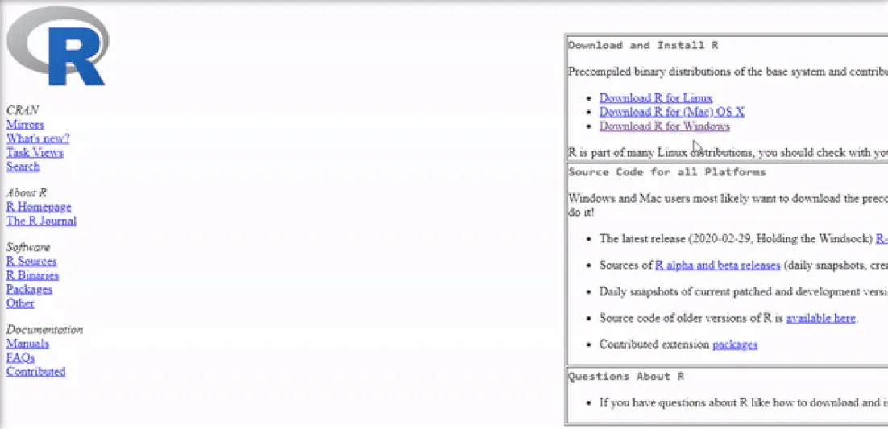
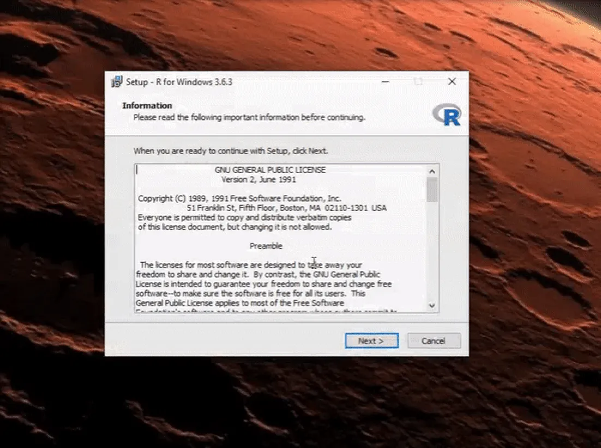
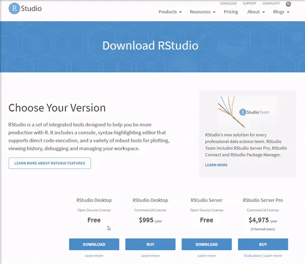

```{r setup, include=FALSE, eval = FALSE}
knitr::opts_chunk$set(echo = TRUE)
```

O inicio deste documento se dedicará a explicar os objetivos e motivos curso, bem como o porquê de estarmos utilizando o **R** enquanto linguagem. Se você não se interessa por isto, pode pular para a parte "Onde eu Começo". Se você já tem o **R**, **RStudio** e o **Rtools** (opcional) instalado, pode pular para o ***Tópico 1 - Tipos de Objetos e Estruturas de Dados***.


## Apresentação do Curso


Este curso de **R** nasceu de uma demanda derivada. A tradição do Instituto de Economia da UFRJ no que tange às técnicas de Insumo-Produto gerou a demanda pela oferta de uma disciplina no PPGE que abrangesse o tópico. Por consequência a necessidade de um curso que desse um ferramental básico de programação se fez presente.

Neste sentido, o curso **NÃO** tem como escopo fornecer uma formação completa em **R** ou em programação. Vamos nos manter ao básico neste curso. Também **NÃO** serão trabalhadas a aplicação do **R** à áreas da economia, como a econometria. Este curso **é** voltado para a aplicação do **R** em técnicas Insumo-Produto. No entanto, se espera que o aprendizado adquirido neste curso, combinado com outros materiais que indicaremos mais a frente, abra as portas para outros conhecimentos em termos do **R** e de programação.

Dito isso, existe muito material disponível na Internet sobre a programação e **R**. Livros, vídeo-aulas, tutoriais, cursos online e mais importante pessoas tendo as suas dúvidas e seus problemas sendo resolvidos. É todo um universo de pessoas que assim como eu e você não nasceram sabendo e nem sabem tudo. E para além de todos os problemas da internet, **as pessoas se ajudam**. No entanto, há um **porém**! Precisamos de algum conhecimento mínimo até mesmo para a nossa pesquisa do Google nos responda o que estamos procurando. Em última instância, programação é saber se virar. E é exatamente **como se virar** que queremos ensinar neste curso.

Explicados, minimamente, a motivação, o escopo e o objetivo deste curso, cabe no entanto expressar a sua justificativa. Por que simplesmente não usar programas como o **Excel**, que são mais visuais e inegavelmente mais simples de manejar (clicar e arrastar com o mouse)?

## Por que usar programação?

O uso de uma linguagem de programação para realizar trabalhos quantitativos tem vantagens em relação aos trabalhos feitos em programas a base de planilhas ou cliques como o Excel:

### Clareza

Um problema comum quando realizamos trabalhos mais complexos em programas como o Excel é que se torna fácil nos desorientarmos ao longo do processo. Não raro se confunde a aba, a célula ou mesmo o arquivo onde estavamos trabalhando ou que deveriamos usar. Muitas vezes, achamos que selecionamos mais de uma aba e não o fizemos. Ou desconfiguramos uma célula que era dependente de outra. Na maioria das vezes, percebemos o que ocorreu e conseguimos resolver isto na base de múltiplos apertos no `ctrl z`. No entanto, um erro deste que passa desapercebido pode nos custar caro em termos do resultado final de trabalho que dispendemos muito tempo.

Neste sentido um código (ou conjunto deles) é um texto com começo, meio e fim. Desse modo, ele nos possibilita estruturar com facilidade o que iremos fazer e compreender o que já fizemos. Com alguma prática e leitura, conseguimos escreve-lo de tal forma que resolver problemas facilmente.

Para exemplificar: imagine, usando EXCEL, que erramos *apenas* uma coisa no inicio do projeto em que estamos trabalhando. Uma coluna que somamos a mais (ou a menos) que seja. E numa transposição aqui, uns bons `ctrl c + ctrl v` ali, e não temos certeza que ao mudarmos apenas aqueles dados já resolveremos o problema. Para termos 100% de certeza, teriamos que ir refazer todo o trabalho de clicar e arrastar. Algo nada agradável. Por outro lado, ao fazermos o mesmo erro só que usando **R**, podemos simplesmente executar o código novamente do inicio ao fim e temos o nosso resultado correto. Se o seu computador for demorar para executar tudo de novo, você pode até ir no banheiro ou ir tomar aquele cafézinho batendo um papo enquanto espera.

### Exigência computacional 

No entanto, alguém pode argumentar que se pode conectar várias planilhas, abas e pastas do Excel de modo que ao alterarmos uma planilha, faremos por efeito cascata o resultado final mudarmos para o correto. Sim, isso é verdade. No entanto, quanto mais fizermos multiplas conexões no Excel, mais este irá requerer do seu processador e da sua memória RAM. Abra um arquivo de excel em que todas das suas muitas abas estão conectadas e você entenderá o que eu quero dizer. Neste caso você ficará com um empasse entre perder a conexão rápida ou ter de enfrentar corriqueiramente o seu computador travando.

Ao usarmos a programação, podemos remover variaveis que não nos servirão mais e, ao termos escrito o código, manter a conexão. 

Além disso, ao trabalhar com bases de dados muito grandes o Excel se torna extremamente ineficiente. 

### Generalização e Automação

Existe uma outra questão relevante quando tratamos da dimensão do nosso projeto: se vamos fazer uma mesma tarefa multiplas vezes, o processo de arrastar e clicar se torna por si só um castigo dantesco. Por outro lado, ao programarmos podemos facilmente generalizar uma rotina que antes era para apenas um ano ou país.

Outro aspecto interessante é que ao estabelecer um código para um trabalho que você faz recorrentemente, você pode muitas vezes apenas mudar uma ou duas linhas e pronto. Trabalho feito, pode ir tomar o cafézinho enquanto espera.

### Replicação e transparência

Todos os motivos expostos até aqui dizem respeito a problemas relacionados ao trabalho de modo geral. Por outro lado, quando se pensa na academia e na ciência, uma questão merece atenção especial: a replicabilidade e transparência da forma como você atingiu o seu resultado. O método científico pressupõe que você dê ao seu interlocutor  condições deste acompanhar a forma como os seus resultados foram alcançados. Deste modo, para além de simplesmente mostrar a metodologia no paper, a boa prática cientifica deveria ser também apresentar o código em que você executou a metodologia, de modo que possíveis erros possam ser apontados e corrigidos.

Podemos aqui relembrar o embaraçoso caso do artigo de Reinhart e Rogoff (2010), em que os autores deixaram de fora 5 dos 20 países da sua amostra por um erro de Excel. Poucos se atentam no entanto ao fato de que [Thomas Herdon](https://en.wikipedia.org/wiki/Thomas_Herndon) pretendia apenas replicar os resultados do paper original para um trabalho de uma displina[^1]. O erro de Reinhart e Rogoff só foi descoberto pois Herdon passou um semestre tentando replicar os resultados e de modo algum conseguia.

[^1]: A crítica no artigo de [Herdon, Ash e Pollin (2013)](http://www.peri.umass.edu/fileadmin/pdf/working_papers/working_papers_301-350/WP322.pdf) não se resume a essa questão apenas, porém foi o que deu notoriedade ao caso.

## Por que R?

Podemos dizer que algumas das qualidades do **R** que mais nos interessam neste momento são[^2] :

[^2]: A lista de qualidades e defeitos abaixo é em muito baseada na lista *Why R?* apresentada por [Hadley Wickham (2019)](https://adv-r.hadley.nz/introduction.html). Porém eu selecionei apenas alguns dos itens, uma vez que esta apostila não se trata de uma introdução ás caracteristicas do **R** à programadores intermediários. Eu também adicionei algumas outras também que eu achei pertinente.

- Ele é *Open Source* e gratuíto, o que lhe garante acessabilidade. Você pode rodar **R** em qualquer sistema operacional e de graça.

- O **R** tem uma comunidade fantástica e ativa. Ao longo de foruns pela internet, há uma comunidade sempre ativa para ajudar e explicar.

- **R** é uma linguagem que carrega consigo 20 anos de desenvolvimento. Isso faz com que se você tem um problema, muito provavelmente alguém também já teve, perguntou na internet e teve sua dúvida respondida. 

- Dada a natureza colaborativa do programa, muitos pacotes já foram feitos para ajudar o programador nos seus objetivos.

- No geral, uma linguagem de programação tem um software de apoio com o objetivo de agilizar o processo. É o chamado "Ambiente de Desenvolvimento Integrado", muitas vezes referido pela sigla IDE[^3]. Uma das grandes qualidades do **R** é o **RStudio**. Não há em linguagens similares nenhum IDE que chegue ao nível de praticidade, apoio e interatividade que o **RStudio** proporciona. Você consegue inclusive escrever arquivos em `.PDF`, `.tex` e `.html` nele! 

- Apesar dos pesares **R** é extremamente consistente entre as suas versões ao longo do tempo. Um código que roda na versão 3 de **R** (lançada em 2013) muito provavelmente rodará na versão 4.0.0 (a ser lançada em abril de 2020). Há via de regra uma transição "lenta, gradual e segura" entre as versões, ao contrário do que foi do Python 2 para o 3.

[^3]: Do inglês *Integrated Development Environment*

- O **RStudio** tem uma conexão **git** direta, o que permite à você trabalhar remotamente.

Obviamente **R** não é perfeito, então podemos dizer que o **R** tem algumas desvantagens:

- Existem linguagens mais rápidas para certas coisas, como é o caso do Python. No entanto, em niveis mais avançados, há a possibilidade de você integrar o **R** com linguagens mais rápidas como `Fortran`, `C` e o `C++`

- A comunidade do **R** tem uma tendência a ser muito mais focada no resultado em relação à forma. Com prazos apertados, muitas vezes se faz um código feio e confuso que não tem muito padrão. Apesar de que *"Código feio também roda"*, a falta de um padrão universal em meio a toda a comunidade do **R** sobre como seria a forma de escrita ideal, faz com que os códigos possam não ser tão claros assim para outras pessoas.

## Onde eu começo?

A esta altura, se as seções anteriores não foram puladas, você deve estar pensando "ok, você me venceu. Irei programar e usar **R**, só me diz o que eu tenho que fazer! E por favor para de blábláblá!"

Assim sendo, precisamos agora de duas coisas. Primeiro, você deve installar o **R**, **RStudio** e, se você usa Windows, o **Rtools**. 

Vale dar uma olhada no manual em inglês do [DataCamp](https://www.datacamp.com/community/tutorials/installing-R-windows-mac-ubuntu) que é bem explicado para o **R** e o **RStudio**. As partes abaixo (bem como as imagens), foram tiradas de lá:

## Instalações

### Instalando o **R**

Vá em https://cran.r-project.org/ e siga o procedimento da imagem abaixo:



A versão da tela é a 3.6.3, mas pode baixar qualquer uma que aparecer. Depois siga os procedimentos abaixo para a instalação:



### Instalando o **RStudio**

Baixe o **RStudio** na página deste link: https://rstudio.com/products/rstudio/download/#download  



Depois de baixado, apenas vá clicando `NEXT` tal qual no exemplo do R e o serviço estará feito. 

### Instalando o **Rtools**

**Importante: Se por algum motivo você não conseguir instalar o Rtools, não tem problema para os exercicios que iremos fazer neste momento. Porém algumas funcionalidades de certos pacotes do R pressupõe o Rtools.**

Se você usa Windows, para algumas das funcionalidades do **R** e do **RStudio** será necessário **Rtools**. Se você não tem baixe o Java neste link https://www.java.com/pt_BR/download/ e o instale.

Depois disso, clique no link a seguir https://cran.r-project.org/bin/windows/Rtools/ e baixe e instale a versão recomendada.

