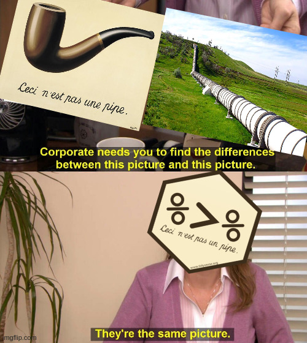

```{r setup, include=FALSE}
knitr::opts_chunk$set(echo = TRUE)
```

Esse tópico pressupõe que você conseguiu instalar o R e o RStudio. Neste documento iremos tratar já de alguns temas básicos do R: os Tipos de Objetos e as Estruturas de Dados.

A lista de exercicios associada a este Tópico pressupõe a leitura das partes *"Principais Conceitos"* e *"O modelo de Leontief"* do material ***"Introdução à álgebra linear com R"*** feito pelo Kaio Vital.

## [Sua primeira vez no **R**!](#PrimeiraVez)

*Ou melhor dizendo*: no **RStudio**! Se você abrir o programa que vem escrito apenas **R**, você não irá se sentir muito convidado. Por outro lado, como já dissemos antes, o **RStudio** por ser um IDE foi feito para ser intuitivo, simples e interativo.^[Na primeira monitoria nós também iremos apresentar o RStudio de forma melhor.]

Com o **RStudio** ligado, se você apertar ``ctrl + shift + n`` irá abrir um novo `R Script`, chamado "Untitled1" (ou 2 se já havia um Untitled1 aberto). O `R Script` é o arquivo que serve para escrevermos e salvarmos o nosso código. No caso do **R**, todos os arquivos com o sufixo `.R` no final são um `R Script`.

Vamos explicar agora três conceitos básicos da programação, que valem para o **R**: valor, variável e função. Leia o quadro abaixo com os comentários (No **R** os comentários do código vêm após um `#`.):

```{r eval=FALSE}
2 # 2 é um valor
a <- 3 # "a" é um variável 3 é um valor. "<-" associa um objeto à um valor ou operação.

b <- 4
d <- c(a,b, 5) #"d" é uma variável. c() é uma função que combina elementos num mesmo vetor.
 sum(d) # sum() é uma função que retorna a soma de todos os valores de uma variável
```

Se você não usar `<-` no código, a conta será feita, o valor estabelecido não será associado à nenhum objeto, e deste modo não poderá ser recuperado depois, lhe obrigando a fazer todas as contas no futuro.

**R** é em sua base uma linguagem multiparadigma . Ou seja, você pode usar ela tanto como [orientada à objetos](https://pt.wikipedia.org/wiki/Orienta%C3%A7%C3%A3o_a_objetos), quanto no [modo funcional](https://pt.wikipedia.org/wiki/Programa%C3%A7%C3%A3o_funcional), especialmente com o uso de  pacotes tal qual o `purrr`. Desse modo, para usar o pacote `purrr` no **R** por exemplo,  devemos instala-lo, usando a função `install.packages()`, e depois carrega-lo, com a função `library()`. O código no **R** pode ser escrito de duas formas, veja abaixo:

```{r eval=FALSE}
install.packages("purrr")
library(purrr)

#"Nested function call" (usando o R básico):
a <-  sum(c(1:4)) 

#Pipe (usando o R com magrittr)
a <- 1:4 %>% c() %>% sum

#Perceba, que podemos escrever 1,2,3,4 como 1:4
1:4
c(1,2,3,4)
```

O pacote `magrittr`, que estabelece o *pipe*, é automaticamente carregado por todos os pacotes que compõem  o `tidyverse`, que são pacotes que facilitam muito a sua vida. Neste curso iremos sempre usar o *pipe*, `%>%`. Existe uma outra forma de escrever no *R*, o modo *nested*, que era a única nativa do R até a versão `4.1`. Nesta forma, nós temos do lado direito a seguinte estrutura `função_2(função_1(objeto))`, enquanto no modo *pipe* nós temos `objeto %>% função_1 %>% função_2`. Desse modo, podemos perceber que no caso do modo *nested* uma `função()` sempre irá atuar sobre o objeto que esta entre o seu parênteses. Assim sendo, num mesmo comando do script podemos escrever multiplas funções.

```{r eval=FALSE}

objeto <- 1:4
novo_objeto <- sum(objeto)
novo_objeto_2 <- solve(novo_objeto)

# Podemos reescrever tudo isso como:
objeto <- solve(sum(1:4))

## Usando pipe

objeto <- 1:4 %>%
   sum %>%
   solve

# Descubra para o que serve a função solve() digitando ?solve no console.
?solve

```

Se vamos escrever tudo na mesma linha ou em linhas diferentes fica a cargo da comodidade e praticidade. Poupar linhas faz o seu código ficar mais direto ao ponto, o que sem dúvidas é bom. Por outro lado, uma linha de comando muito longa, especialmente com o código escrito do modo *nested*, pode se tornar confusa demais. Além disso, muitas vezes podemos querer no futuro o `novo_objeto` e o `novo_objeto_2`. Falaremos mais de como escrever pelo no modo *pipe* no final deste tópico.

Uma interrogação `?` acessa os documentos de help, baixados no seu computador. Ao digitarmos duas interrogações, `??`, o *RStudio* procura via internet os documentos presentes no CRAN. Ao passo que `?solve` funciona, se tentarmos aplicar diretamente com símbolos, como `?%<-%` ou `?:`, não irá funcionar. Para tanto, basta colocar o símbolo entre aspas, como  `?"<-"` ou `?":"`.

Até agora falamos muitas vezes sobre os *pacotes*, então vamos agora deixar claro o que é um pacote. O **R** e o **RStudio** que você baixou e instalou na sua casa, vem com uma série de funções. Os pacotes nos dá funções, e também base de dados em alguns casos, adicionais criadas por outros usuários de **R**. Criar uma função nos permite realizar uma cadeia de comandos de uma vez, como podemos ver no quadro abaixo. Além disso, vamos ver como realizar as operações matemáticas básicas no **R**:

```{r}
a <- c(1,3,2,4)
d <- c(0,-2,3,1)

b <- sum(((((a+(2*d))*4)^(2))-2)/3)

# + é o comando da soma 
# - é o comando da subtração 
# * é o comando da multiplicação
# / é o comando da divisão
# ^ é o comando da exponencial. Para raizes a n°, faça ^(1/n).
# c() é uma função. Falaremos mais dela a frente.
## Detalhe: solve() é o mesmo que ^(-1)

# Podemos escrever uma função que tome a e d como insumos e devolva b.

#Estabelecendo uma função
soma_doida <- function(objeto_1,objeto_2){ #function estabelece que soma_doida() será uma função. Colocar x,y estabelece que ela precisa de dois insumos para funcionar. Já "{" estabelece o inicio de tudo que está dentro de uma função.
 temp_b <- objeto_1 + (2*objeto_2)
 temp_b <- temp_b+4
 temp_b <- temp_b^2
 temp_b <- temp_b-2
 temp_b <- temp_b/3
 final_b <- sum(temp_b)
 return(final_b) # return() explicita qual objeto deve ser retornado. Por via de regra, não coloque nada mais de uma função depois de return()
   } # "}" estabelece que a função terminou 

b <- soma_doida(a,b) # Deste modo, dizemos que "a" é o "objeto_1" e "b" é o "objeto_2". Ou seja: A ORDEM IMPORTA!
```


Podemos numa função escrever de forma mais passo a passo ao mesmo tempo que deixamos o seu código mais fluido. Temos também que mesmo que não seja o caso de `soma_doida`, você poderia deixar claro em uma parte do código que você esta fazendo uma `decomposicao_leontief` por exemplo.
Além disso, fazer suas próprias funções tem ao menos [três vantagens](https://r4ds.had.co.nz/iteration.html#introduction-14) em relação a duplicar seu código muitas vezes:

- É mais fácil ver qual é a intenção do nosso código, uma vez que seu foco será atraído pelo que é diferente e não pelo que permanece igual.

- É mais fácil realizar mudanças no seu código. Imagine que você está ampliando o número de anos de um determinado artigo que você fez antes, com uma função você precisa mexer em menos lugares ao invés de ter que lembrar de todos os lugares em que você tem que fazer mudanças.

- Você tem menos problemas para resolver, uma vez que cada linha do código é usada em mais lugares: se você consertou em um lugar, consertou em todos.


# [Tipo de objetos.](#TiposObjetos)

Existem diferentes tipos (`types`) de objetos no `R`. Uma função básica (como `sum` ou `+`) é do tipo `builtin`, enquanto a nossa função `soma_doida` será do tipo `closure`. Porém o que nos interessa neste momento é tratar dos tipos dos objetos que irão guardar dados e resultados. Podemos descobrir o tipo de um objeto ao usarmos a função `typeof`. Abaixo vamos descobrir rapidamente os quatro principais:

```{r}
#character: texto
a <- c("sss", "ddd", "ccc", "ddd") #precisamos de colocar ""
typeof(a)

# double: números reais
d <- c(1, 2, 3)
typeof(d)

# integer: números inteiros que são acompanhados por L no final
e <- c(-1L,1L, 2L, 3L) 
typeof(e)

# logical: valores lógicos, verdadeiro ou falso.
b <- c(TRUE, FALSE, T, F) # Podemos escrever TRUE ou FALSE apenas como T ou F.
typeof(b)

 
```


Não trataremos aqui de outros dois tipos `complex` (para números complexos) and `raw` (para valores binários).

Uma coisa interessante de se pensar é que o **R** é mais prático do que as linguagens de "baixo nível", como  **C**, na hora de criar vetores, isso porque o **R** não requer que você defina qual será o tipo de dado do vetor. Isso é importante também pois você pode não necessariamente saber qual será o tipo do vetor. A função `all.equal` por exemplo pode retornar tanto `TRUE` quanto um vetor do tipo `character`. Essa comodidade é muito útil, em especial para quando se está iniciando.

# [Estrutura básica dos dados no **R**](#EstruturaVetor)

A estrutura básica de estruturar os dados no **R** são os vetores, que podem ser subdivididos em duas categorias: Vetores atômicos e Listas. Vetores atômicos obrigam que todos os seus elementos sejam de mesmo tipo, enquanto uma lista permite que eles possam variar. Para criar um vetor atômico usamos `c()`, enquanto para criarmos uma lista usamos `list()`. Além disso, ao contrário dos vetores atômicos, uma lista pode ser *recursiva*, ou seja podemos ter listas de listas que estão contidas em uma lista (e assim por diante).

Existem 3 propriedades fundamentais que tanto listas quanto vetores atômicos possuem:

- Tipo: o que ele é e pode ser descoberto a partir de `typeof()`, como podemos ver.

- Comprimento: a sua quantidade de elementos `length()`

- Atributos: metadados adicionais arbitrários `attributes()`


## [Vetores Atômicos](#AtomVectors)

Algumas funcionalidades que podemos fazer com vetores:

```{r eval=FALSE}
vetor_exemplo <- c(5,3, 1:5, 3, 4:6)

vetor_exemplo[2] #retorna apenas o segundo valor do vetor_exemplo

vetor_exemplo[3:5] # retorna apenas os valores 3,4 e 5.

vetor_exemplo[c(1,3)] # retorna apenas os valores 1 e 3 apenas

vetor_exemplo[-c(1,3)] # retorna todos os valores menos 1 e 3.

str(vetor_exemplo) # retorna as informações básicas sobre o objeto 


length(vetor_exemplo) # retorna a quantidade de elementos do vetor atômico


names(vetor_exemplo) <- letters[1:11] # names(vetor)<- associa os objetos a direita de "<-" aos nomes de cada elemento do vetor

names(vetor_exemplo) # retorna os nomes dos elementos do vetor 

attributes(vetor_exemplo) # retorna todos os metadados do objeto, neste caso os nomes apenas.

str(vetor_exemplo) # veja como str() mudou agora.


#Podemos testar se um vetor é de um certo tipo especifico

is.character(vetor_exemplo) #confere se o vetor é do tipo character

is.double(vetor_exemplo) #confere se o vetor é do tipo double
# o mesmo vale para is.integer e is.logical.

as.character(vetor_exemplo) # transforma o vetor em tipo character.

```

É relevante dizer que nem toda coerção é possível (ou desejável). Se tentarmos coergir um vetor `character` que contenha letras num vetor `double`, teremos como resultado valores `NA`s (missing values). Desse modo, devemos tomar cuidado ao trasnformarmos um tipo de dado em outro. Por consequência, devemos também ficar atento ao tipo de dados que estaremos combinando com `c()`. Isso porque `c()` sempre irá obrigar os valores a serem de um mesmo tipo. Existem tipos mais e menos flexíveis. O tipo mais flexível pode sempre ser coergido para um tipo menos flexível, mas o contrario nem sempre é verdade. Do tipo mais flexível para o tipo menos flexível:

 - logical
 - integer
 - double
 - character

## [Listas](#ListasTop1)

Ao contrário dos vetores atômicos, as listas não forçam que seus elementos sejam do mesmo tipo. Além disso, uma lista pode ser recursiva  indefinidamente. Vejamos o que isso quer dizer:

```{r}
lista_1 <- list("aaaa", 2, "ssss", 1L, TRUE)
vetor_1 <- c("aaaa", 2, "ssss", 1L, TRUE)
lista_1[4] # TRUE continua como lógico.

vetor_1[[4]] # TRUE se tornou character.

unlist(lista_1) # Você pode tornar uma lista em um vetor atômico a partir da função unlist.

# Da mesma forma, você pode usar as.list() para transformar um objeto numa lista.

#Recursividade
lista_2 <-list(list(list(list(list()))), list())

str(lista_2)

```

**Importante:** A depender da situação é necessário usar `[]` ou `[[]]` para acessar elementos de uma lista. Não trataremos disso aqui, mas saiba que com `[[]]` você conseguirá acessar apenas um elemento da lista por vez, mas quase sempre funcionará. Enquanto com `[]` você conseguirá acessar multiplos elementos da lista, porém nem sempre irá funcionar (especialmente com elementos como matrizes e dataframes). Via de regra, vale usar `[[]]` como o padrão.

## [Dataframes e matrizes](#dfMatrix)~

A maioria dos dados em **R** estão por sua vez salvos em tabelas da classe `data.frame`. Tabelas também podem ser da classe `matrix`. A diferença entre ambas é que `data.frame` pode conter vetores de diferentes tipos, enquanto `matrix` não. Pense em `data.frame` como uma lista de vetores e `matrix` como um vetor atômico que foi dividido em multiplas colunas. Vale notar que cada coluna de um `data.frame` é um vetor atômico, logo, os seus elementos tem que ser do mesmo tipo. Podemos criar ambos objetos usando as matrizes `data.frame()` e `matrix()`

```{r eval=FALSE}
# criando uma matriz com 8 linhas e 3 colunas, a partir de um vetor double de 1:24.

matrix_a <- matrix(data = c(1:24), nrow = 8, ncol = 3)

# criando um data.frame com 8 linhas e 4 colunas, sendo uma delas character.
df_a <- data.frame( letters[1:8], c(1:8), c(9:16), c(17:24))

# Podemos obter informações sobre ambas a partir dos seguintes comandos:

ncol(matrix_a) # Número de colunas da matrix_a
nrow(matrix_a) # Número de linha da matrix_a

#Podemos trasnformar uma df em uma matriz e vice e versa usando as.matrix e as.data.frame:

as.matrix(df_a) # irá coagir todos os elementos em character.

as.data.frame(matrix_a)

```

Cada uma das duas nos serve a um propósito. Quando estamos organizando e selecionando a base de dados a classe `data.frame` nos serve muito melhor, pois de modo geral iremos precisar de valores `character` ou `logical` no processo. Agora, durante algumas operações, `matrix` é mais conveniente, pois garante a uniformidade dos dados. Além disso, temos mais alguns comandos para ambas:

```{r eval= FALSE}
# Mostra apenas as primeiras linhas de uma tabela

head(df_a) #ou head(matrix_a)
str(df_a)
#Retorna o nome das colunas da tabela
colnames(df_a)
colnames(matrix_a)
#Retorna o nome das linhas da tabela
rownames(df_a)
rownames(matrix_a)

```

Repare que data.frame() gerou automaticamente um nome para as colunas e linhas, enquanto matrix() não. Também podemos alocar os nomes usando `rownames(tabela)<- vetor_com_nomes`. O vetor com os nomes precisa ter o  comprimento do tamanho do número de linhas (para o caso de `rownames()<-`) ou de colunas (para o caso de `colnames()<-`).

Assim como na notação de algebra linear, para encontrar um elemento fazemos `tabela[linha, coluna]`.

```{r eval=FALSE}
# Para retornar os elementos da linha 1 de df_a:
df_a[1,]
# Para retornar os elementos da coluna 1 de df_a:
df_a[,1]
# Para retornar os elementos de df_a menos a coluna 1:
df_a[,-1]
# Retornar os elementos das colunas 1,2 e 3
df_a[,1:3]
# Retornar os elementos das linhas 1,3,5
df_a[c(1,3,5),]

```

## [Matrizes e Operações Matriciais](#AlgLin)

Como dito no inicio deste tópico, essa parte  está disponível na apostila ***"Introdução álgebra linear com R"*** na parte *"Principais Conceitos"*x. Lá você será introduzido às funções `matrix`, `diag`, `solve`, `%*%` e  `cbind`. Na parte *"O modelo de Leontief"* você verá como calcular a inversa de Leontief.


# [Escrevendo com o **pipe**](#pipe)

```{r}
library(magrittr)
```

No inicio do tópico nós abordamos de forma rápida o modo *nested* e *pipe* de se escrever, o código. O modo *nested* é `baseR` enquanto o operador `%>%` é do pacote `magrittr`. Aqui vale gastar um momento para entender o espírito da coisa: *pipe* em inglês pode significar "cano"^[2], ou seja, o objetivo do pipe é justamente fazer com que o código **desça pelo cano**. Ou seja, que a escrita do código seja tal que a sua leitura fique a maís próxima o possível da de um texto normal: saindo da esquerda para a direita e indo de cima para baixo.^[2] O pacote `magrittr` por sua vez tem esse nome por conta do pintor surrealista René Magritte. Isso porque *pipe* em inglês e francês também pode significar cachimbo, fazendo o pacote `magrittr` uma referência ao famoso quadro _La trahison des images_ de Magritte, em que aparece um cachimbo com os dizeres _Ceci n'est pas une pipe_ (Isto não é um cachimbo).



Misturando o operador `%>%` com uma boa prática na escrita, podemos criar códigos de fácil compreensão. Isso é o que muitos diriam ser a definição de um "código elegante": fácil compreensão e manutenção do código. Vamos ver o caso abaixo:

```{r,eval=FALSE, include = TRUE}
#Modo nested
objeto2 <- funcao3(funcao2(funcao1(objeto1, arg1 = FALSE), arg2= par1), arg3= par2, arg4 = par3)
```

Nesse modo, temos que procurar qual é o parentêses mais "interior" de todos para começar a entender o código e ir lendo a função e os seus argumentos. Em funções complicadas, isso pode se tornar bastante obscuro. Alterando isso usando o operador `%>%`:

```{r, eval =FALSE}
objeto2 <- objeto1 %>% funcao1(arg1=FALSE) %>% funcao2(arg2=par1) %>% funcao3(arg3=par2, arg4=par3)
```

Agora lemos o código da esquerda para a direita, facilitando a nossa compreensão. Vamos considerar então agora, a definição do `objeto2b`:

```{r, eval=FALSE}
# objeto2b definido via modo nested
objeto2b <- funcao5(funcao4(funcao3(funcao2(funcao1(objeto1, arg1 = FALSE), arg2= par1), arg3= par2, arg4 = par3), arg5= TRUE, arg6=par4), arg7 = par5, arg8 = par6) 
```

Exceto que você tenha um monitor muito largo, esse código estará quebrado em ao menos duas linhas no editor. O mesmo ocorrerá se você usar o operador `%>%`:
```{r, eval =FALSE}
# Objeto2b definido com %>%
objeto2b <- objeto1 %>% funcao1(arg1=FALSE) %>% funcao2(arg2=par1) %>% funcao3(arg3=par2, arg4=par3) %>% funcao4(arg5=TRUE, arg6 =par4) %>% funcao5(arg7 = par5, arg8 = par6) 
```


O problema nas definições de `objeto2b` acima não é eles ocuparem mais de uma linha, é o fato de da quebra das linhas atrapalhar a inteligibilidade do código. Por sorte o R permite que você faça quebra uma linha em várias, como se fosse uma mesma linha:

```{r, eval =FALSE}
# Objeto2b definido com %>% dividido em 2 linhas
objeto2b <- objeto1 %>% funcao1(arg1=FALSE) %>% funcao2(arg2=par1) %>%
   funcao3(arg3=par2, arg4=par3) %>% funcao4(arg5=TRUE, arg6 =par4) %>% funcao5(arg7 = par5, arg8 = par6)
```

Aqui dividimos a linha em duas. Porém nada nos impede de enfiar o pé na jaca e fazermos uma quebra de linha depois de cada operador pipe:

```{r, eval =FALSE}
# Objeto2b definido com %>%  dividido em 6 linhas
objeto2b <- objeto1 %>%
   funcao1(arg1=FALSE) %>%
   funcao2(arg2=par1) %>%
   funcao3(arg3=par2, arg4=par3) %>%
   funcao4(arg5=TRUE, arg6 =par4) %>%
   funcao5(arg7 = par5, arg8 = par6)
```

## O outro operador pipe: |>

Antes do operador `%>%` do pacote magrittr ser introduzido em 2014, não existia um operador pipe no R. Eram tempos dificeis. No entanto, depois da atualização 4.1 do **R** em 2021 agora existe um operador pipe ***nativo***, ou seja, do *baseR*. Esse é o operador `|>`. Esse operador é **ligeiramente** mais rápido do que o operador do pacote magrittr e tem a vantagem de não ter dependência externa. Tal qual `%>%`, o operador `|>` funcionaria sem nenhum problema e seria inclusive mais rápido:

```{r, eval=F}
objeto2b <- objeto1 |>
   funcao1(arg1=FALSE) |>
   funcao2(arg2=par1) |>
   funcao3(arg3=par2, arg4=par3) |>
   funcao4(arg5=TRUE, arg6 =par4) |>
   funcao5(arg7 = par5, arg8 = par6)
```

No entanto, `|>` é mais restrito do que o operador `%>%`. Veja abaixo

```{r}
1:5 %>% sum() #Funciona
1:5 %>% sum #Funciona
1:5 |> sum() #Funciona
```
```{r, error=TRUE}
1:5 |> sum # Não funciona
```

Se uma função não tiver argumento além do que está à esquerda do operador *pipe*, `%>%` aceita que você escreva-a sem o `()`, enquanto o operador `|>` não.

## O ponto final no operador %>% ?

O operador `%>%` tem uma maior flexibilidade em relação à `|>` não só por permitir algo como `1:5 %>% sum`, mas também por aceitar o ponto final `.` como representação do objeto no seu lado esquerdo. A função `soma_doida` que definimos anteriormente temos dois paramêtros: `objeto1` e `objeto2`. Na definição da função, o argumento `objeto1` veio antes de `objeto2`: `soma_doida <- function(objeto1, objeto2){...}`, assim sendo se não especificarmos, o primeiro parametro fornecido será o `objeto1`:

```{r}
# Definindo o argumento que recebe o parametro na ordem da função
soma_doida(objeto_1 = 1:4, # Você pode quebrar uma linha depois da virgula se convir
           objeto_2 = 11:14) 

# Definindo o argumento que recebe o parametro, mas colocando na ordem da função
soma_doida(1:4, 11:14) 
```

Agora, podemos definir o parametro de `objeto_2` antes de `objeto_1`:

```{r}
# Definindo o argumento que recebe o parametro fora da ordem da função
soma_doida(objeto_2 = 11:14,
           objeto_1 = 1:4) 
```

Se você não nomeia nenhum argumento, o R sempre segue a ordem da função:

```{r}
# Na ordem da função
soma_doida(11:14, 1:4) == soma_doida(objeto_1 = 11:14, objeto_2 = 1:4)
# Fora da ordem da função
soma_doida(11:14, 1:4) == soma_doida(objeto_2 = 11:14, objeto_1 = 1:4)
```
Por que isso é importante? Por que o lado esquerdo do operador pipe é por padrão entendido pelo **R** como o primeiro argumento:

```{r}
# Na ordem
1:4 |> soma_doida(11:14)
1:4 %>% soma_doida(11:14)
# "Fora de ordem"
11:14 |> soma_doida(1:4)
11:14 %>% soma_doida(1:4)
```

O operador **pipe** irá por _default_ usar o elemento a sua esquerda como o primeiro argumento da função. Ou seja:

```{r, eval = FALSE}
# Não rodar!
funcao <- function(x, y) x/y

resultado <-   objeto %>%
   funcao(y = z)

# É a mesma coisa que:
funcao(x = objeto, y =z)
```

Para atribuir o elemento a esquerda de `%>%` como outro argumento basta fazer:
```{r, eval = FALSE}
# Não rodar
objeto %>%
   funcao(x=z)

objeto |>
   funcao(x=z)
```

Nesse caso, ocupamos o argumento `x` com o objeto `z`. No exemplo prático podemos fazer isso da seguinte forma:

```{r}
11:14 %>% soma_doida(objeto_1 = 1:4)
1:4 %>% soma_doida(objeto_2 = 11:14)
```


Usaremos a seguir a comparação do operador `%>%` com  `|>`, para descobrirmos outra facilidade do operador `%>%`: o uso do ponto final. Vejamos o exemplo abaixo:

```{r}
sum(1:15, 2, NA, na.rm=TRUE)
```
No caso acima, o `na.rm`, abreviação de "NA remove", é um argumento que decide se é para levar em conta valores `NA` ou não. Se houver mesmo que apenas um elemento `NA`, o resultado será `NA` se `na.rm =  FALSE`:

```{r}
sum(1:15,2,NA, na.rm=FALSE)
# na.rm= FALSE é o valor padrão da função sum.
sum(1:15,2,NA)
```
Suponha agora o caso abaixo:
```{r}
verdade <- TRUE

verdade %>%
   sum(1:15, 2, NA)
```
Nesse caso, precisamos estabelecer que o objeto `verdade` será usado em um argumento especifico. Com o `%>%` e apenas ele, podemos usar o `.` para mostrar qual o argumento queremos usar o objeto a esquerda do operador **pipe**:

```{r}
verdade %>%
   sum(1:15, 2, NA, na.rm=.)
```
Dada a natureza do *Tidyverse*, será mais usada nessa parte o operador *pipe* `%>%`, ao invés da escrita *nested*. Veja mais alguns exemplos abaixo:

```{r, eval = FALSE}
#Modo Nested
objeto2 <- funcao3(funcao2(funcao1(objeto1)))


#Modo Pipe
objeto2 <- objeto1 %>% funcao1() %>% funcao2() %>% funcao3()
```

Ou seja, ao invés de uma escrita que vai de dentro (`objeto1`) para fora (`funcao3`) como no modo *nested*, você tem uma escrita da esquerda (`objeto1`) para a direita (`funcao3`). Veja alguns exemplos abaixo:

```{r, eval = FALSE}
# mtcars é uma base de dados interna do R usada para dar exemplos. 

#calcular a media de cada coluna usando colMeans

#modo nested
means_mtcars <- colMeans(mtcars)

# modo pipe %>%
means_mtcars <- mtcars %>% colMeans

#modo_nested
colMeans(mtcars)[5]

# modo pipe %>%
mtcars %>% colMeans %>% .[5]

# Há também o operador %$%, dentro do pacote magrittr também do tidyverse
mtcars %>% colnames() %>% .[5]
mtcars %$% mean(drat) 

# Repare que ao usar %$% não é necessario usar "" para ser referir ao nome das colunas! 
```

Quanto mais longo a linha de comando, melhor será aplicar o modo *pipe* em detrimento do *nested*. O modo *pipe* que usamos foi desenvolvido no pacote `magrittr`, sendo que o operador *pipe forward* `%>%` estará disponível para uso sempre que você carregar um pacote do `tidyverse`. Isso não é o caso do operador *exposition pipe*, que é necessário que você carregue explicitamente o pacote `magrittr`, pois este não é um dos pacotes do "núcleo" do *Tidyverse*. Existem outros dois operadores dentro do pacote `magrittr`[^5] que são o *tee pipe* `%T>%` e o *compound assignment pipe* `%<>%`, mas que não serão discutidos aqui[^6].

[^2]: No mundo corporativo também tem o conceito de ***pipeline*** que é justamente o estabelecimento de um fluxo especifico de produção e vendas. No fim, o espírito da coisa permanece o mesmo: tentar tornar algo o mais linear possível. 

[^5]: E ficam disponíveis apenas se você carregar o `magrittr` explicitamente.

[^6]: Para mais informações sobre o `magrittr` veja <https://cran.r-project.org/web/packages/magrittr/vignettes/magrittr.html>


