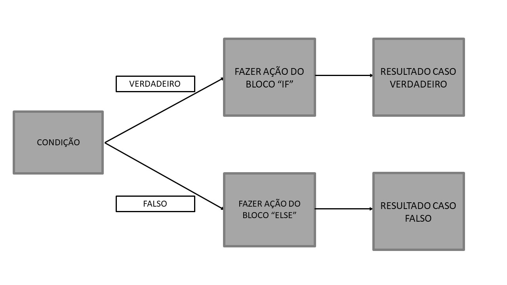

```{r setup, include=FALSE}
knitr::opts_chunk$set(echo = TRUE)
```

O Tópico 3 propõe introduzir duas questões principais aos alunos: o uso de Condicionalidades e a Manipulação de Dados. Falaremos na parte [3.1](objetivos) do que se propõe com cada um deles, mas antes, vamos passar para uma questão relevante que é a instalação do `tidyverse`. O uso deste será a última parte deste tópico, mas como sua instalação pode tomar tempo, colocamos ele logo no ínicio.

## [3.0 - O `tidyverse`: Instalação](#tidyverse_instalacao)

Como iremos tratar de muitos pacotes dentro do *tidyverse*, vale baixar a família de pacote como um todo. Por ser muito grande, pode demorar um tempo, então sugiro que se vocês ainda não estiverem instalado eles, que o façam logo. Se você tiver que instala-lo, você pode esperar isso enquanto:

1.  Ir no banheiro ou lavar ao menos parte da louça enquanto escuto o Podcast do IE;
2.  Ler o resto do Tópico, enquanto espera o R instalar o tidyverse.

```{r, eval = FALSE}
install.packages("tidyverse")
```

A vantagem de assinalar o `tidyverse` é que o R irá baixar e instalar todos os pacotes do tidyverse. Ao usar `library(tidyverse)`, todos os pacotes do *"núcleo duro"* do `tidyverse` são carregados. Repare que se você instalou o `tidyverse` inteiro, ele irá carregar o `dplyr` e o`tidyr`[^1].

[^1]: O inverso não seria verdadeiro por outro lado. A instalação do `dplyr` não garante a instalação do resto dos pacotes.

```{r eval=TRUE, warning=FALSE, message= FALSE}
#Carregando os pacotes nucleares tidyverse
#library(tidyverse)
# O magrittr é instalado com o tidyverse, porém não é carregado com library(tidyverse), logo precisa ser carregado explicitamente.

#library(magrittr)
#Carregando só os pacotes que iremos precisar.

library(dplyr)
library(tidyr)
library(magrittr)
library(readr)
```

## [3.1 - Os objetivos do Tópico 3](#objetivos)

A introdução ao uso dos Condicionantes e à Manipulação de Dados serão expostas no mesmo Tópico pelo fato de que a combinação de ambos permite realizar muita coisa na hora de extrair os dados que você quer.

Ao longo das seções [3.2](32oplogicas), [3.3](33ifstatements) e [3.4](34booleans) deste Tópico, iremos apresentar situações em que você necessite realizar operações lógicas para tomar decisões ou realizar tarefas especificas de acordo com determinadas condições. Essas operações podem ser importantes para avaliar resultados obtidos e automatizar ações condicionais aos resultados. Englobam-se aqui as operações lógicas e as condicionais (usando as funções `if`, `else` e `ifelse`).

Por sua vez, a seção [3.5][35subsetRbase] Neste parte discutiremos a forma de se manipular uma base de dados dentro do `base R`. Isto é particulamente útil se você está trabalhando com uma base de dados extensa e com várias observações, mas também para base de dados menores mas heterogêneas. No caso da matriz insumo-produto, estamos em geral trabalhando com base de dados que não apresentam elevados números de observações tanto no tempo quanto em países, pessoas ou empresas. Ainda assim, bases de dados no estilo insumo-produto que, por exemplo, lidem com fluxo de comércio entre países, que apresentam informações setoriais mais específicas ou que até mesmo a frequência temporal dos dados está aumentada. Assim sendo, bases assim podem ser manipuladas e refinadas somente com as informações necessárias para você trabalhar no R.

Muitas das coisas que o `base R` faz podem ser feitas de forma mais verbosa com os pacotes do `tidyverse`. Apesar de no fim acabar que se escreve mais, o código pode ficar mais claro para quem escreve e lê o código. Desse modo, a manipulação de dados é mais baseada em verbos e nome de colunas do que em colchetes, chaves e índices das colunas. Além disso, o `tidyverse` dá uma gama de elementos para as suas funções do subsetting que não é tão trivial assim usar no `base R`. Além disso, muitas funções do `tidyverse` foram escritas em `C++` e isso faz com que elas sejam *muito* rápidas.

Por conta disso, na seção [3.6](tidyverseintro) iremos falar um pouco mais do `tidyverse` de modo geral, apresentando os seus pacotes principais e como ele se relaciona com as propostas desse curso. Na seção [3.7](tidyversesubset) vamos apresentar algumas das formas de se extrair a base de dados usando majoritariamente o `dplyr` e um pouco do `tidyr`. Na seção [3.8] vamos atentar para como manipular a base de dados de acordo com o nosso interesse, usando o `tidyr` e o `dplyr`

### [3.1.1 Materiais alternativos que foram inspirados na criação deste Tópico](#311matalternativo)

Para as seções [3.2](32oplogicas), [3.3](33ifstatements) e [3.4](34booleans):

-   A subseção [7.0.2](https://rstudio-education.github.io/hopr/modify.html#logical-subsetting) do **Hands-on Programming with R** do Hadley Wickham para a parte de *Operações Lógicas*.
-   Para a parte de condicionais e escolhas foram usadas as subseções [9.2](https://rstudio-education.github.io/hopr/programs.html#if-statements) do *Hans-On Programming with R* e a subseção [5.2](https://adv-r.hadley.nz/control-flow.html#choices) do **Advanced R** do Hadley Wickham.

Para a seção [3.5](35subsetRbase):

-   Destaque aqui para a [seção 4](https://adv-r.hadley.nz/subsetting.html) do **Advanced R**.
-   Também importante a [seção 6.1](https://rstudio-education.github.io/hopr/r-notation.html#selecting-values) do **Hands-On Programming with R**.

No que tange as seções referentes ao `tidyverse`, vale notar que várias funções muito poderosas desses pacotes, especialmente do `dplyr`, não são abordadas neste tópico. É o caso de funções como `mutate`, `summary`, `group_by`e coisas que aumentam o poder do pacote como [`across`](https://dplyr.tidyverse.org/reference/across.html). Por conta disso vale pontuar:

-   O `tidyverse` é incrível e faz muita coisa, tanto é que escreveram um livro em que você basicamente só usa ele do inicio ao fim, o *R for Data Science*.

-   Para uma visão especifica do `dplyr` vale conferir os capítulos [5](https://r4ds.had.co.nz/transform.html) e [13](https://r4ds.had.co.nz/relational-data.html) do *R for Data Science*

-   Para uma visão especifica do `tidyr` ver o capítulo [12](https://r4ds.had.co.nz/tidy-data.html) do *R for Data Science*.

## [3.2 - Operações Lógicas](#32oplogicas)

Para você realizar operações que os resultados são respostas lógicas, existem algumas opções a serem usadas. Veja abaixo exemplos dos chamados *Relational Operators*:

```{r}
#Maior que:
2>3
#Maior ou igual:
c(1:3) >= c(3:1)
#Menor que:
4<5
# Menor ou igual
2 < 2
2 <= 2
# Igual à
2 == 2
# Diferente de
2 != 2
# Se está contido em um grupo
 2 %in% c(1:3)
 c(1:3) %in% matrix(1:6, 3, 2)
 c(6:9) %in% matrix(1:6, 3, 2)

```

Ps.: Um ótimo resumo sobre o que cada operador faz pode ser encontrado na [Table 7.1](https://rstudio-education.github.io/hopr/modify.html#tab:logop) do **Hands-On Programming with R**.

## [3.3 - Escolhas e Condições (If Statements)](33ifstatements)

Imagine que você queira fazer determinada operação somente no caso de certa condições são atendidas? Ou fazer uma sequência de operações de acordo com o resultado de etapas anteriores? Nessas situações, o uso das função `if`, `else` e `ifelse` podem ser úteis.



### 3.3.1 - if

A função `if`é a responsável por realizar a "pergunta" por trás da condição escolhida. No caso, **se** algo acontecer faça determinada operação (que estará entre {}):

```{r, eval = FALSE}

if (condição) {
  
  Execute esta operação caso a condição seja verdadeira

}


```

No modo como está escrito acima, para `if` retornar algum valor, é necessário que a condição seja igual à TRUE. Vamos ver abaixo:

```{r}
a <- 2
a==2

if(a == 2){
  "Condição válida"
}


b <- 3
b==2

if(b == 2){
 "Condição válida"
}
```

Quando usamos `a == 2` como condição, `if` nos retorna o valor `"Condição válida"` expresso entre as chaves `{}`. No entanto quando usamos `b == 2`, como condição, não obtemos nenhum valor de retorno. Isso ocorre por dois motivos:

-   O valor de `a==2` é `TRUE`, enquanto de `b ==2` é `FALSE`. Assim sendo, apenas no caso de `a==2` é que temos que a Condição como verdadeira, de modo que o que vale entre as chaves será retornado.

-   Não estabelecemos nada para retornar no caso da condição ser falsa. Por tanto, no caso de `b==2`, `if` não retornará nada.

De modo cru, pode-se entender `if` como:

```{r}
if(TRUE){
  "Condição Válida"
}

if(FALSE){
  "Condição inválida"
}
```

### 3.3.2 - if e else

Caso seu objetivo não dependa apenas da validade do condição estabelecida ser `TRUE`, mas de fazer outra determinanda operação caso o resultado lógico da sua condição ser `FALSE`, é necessário adicionar mais uma etapa. Nesse caso, além do `if` é necessário inserir a função `else`, bem como a tarefa ou resultado que você deseja obter. Novamente, a representação no R é da seguitne forma:

```{r, eval=FALSE}

if (condição){
  
  Execute esta operação caso a condição seja verdadeira
  }else{
    Caso contrário, faça esta outra operação
    }
```

Voltando ao exemplo usado em `3.3.1`, nesse caso teremos:

```{r}
a <- 2

if(a == 2){
  "Condição válida"
  }else{
  "Condição inválida"  
  }

b <- 3

if(b == 2){
  "Condição válida"
  }else{
  "Condição inválida"
  }
```

No caso acima os dois casos tem um retorno pois tem o `else`. Os exemplos acima foram realizados usando condição de igualdade `==`, mas qualquer uma das operações lógicas citadas na seção 3.2 pode ser usada. Vamos fazer alguns exemplos (mas não de todos)

```{r}
a <- 2
b <- 3

if(a > b){
  "a é maior que b"
  }else{
  "a é menor ou igual que b"  
  }

d <- c(1:5)
e <- c(6:10)

if(a %in% d){
  "a está contido em d"
  }else{
  "a não está contido em d"
  }

if(a %in% e){
  "a está contido em d"
  }else{
  "a não está contido em d"
  }


```

As opções não se resumem apenas à mensagens indicando o resultado da condição que você escolheu, mas fazer novas operações de acordo com o `TRUE` ou `FALSE`.

Vamos fazer um exemplo que caso a condição `a > b` seja atendida realiza-se a soma desses valores e, caso contrário, realiza-se a subtração:

```{r}

a <- 2
b <- 3

if(a > b){
    a + b
  }else{
    a - b
  }
```

### 3.3.3 - A função ifelse

Existe uma função que pode ser mais prática do que escrever o `if` e `else`, tal como foi feito até agora, é a função `ifelse`. Mais importante ainda, o `ifelse` funciona também com vetores e não apenas com escalares. Para o nosso caso de Matriz Insumo-Produto, tal diferença é fundamental de se ter em mente. No Tópico 4 falaremos mais sobre funções vetoriais.

A estrutura da `ifelse` é semelhante ao caso de `if` e `else` separado, no entanto, todos os argumentos são escritos numa mesma linha:

```{r, eval=FALSE}

ifelse(condição, resultado se verdadeiro, resultado caso contrário)

```

Vamos rapidamente refazer os exemplos da seção anterior com essa função:

```{r}

ifelse(a == b, "a é igual a b", "a é diferente de b")
ifelse(a > b, "a é maior que b", "a é menor ou igual b")
# Podemos também inserir as operações (replicando o caso da soma e subtração)
ifelse(a > b, a + b, a - b)

```

Um importante detalhe a ser lembrado é que a própria condição pode ser a existência de algum resultado lógico. Ou seja, caso se um encontre um `TRUE` ou `FALSE`, faça determinada tarefa.

```{r, eval = FALSE}

ifelse (a == TRUE, "faça isso", "faça outra coisa")
ifelse (b == FALSE, "faça isso", "faça outra coisa")

```

Vamos rapidamente relembrar algumas funções que já usamos e que são da estrutura de condições, por exemplo: `is.character`, `is.matrix` e `is.data.frame`.

Vamos primeiro criar 3 objetos de diferentes tipos: um vetor atômico `character`, um vetor atômico `double`, uma matriz `double` e um data.frame `double`:

```{r, eval=T}
f <- c("a", "b", "c")
g <- c(1:3)
h <- matrix(1:9, 3, 3)
i <- data.frame(h)
```

Agora vamos criar uma nova função que exerça o mesmo papel das funções que queremos representar:

```{r, eval=T}
is.character2 <- function(x){ifelse(typeof(x) == 'character', TRUE, FALSE)}
is.character2(f)
is.character2(g)

```

```{r, eval=T}
is.matrix2 <- function(x){ifelse(class(x) == "matrix", TRUE, FALSE)}
is.matrix2(h)
is.matrix2(i)

```

```{r, eval=T}
is.data.frame2 <- function(x){ifelse(class(x) == "data.frame", TRUE, FALSE)}
is.data.frame2(h)
is.data.frame2(i)

```

## [3.4 - Operações em Conjuntos (Booleans)](34booleans)

Para essa parte é importante relembrar a ideia de conjuntos, em que iremos incluir mais de uma condição. Poderemos especificar determinadas tarefas para o caso em que diversas condições necessitam ser atendidas.

Veja abaixo alguns exemplos dos chamados *Logical Operators*, em especial os do tipo `and ( & )`e `or ( | )`.

O operador & vai representar se duas ou mais condições são verdadeiras ou não:

```{r}
# Se uma delas é FALSE, automaticamente o resultado é FALSE
TRUE & FALSE
# Se as duas são FALSE, o resultado também será FALSE
FALSE & FALSE
# Somente ocorrerá TRUE, caso ambas condições sejam TRUE:
TRUE & TRUE
```

Vamos ver uns exemplos numéricos:

```{r}
a <- 2
b <- 3
d <- c(1:5)
e <- c(6:10)

# Vamos testar se a e b são maiores que 1

a > 1 & b > 1
a > 2 & b > 2
a %in% d & b %in% e

# Vc também pode adicionar mais condições:
a > 1 & b >1 & a %in% d

```

Agora juntando isso com o ifelse, você pode refinar ainda mais as escolhas que você deseja:

```{r, eval=FALSE}
# Se cond1 e cond2 forem atendidas:
ifelse(cond1 & cond2, "Faça isso". "Faça outra coisa")
# Se cond1, cond2 e cond3 forem atendidas:
ifelse(cond1 & cond2 & cond3, "Faça isso". "Faça outra coisa")
# e assim  por diante

```

Já o operador `|` será reponsável por avaliar se pelo menos umas das condições é satisfeita:

```{r}
# Se pelo menos uma das condições é verdadeiro, o resultado é verdadeiro:
TRUE | FALSE
# Agora dois resultados FALSE, darão FALSE:
FALSE | FALSE

```

Todos os casos realizados para o `&` são também válidos para `|`, mas ainda faremos um caso somente pra ilustrar:

```{r}

a > 2 | b > 2
a > 2 | b == 2 
# Como a é menor que 2 e b é diferente de 2, o resultado é FALSE
```

Temos também o operador `xor`, que serve quando vocẽ quer saber se os valores lógicos são diferentes ou não. Veja abaixo:

```{r}
# Caso você queira que apenas UMA das condições seja atendida use xor(cond1, cond 2) 
xor(a > 2, b == 2)
xor(a > 2, b > 2)
```

Outro operador interessante é o `!`, que simplesmente inverte o sinal lógico do elemento:

```{r}
# Caso você queira extrair o resultado de uma condição escolhida use "!":
!(a > 2) # Que equivale a receber o resultado lógico do teste TRUE ou FALSE
```

Em alguns casos, outra opção é usar dois operadores em sequência `&&` ou `||` que realizaram a mesma tarefa mas poupará a capacidade computacional do seu computador. Na caso de `&&`, o resultado é automaticamente dado como `FALSE` caso a primeira condição já não seja atendida. Já para `||`, caso a primeira condição seja atendida, o resultado automaticamente é `TRUE`. Uma boa analogia de `||` e `&&` é de `identical` e `==`, que caso você tenha feito os desafios do Tópico 1 você se lembrará que:

<center>

**Testando igualdade no R**

</center>

|           | Célula à Célula |      Objeto      |
|-----------|:---------------:|:----------------:|
| Exato     |      `a==b`     | `identical(a,b)` |
| Tolerante |    $\nexists$   | `all.equal(a,b)` |

|                         | Para retornar `TRUE` é necessário:                                                                                 |                     Célula à Célula                    |               Primeira Célula              |
|-------------------------|--------------------------------------------------------------------------------------------------------------------|:------------------------------------------------------:|:------------------------------------------:|
| E (and)                 | **Todas** as Condições devem ser satisfeitas (`TRUE`)                                                              |                           `&`                          |                    `&&`                    |
| E/OU (or)               | **Ao menos uma** condição tem que ser satisfeita (`TRUE`);<br><br>a outra **não precisa** ser satisfeita (`TRUE`). |                          `\|`                          |                   `\|\|`                   |
| OU EXCLUSIVAMENTE (xor) | Apenas uma condição deve ser satisfeitar (`TRUE`);<br><br>a outra **não pode** ser satisfeita (`TRUE`).            |                          `xor`                         |                 $\nexists$                 |
| Todos                   | Todos os valores do vetor serem `TRUE`                                                                             | Condiçao Suficiente<br> **se** usado dentro de `all()` | Condição Necessária,<br>mas não Suficiente |
| Algum                   | Pelo menos um valor do vetor ser `TRUE`                                                                            |  Condição Suficiente<br>**se** usado dentro de `any()` | Condição Suficiente,<br>mas não Necessária |

A coluna "Primeira Célula" da linhas "Todos" e "Algum" diz respeito aos resultados de `&&` e `||` em relação a preposição lógica da linha.

**É muito importante** que você entenda que `&&` e `||` retornar `TRUE` **NÃO** quer dizer que o teste foi feito para todo o vetor analisado e portanto ele é `TRUE`. Só que o teste para os primeiros valores responderam `TRUE`. Por outro lado, se o resultado retorna `FALSE` você sabe que os vetores não são suficientes. Para ficar mais claro, vamos considerar os seguintes vetores:

```{r, eval= TRUE}
vetor_a <- c(TRUE, FALSE, FALSE, TRUE)
vetor_b <- c(TRUE, TRUE, TRUE, FALSE)
vetor_c <- c(FALSE, TRUE, TRUE, FALSE)
vetor_d <- c(FALSE, FALSE, TRUE, FALSE)
```

Agora vamos aplicar os operadores em `vetor_a` e `vetor_b`:

```{r}
list("E" = vetor_a & vetor_b,
     "E/OU" = vetor_a | vetor_b,
     "OU_Exc" = xor(vetor_a, vetor_b))

list(vetor_a && vetor_b,
     vetor_a || vetor_b)
```

Sabemos que nem todos os valores do teste célula à célula para `vetor_a` e `vetor_b` retornam `TRUE`, mas mesmo assim os teste `&&` e `||` retornam `TRUE` pois tem TRUE na primeira célula. Assim sendo, nesse caso acima, não podemos dizer nada sobre a relação do `vetor_a` e `vetor_b` como um todo. No caso de `vetor_c` e `vetor_d`, temos que:

```{r}
list("E" = vetor_c & vetor_d,
     "E/OU" = vetor_c | vetor_d,
     "OU_Exc" = xor(vetor_c, vetor_d))

list(vetor_c && vetor_d,
     vetor_c || vetor_d)
```

Ou seja, quando a primeiras células dos resultados dos testes de `&` e `|` for `FALSE`, teremos que o mesmo ocorrerá com `&&` e `||` respectivamente. Assim, podemos dizer que nem todos os valores do resultado serão `TRUE`.

Para saber se todos os valores de um vetor são `TRUE`, é possível realizar um teste usando a função `all()`:

```{r}
all(a >= 2, b == 2, 6 %in% d) # ao menos uma não é atendida resultado deve ser FALSE
all(a >= 2, b > 2, 5 %in% d) # agora com todas sendo antendidas
```

Vamos ver isso agora para reforçar a ideia de `&&` e `||` serem necessária mas não suficiente:

```{r}
all(vetor_a & vetor_b) == (vetor_a && vetor_b)
```

O resultado é `FALSE`, pois `all` retorna `FALSE` ao avaliar que os resultados de `&` não são todos `TRUE`, enquanto `&&`avaliou apenas os primeiros valores, assim sendo, a comparação `TRUE ==FALSE` retorna `FALSE`. Por outro lado, para o caso de `vetor_c&& vetor_d`, temos:

```{r}
all(vetor_c & vetor_d) == (vetor_c && vetor_d)
```

Como ambos os resultados dão `FALSE`, temos que a comparação retorna `TRUE`. Ou seja, quando `&&` retorna `FALSE`, `all` necessariamente retornará o mesmo valor. Condição necessária, mas não suficiente. A extensão disso para o caso de `||` é deixado como exercicio para o leitor.

Temos também o caso de `any`, em que retorna `TRUE` se algum dos valores analisados for `TRUE`.

```{r, eval=FALSE}
# Caso você tenha várias condições, você pode perguntar se qualquer uma delas é atendida usando o "any()" ou se todas são atendidas com "all()":
any(a > 2, b == 2, 6 %in% d) # nenhuma é atendido logo devemos receber "FALSE"
any(a >= 2, b == 2, 6 %in% d) # mudando a condição, agora "a >= 2" é atendida
```

Temos agora o caso inverso de antes. Se `a||b` ou `a&&b` retornar `TRUE`, então a análise de `any(a|b)` ou `any(a&b)` necessariamente retornará `TRUE`. Porém, se os testes de `&&` ou `||` retornar `FALSE`, não pode-se dizer que `any()` retornará `FALSE`. Veja os casos abaixo:

```{r}
#Ambos dão TRUE
any(vetor_a & vetor_b) == (vetor_a && vetor_b)
#&& retorna FALSE, mas any() retorna TRUE
any(vetor_c & vetor_d) == (vetor_c && vetor_d)
```

Por fim, novamente, todas essas operações podem ser usadas conjuntamente com `if`, `else` e `ifelse`. Isso amplia seu leque de opções quando deseja automatizar algumas tarefas, bem como realizar testes na sua base de dados.

Ps.: Um ótimo resumo sobre o que cada operador Booleano faz pode ser encontrado na [Table 7.2](https://rstudio-education.github.io/hopr/modify.html#tab:boole) do **Hands-On Programming with R**.

## [3.5 - Manipulação de Dados no base R](#35subsetRbase)

Aqui iremos explicar como realizar a manipulação de dados usando os comandos básicos do R. Essa parte tem relação direta com o tópico anterior em que foi ensinado sobre a leitura de dados no R. Agora iremos explorar como trabalhar base de dados importadas ou geradas no próprio R.

### 3.5.1 - Selecionando Valores

Em primeiro lugar, a forma de extração ou seleção de valores no R é feito mediante o uso de colchetes `[]`. Logo, para extrair informações de um objeto "exemplo" qualquer:

```{r, eval=FALSE}
a[] # se for um objeto de uma dimensão
a[,] # se for um objeto de duas dimensões
```

Antes disso vamos relembrar alguns conceitos já apresentados em tópicos anteriores, mas que são fundamentais para esse tópico. Temos, basicamente, seis formas de escolher valores dentro de um vetor atômico:

```{r}
a <- c(4,1,3,2)

# Números Inteiros Positivos: pegam o elemento da posição especifica
a[2]
# Números Inteiros Negativos: pegam todos elementos exceto o especificado
a[-1]
# Zero: retorna o valor zero (útil para gerar vetores com zeros)
a[0]
# Vazio: retorna o próprio vetor (o mesmo que chamar somente "a")
a[]
# Logical Values: somente as posições com TRUE serão retornadas
a[c(TRUE,FALSE,TRUE,FALSE)]
# Names: se o vetor é nomeado, vc pode chamar os elementos pelo seu "nome"
a <- setNames(a,c("Primeiro", "Segundo", "Terceiro", "Quarto"))
a["Segundo"]

```

Quando estamos trabalhando com estruturas que tenham duas dimensões (linhas e colunas), tal como o caso de matrizes, a lógica é semelhante. No entanto, é necessário especificar valores para ambas dimensões. Lembrando sempre que os espaços vazios representam extrair toda a informação naquela dimensão. Em outras palavras, ao deixar vazio o espaço para as linhas você estará retornando todas os elementos nas linhas de um determinado intervalo das colunas.

```{r}
b <- matrix(a, 2, 2)
row.names(b) <- c("Linha 1", "Linha 2")
colnames(b) <- c("Coluna 1", "Coluna 2")

# Números Inteiros Positivos
b[,1] # Pegar a Coluna 1
b[1,] # Pegar a Linha 1
b[1,1] # Pegar a Linha 1 e Coluna 1

# Números Inteiros Negativos
b[,-1] # Tudo exceto a Coluna 1

# Logical Values
b[c(TRUE, FALSE),] # Linha 1 (TRUE) e Linha 2 (FALSE)

# Names
b["Linha 1",] # Pegar somente a Linha 1
```

Podemos citar três operadores para selecionar valores em um objeto: `[]` e `[[]]` e `$`. O `[]` é decerto o mais útil e mais usado, enquanto os outros dois cumprem funções mais especificas, em especial quando usado em listas.

-   `[]` retornará as informações especificadas, como uma sublista, uma coluna, uma linha, etc. Essa opção vai trazer os resultados na menor dimensão possível.
-   `[[]]`retornará uma informação especifica que está contida, por exemplo, em uma lista ou data.frame.
-   `$` retornará uma lista ou objeto especificado em uma lista ou data.frame.

O `$` e `[[]]` são basicamente a mesma coisa, com o primeiro sendo uma forma mais "direta" de realizar a extração. No entanto, o `$` é mais indicado quando se está trabalhando com colunas que estão nomeadas, enquanto o `[[]]` é preferível quando as colunas não estão nomeadas (e que você deva colocar a posição escolhida dentro do objeto).

No caso de uma lista, ocorre de forma semelhante ao vetor atômico. Dessa forma, usar `[]` em uma lista retornará uma lista, enquanto `[[]]` e `$` retornarão o elemento especificado que está dentro da lista (que pode ser inclusive uma lista).

No caso de data frames, eles compartilham características tanto de listas quanto de matrizes. Caso você faça a manipulação com somente um elemento entre colchetes, ele se comportará como uma lista.

```{r}
df <- data.frame(matrix(1:9,3,3))
colnames(df) <- c("C1", "C2", "C3")
rownames(df) <- c("L1", "L2", "L3")
df[1:2]

```

Ou seja, ele retorna apenas as duas primeiras colunas. Agora, caso você manipule sua base usando os dois índices, o dataframe se comporta como uma matriz:

```{r}
# Se comporta como uma matrix:
df[2, 1:2]

#Porém não é uma
is.matrix(df[2, 1:2])
is.data.frame(df[2, 1:2])
```

No caso, retornou apenas os elementos da segunda linhas e das duas primeiras colunas.

### 3.5.2 - Manipulando Base de Dados usando Condições

Uma das melhores formas de se manipular uma base de dados é fazendo uso dos diversos operadores condicionais ou relacionais explicados anteriormente. Tais operações podem facilitar muito a limpeza de dados, ao estabelecer para o R as "regras" que você deseja. Inúmeras combinações podem ser utilizadas, tais como selecionar observações que são maiores que determinado valores, países especificios por meio de seu nome ou até mesmo "outliers" da sua série.

Como exemplo, vamos aqui trabalhar com uma das base de dados padrão do R, a `iris`. Vamos avaliar qual é o tipo de base de dados, e fazer uma visualização parcial dos dados:

```{r}

typeof(iris)
head(iris)
str(iris)
```

Ou seja estamos trabalhando com uma lista, composta por 5 variáveis. Vamos supor que nós desejamos somente trabalhar com a variável "Species". Vamos dar três formas como exemplo, mas todas alternativas citadas anteriormente são válidas:

```{r}
iris_species <- iris[,5]
iris_species2 <- iris$Species
iris_species3 <- iris[,"Species"]
iris_species4 <- iris[[5]]

# São todas iguais?
all.equal(iris_species,iris_species2,iris_species3,iris_species4)
```

Essas são formas de se extraírem váriaveis por inteiro de uma base de dados. No entanto, podemos ter situações em que queremos filtrar a base de dados para pegar apenas alguns casos especificos. Retornando para a base de dados original `iris`, a sublista "species" é composta por 3 categorias: "setosa", "versicolor" e "virginica". Vamos então filtrar a base de dados para somente pegar as informações sobre "virginica":

```{r}

virginica <- iris[iris$Species == "virginica",]
virginica2 <- iris[iris[,5] == "virginica",]

head(virginica)
```

Seguindo no nosso exemplo, imagine que agora você precisa filtrar ainda mais sua base, agora com flores que apresentam valores maiores que um determinando valor. Vamos então pegar as flores do tipo "virginica" que apresentam "Petal.Length" maiores que a média:

```{r}

virginica_petal <- virginica[virginica$Petal.Length > mean(virginica$Petal.Length),]
head(virginica_petal)

# Você também pode fazer essa operação de forma sequencial (isso pode ser útil caso você queira também a média como um objeto separado ou um código do R mais limpo).
media_petal_virginica <- mean(virginica$Petal.Length)
virginica_petal_2 <- virginica[virginica$Petal.Length > media_petal_virginica,]

# Vamos testar se todos os valores são realmente maiores que a média?

ifelse(virginica_petal$Petal.Length > mean(media_petal_virginica), "OK", "Errado")

```

Você pode ter a liberdade de realizar quanto mais "subsetting" desejar usando os diversos outros operadores apresentados.

Por fim, um procedimento muito comum é substituir valores que não podem ser aplicados que resultam em `NA` (Por exemplo, uma divisão com denominar zero ou valores faltantes em uma base de dados). Uma forma de substituir valores `NA` por 0 é a seguinte:

```{r}
aa <- matrix(c(1, NA, 2, 3, NA, NA), ncol = 2)
aa

# Usa-se a função is.na() para identificar e selecionar os valores com NA e substitui por 0:
aa[is.na(aa)] <- 0
aa
```

## [3.6 - O tidyverse: Introdução](#tidyverseintro)

A familia de pacotes do `tidyverse` fortalece bastante a análise e manipulação de dados no R, especialmente para bases de dados retangulares e mais ainda para bases *tidy*. Vale notar, que este não é o caso de Matrizes Insumo Produto (que no geral são bases de dados quadradas), porém além de várias funcionalidades uteis como um todo, além do maravilhoso pacote *purrr* que veremos no Tópico sobre automatizar as tarefas.

Os pacotes do núcleo duro do *tidyverse* são:

-   ***tibble***: Já falamos, brevemente, desse pacote no Tópico 2. Um `tibble` é como um `data.frame` só que, na propria definição do site do [`tidyverse`](https://tibble.tidyverse.org/), mais preguiçoso e ranzinza. Ele não facilita sua vida como o `data.frame` o faz. Por exemplo, ele não muda nem o nome nem o tipo das variáveis e irão reclamar mais. Importante notar que antes um `tibble` e um `data.frame` eram mais diferentes do que são hoje[^2], pois a função `data.frame` por default convertia `strings` em `factor`, o que mudou na atualização 4.0.0 do R.[^3] A principio, o `tibble` não será mais abordado aqui no curso, (pelo fato de que teremos um ) assim que desejar se aprofundar mais nele pode conferir o capitulo 10 do [*R for Data Science*](https://r4ds.had.co.nz/tibbles.html) e [neste artigo](https://tibble.tidyverse.org/articles/tibble.html).

-   ***readr***: No Tópico 2, também já falamos sobre o pacote `readr`, e como ele é muito mais rápido que o `base` R para importar uma base de dados. É importante considerar apenas que ele importa a base como um `tibble` e não um `data.frame`. Vamos falar um pouco dele aqui também.

-   ***dplyr***: O pacote `dplyr` é **O** pacote para manipular os dados. Ele irá te ajudar a lidar conscientemente com problemas comuns na hora de manipular a base de dados. Uma parte das suas utilidades será apresentada no Tópico 3[^4]. Os capítulos [5](https://r4ds.had.co.nz/transform.html) e [13](https://r4ds.had.co.nz/relational-data.html) do *R for Data Science* introduzem uma boa parte das funções que `dplyr` oferece, inclusive algumas das que não falaremos aqui.

-   ***tidyr***: O pacote `tidyr` é por sua vez focado em deixar uma base de dados mais bem comportada, especificamente no modo `tidy`. Assim, o `tidyr` é muito voltado para base de dados retangulares. Algumas poucas funções do `tidyr` serão apresentadas no Tópico 3, em especial as mais úteis para Matriz Insumo Produto. Para uma visão (bem) mais abrangente do `tidyr` olhe o capítulo [12](https://r4ds.had.co.nz/tidy-data.html) do *R for Data Science*

-   ***purrr***: O pacote `purrr` traz consigo um poderoso ferramental para lidar com automação de tarefas e com estruturas de dados muito recursivas (listas). Sua abordagem radicalmente funcional te dá uma grande vantagem frente ao loop tradicional do base R. Uma parte deste pacote será abordado no Tópico 4, sendo também abordado no capítulo [21](https://r4ds.had.co.nz/iteration.html) do *R for Data Science* e no [9](https://adv-r.hadley.nz/functionals.html) do *Advanced R*.

-   ***stringr***: Esse pacote lida com dados que na realidade são textos, as chamadas `strings`. Assim sendo, é uma ferramenta muito poderosa, que para além de questões óbvias, serve de apoio para o `subsetting` e a automação de determinadas tarefas. O pacote `stringr` e suas aplicações será discutido no Tópico 5. As funcionalidades do pacote são explicadas no capítulo [14](https://r4ds.had.co.nz/strings.html) do *R for Data Science*.

-   ***ggplot2***: A ferramente mais poderosa de construção de gráficos do R. É o que se tem para falar do `ggplot2`. Ele será introduzido no Tópico 6. Uma abordagem mais ampla de todo o seu poder pode ser vista no livro [*ggplot2: Elegant Graphics for Data Analysis*](https://ggplot2-book.org/) feito pelo Hadley Wickham.

-   ***forcats***: Este pacote é útil para lidar com `factors` (*forcats* é um anagrama de *factors*), que é uma `classe` de vetores que servem para dar categorias à um `data.frame`. `factors` já foram mais comuns no R do que são hoje, em especial após a expansão do *Tidyverse* e da versão 4.0.0 da linguagem. Por conta disso, não vamos entrar em `factors` nesse curso à principio, sendo que com o `stringr` se consegue fazer tudo e mais um pouco que se faz com `factors`. Para quem tiver interesse, vale acessar o capitulo [15 do R for Data Science](https://r4ds.had.co.nz/factors.html) para aprender sobre o *forcats*. Para usar *factors* com um maior enfoque no base-R, vale a leitura da subseção [5.5.2](https://rstudio-education.github.io/hopr/r-objects.html#factors) do *Hands-on Programming with R*, e das subseções [3.4](https://adv-r.hadley.nz/vectors-chap.html#s3-atomic-vectors) e [4.2.1](https://adv-r.hadley.nz/subsetting.html#atomic-vectors-1) do *Advanced R*.

[^2]: Até agora (Junho de 2020) nem o [site](https://tibble.tidyverse.org/) nem a documentação do `tibble` no R foram atualizadas nesse sentido.

[^3]: Veja mais na documentação de `data.frame`, em especial no argumento de `stringAsFactors`.

[^4]: A mais relacionada com `subsetting`

### [3.6.1 Escrevendo com o **pipe**](#361pipe)

Dada a natureza do *Tidyverse*, será mais usada nessa parte o operador *pipe* `%>%`, ao invés da escrita *nested*. Sempre que você carregar algum dos pacotes Relembrando o uso dele abaixo:

```{r, eval = FALSE}
#Modo Nested
objeto2 <- funcao3(funcao2(funcao1(objeto1)))


#Modo Pipe
objeto2 <- objeto1 %>% funcao1() %>% funcao2() %>% funcao3()
```

Ou seja, ao invés de uma escrita que vai de dentro (`objeto1`) para fora (`funcao3`) como no modo *nested*, você tem uma escrita da esquerda (`objeto1`) para a direita (`funcao3`). Veja alguns exemplos abaixo:

```{r, eval = FALSE}
# mtcars é uma base de dados interna do R usada para dar exemplos. 

#calcular a media de cada coluna usando colMeans

#modo nested
means_mtcars <- colMeans(mtcars)

# modo pipe %>%
means_mtcars <- mtcars %>% colMeans

#modo_nested
colMeans(mtcars)[5]

# modo pipe %>%
mtcars %>% colMeans %>% .[5]

# Há também o operador %$%, dentro do pacote magrittr também do tidyverse
mtcars %>% colnames() %>% .[5]
mtcars %$% mean(drat) 

# Repare que ao usar %$% não é necessario usar "" para ser referir ao nome das colunas! 
```

Quanto mais longo a linha de comando, melhor será aplicar o modo *pipe* em detrimento do *nested*. O modo *pipe* que usamos foi desenvolvido no pacote `magrittr`, sendo que o operador *pipe forward* `%>%` estará disponível para uso sempre que você carregar um pacote do `tidyverse`. Isso não é o caso do operador *exposition pipe*, que é necessário que você carregue explicitamente o pacote `magrittr`, pois este não é um dos pacotes do "núcleo" do *Tidyverse*. Existem outros dois operadores dentro do pacote `magrittr`[^5] que são o *tee pipe* `%T>%` e o *compound assignment pipe* `%<>%`, mas que não serão discutidos aqui[^6].

[^5]: E ficam disponíveis apenas se você carregar o `magrittr` explicitamente.

[^6]: Para mais informações sobre o `magrittr` veja <https://cran.r-project.org/web/packages/magrittr/vignettes/magrittr.html>

## [3.7 - Subsetting com o `tidyverse`](#tidyversesubset)

### 3.7.1 - Extraindo colunas a partir dos seus nomes

Existe duas funções para você retirar colunas a partir dos seus nomes, `select` e `pull`. O `select` irá manter a estrutura de dados, enquanto `pull` irá alocar todos os dados selecionados num vetor atômico. Veja os exemplos abaixo:

```{r, eval = FALSE}
# Selecionando apenas a coluna 5
selExemplo1 <- select(mtcars, 5)
pullExemplo1 <- pull(mtcars, 5)

# Selecionando as colunas 1,3,7

selExemplo2 <- mtcars %>% select(c(1,3,7))
pullExemplo2 <- mtcars %>% pull(c(1,3,7))
# Excluindo as colunas 1,3,7

selExemplo3 <- mtcars %>% select( -c(1, 3, 7))
pullExemplo3 <- mtcars %>% pull(-c(1, 3, 7))

# Selecionando a primeira coluna pelo nome:

selExemplo4 <- mtcars %>% select(mpg)
pullExemplo4 <- mtcars %>% pull(mpg)

# Excluindo a primeira coluna pelo nome:

selExemplo5 <- mtcars %>% select(-mpg)
pullExemplo5 <- mtcars %>% pull(-mpg)
```

Os exemplos acima fazem de forma bastante similar aquilo que o base R também faz. Porém, existem os `select_helpers` que são muito uteis para usar na função `select` em especifico. Veja alguns abaixo:

```{r}
# starts_with
selExemplo6 <- mtcars %>% select( starts_with("m"))

# ends_with
selExemplo7 <- mtcars %>% select(ends_with("t"))

# contains
selExemplo8 <- mtcars %>% select(contains("s"))

# matches (ignora se é maiusculo ou minusculo)
selExemplo9 <- mtcars %>% select(matches("MPG"))
```

Existem outros elementos que fazem parte dos `select_helpers` se você quiser saber mais.

### 3.7.2 - Linhas

No que tange o subsetting via as linhas, temos três funções relevantes: `filter`, `distinct` e `arrange`.

#### 3.7.2.1 - filter

A função `filter` irá filtrar as linhas a partir de uma condição. Que fique claro, quando falarmos abaixo em *filtrar* determinadas linhas, é que apenas essas linhas serão selecionadas. Você pode usar e abusar das comparações lógicas ( `==`, `!=`, `>`, `>=`, `<`, `<=`). Veja os exemplos abaixo para usar `filter` com apenas uma condição e repare que a ordem dos argumentos não importa:

```{r}


# Filtrando as linhas cuja os valores da coluna Plant seja iguais a "Qn1".
CO2 %>% filter(Plant == "Qn1")
#CO2 %>% filter("Qn1" == Plant)


# Filtrando as linhas cuja os valores da coluna Plant seja iguais a "Qn1" e "Mn1".

#CO2 %>% filter(Plant == c("Qn1", "Mn1"))
CO2 %>% filter(c("Qn1", "Mn1") == Plant)

# Usando filter em sequência:
# Pt1: Filtrando as linhas cuja os valores da coluna Plant seja diferente de "Qn1".
# Pt2: Filtrando depois os valores da coluna Treatment sejam iguais à "chilled".

#CO2 %>% filter("Qn1" != Plant) %>% filter(Treatment == "chilled")
CO2 %>% filter(Plant != "Qn1") %>% filter("chilled" == Treatment)

# Filtrando as linhas que o valor de `conc` seja maior que 250.

#CO2 %>% filter(conc > 250)
CO2 %>% filter(250 < conc)

# Filtrando as linhas que o valor de `uptake` seja menor ou igual a 10

#CO2 %>% filter(10 >= uptake)
CO2 %>% filter(uptake <= 10)
```

Repare que a ordem que você escreve os elementos a serem comparados não alteram o funcionamento da função. Você pode então Você pode deixa o uso de `filter` muito mais complexo. Veja abaixo um exemplo com as funções `mean`, `median` e moda[^7]:

[^7]: Feita a partir deste código: <https://www.tutorialspoint.com/r/r_mean_median_mode.htm>

```{r}
CO2 %>% filter(conc > mean(conc))

CO2 %>% filter(uptake <= median(uptake))

# Criando a função moda:
moda <-  function(v) {
   uniqv <- unique(v)
   uniqv[which.max(tabulate(match(v, uniqv)))]
}

CO2 %>% filter(conc == moda(conc))
```

Podemos colocar mais de uma condição em `filter` para não ter que fazer uma sequência. Veja abaixo:

```{r}
#Ao invés de:
#CO2 %>% filter(conc == moda(conc)) %>% filter(uptake <= median(uptake))

#Você pode fazer:

CO2 %>% filter(conc ==moda(conc), uptake <= median(uptake))
```

No caso acima foram selecionadas as linhas que ao mesmo tempo eram iguais à moda da coluna `conc` e eram menores que a mediana de `uptake`. Poderíamos ir além e colocar um terceiro elemento:

```{r}
CO2 %>% filter(conc ==moda(conc), uptake <= median(uptake), Treatment == "chilled")
```

Já tratamos do uso da função `filter` com as comparações lógicas, agora vamos falar dela com os ***operadores lógicos***. O poder de filter aumenta e muito quando usamos eles, veja só:

```{r}
### Os operadores básicos: Seja A e B dois conjuntos.

# O operador A&B: interseção de A e B(ou)
# Repare que é o mesmo que: 
#CO2 %>% filter(conc ==moda(conc), uptake <= median(uptake))

CO2 %>% filter(conc ==moda(conc) & uptake <= median(uptake))

# O operador A|B: união de A e B (A e B)

CO2 %>% filter(conc == moda(conc) | uptake <= median(uptake))

# A função xor(A,B): todos elementos de A e B fora da interseção. 
#xor(A,B) = A|B - A&B. A chamada Diferença Simétrica.

CO2 %>% filter(xor(conc == moda(conc), uptake <= median(uptake)))

### Combinações entre eles:

## Exclusão de um dos elementos

# A & !B: Excluí de A tudo que é de B. Ou seja, A menos a interseção de A e B.

CO2 %>% filter(conc == moda(conc) & !uptake <= median(uptake))

# !A & B: Exclui de B tudo que é de A. Ou seja, B menos a interseção de A e B.

CO2 %>% filter(!conc == moda(conc) & uptake <= median(uptake))
```

Perceba que `filter`, como toda função do subsetting, faz nada mais que selecionar as linhas que retornam `TRUE` às condições que ele impõe. Por isso, as comparações e operações lógicas são instrumentos tão poderosos para a seleção `filter`.

Existem mais três funções que podem ser usados para aumentar a força de `filter`: `is.na()`, `between()` e `near`. A função `is.na()` confere se um valor é `NA`. Assim podemos usa-la para selecionar (ou excluir), linhas que possuam valores `NA`.

```{r}

# Checando se valores são NA.
is.na(1)
is.na(NA)

# Checando se valores de um vetor são NA ou não.
is.na(c(1,2,NA))

# Checando quais linhas tem NA da coluna Ozone da base de dados Ozone.
airquality$Ozone %>% is.na()

# filtrando as linhas que tem NA
airquality %>% filter(is.na(Ozone))

# filtrando as linhas que não tem NA (pegando as primeiras 20 linhas)
airquality %>% filter(!is.na(Ozone)) %>% .[1:20,]
```

(Veja a subseção "Removendo linhas `NA` diretamente" para um método direto.)

Já a função `between` serve para você filtrar linhas que contém elementos numéricos entre dois valores.

```{r}

x <- 1:7
# Testando quais elementos de x estão entre 3 e 5. (3 e 5 estão inclusos.)
dplyr::between(x, 3,5)

#Filtrando os elementos de CO2 que estão entre 100 e 200.
CO2 %>% filter(between(conc, 100, 200))
```

A função `near` funciona como `==` só que com uma margem de tolerância dada pelo argumento `tol`. Importante notar que `tol` já tem um valor `default` que é `.Machine$double.eps^0.5`. Vejamos abaixo:

```{r}
x <- c(1,2,3)
y <- c(1.4, 3, 3)

#Testando quais valores de x e y estão próximos pela tolerância default:
near(x,y)

# Vendo o valor default de tolerância:
.Machine$double.eps^0.5

# Testando se x e y estão próximos por uma tolerância de 0.5:
near(x,y,0.5)

# Filtrando as linhas com valores de uptake próximos de 40 pela tolerância default:
CO2 %>% filter(near(uptake, 40))

# Filtrando as linhas com valores de uptake próximos de 40 pela tolerância de 1:
CO2 %>% filter(near(uptake, 40, tol = 1))
 
```

#### 3.7.2.2 - Removendo duplicatas com `distinc`

A função `distinct` remove linhas duplicadas dos seus data.frames. Veja o exemplo abaixo:

```{r}
ex_df <- data.frame("A"=c(1,0,1,1,-0), "B" = c(0,1,0,1, 1) )
ex_df
# As linhas 1 e 3 são iguais e a 2 e 5 também. Usemos distinct para remover as duplicatas
ex_df %>% distinct()

```

#### 3.7.2.3 - Reordenando as linhas com `arrange`

A função `arrange` serve para reordenar as linhas de acordo com uma coluna.

```{r}
# Forma crescente (menores primeiro)
iris %>% arrange(Sepal.Length) %>% head()

# Forma decrescente (maiores primeiro )
iris %>% arrange(desc(Sepal.Length)) %>% head()
```

Também é possível fazer isso em vetores `character`:

```{r}
iris %>% arrange(Species) %>% head()
```

#### 3.7.2.4 - Removendo linhas `NA` diretamente

Se queremos apenas remover linhas que tem `NA`, há uma forma mais direta do que combinar a função `filter` do pacote `dplyr`, com o argumento `is.na`. Tal forma é podemos usar a função `drop_na` do pacote `tidyr` para eliminar linhas com `NA`.

```{r}
airquality %>% tidyr::drop_na() %>% head()
```

Você pode escolher inclusive se você quer que sejam eliminadas linhas com `NA` de uma coluna especifica.

```{r}
airquality %>% tidyr::drop_na("Ozone") %>% head()
```

## [3.8 - Arrumando dados.](#arrumandodadostidyverse)

Como vocês puderam ver no Tópico 2, nem todos os dados vem como gostariamos que eles viessem. Vamos aqui tratar apenas de alguns casos mais simples.

### 3.8.1 - Juntar colunas

Veja o `data.frame` abaixo:

```{r}
df_ex <- data.frame("A" = c(1:6), "B" = 20*c(6:1))
```

Agora considere as duas variáveis `"D"` e `"E"` abaixo que seriam mais duas colunas para `df_ex`:

```{r}
D <- c("BRA", "BRA", "ARG", "ARG", "URU", "URU")

E <- rep(c(1,2), 3)

df_ex <- data.frame(df_ex, "D"= D, "E" = E)
```

Suponha, então queremos fazer uma coluna `"DE"`, que seria um vetor tal qual `c("BRA1", "BRA2", "ARG1", ...)` o que poderíamos fazer? Há dois modos. O primeiro, mais longo, seria concatenar os vetores `"D"` e `"E"` usando a função `paste0` e realizar um subsetting de `df_ex` para criar esse vetor:

```{r}
# Primeiro modo.

#Concatenando D e E 
DE <- paste0(D, E)

# Trocando D e E por DE
df_ex <- df_ex[,-c(3,4)] %>% data.frame(., DE)
```

No entanto, pelo pacote `dplyr` nós podemos fazer isso num passo apenas.

```{r}
df_ex <- data.frame(df_ex[1:2], "D"=D, "E"= E)

df_ex <- df_ex %>% tidyr::unite("DE", D:E, sep = "")
```

O argumento `sep= ""` foi colocado ali acima pois o valor *default* do separador é `_`.

### 3.8.2 - Separar colunas

Maioria das vezes, você irá querer muito mais separar colunas do que junta-las. Para tanto, basta usar a função `separate` do `tidyr`

```{r}
df_ex %>% separate("DE", into = c("D", "E"), sep = 3)
```

### 3.8.3 - Mudar comprimento de um vetor

Suponha que ocorreu uma corrida e havia 6 participantes inscritos. Desses 6, só alguns apareceram, e apenas esses tiveram o seu tempo em minutos anotado. Desse modo temos os dois `data.frames` abaixo:

```{r}
df_inscritos <- data.frame("Nomes"= c("Maria", "João", "Silvia", "Arthur", "Gustavo", "Alexandre"), "Idade" = c(15,16,13, 20, 12, 18))

df_km <- data.frame("Nomes" = c( "João", "Silvia", "Arthur", "Alexandre"), "Tempo_min" = c(121, 100, 102, 110))
```

Agora suponha que queremos criar um `data.frame` que tenha todos os inscritos e mostre o tempo daqueles que participaram efetivamente. Podemos fazer isso usando o grupo de funções `join`, mais especificamente a função `left_join`:

```{r}
df_inscritos %>% left_join(df_km)
```

A função `left_join(x,y)` aloca todas as linhas de x, e todas as colunas de x e y. Assim sendo, no caso acima ela retornou todas as linhas de `df_inscritos` e alocou as linhas de `df_km` de acordo. Assim, as linhas de `df_inscritos` que não estavam presentes em `df_km` foram preservadas. Veja o que ocorre se trocarmos a ordem dos argumentas na função:

```{r}
df_km %>% left_join(df_inscritos)
```

No caso acima, as linhas de `df_km` foram preservadas, mas as linhas de `df_inscritos` que não estavam presentes em `df_km` foram excluídas. A função `right_join` inverte a ordem dos argumentos, de modo que:

```{r, eval = FALSE}
#NÃO RODE
left_join(x,y) = right_join(y,x)
```

Agora suponha que no dia da competição apareceu mais uma pessoa para correr que não estava inscrita de tal modo que:

```{r}
corredor_extra <- data.frame("Nomes" = c("Juliano"), "Tempo_min" = 92)

df_km2 <- rbind.data.frame(df_km, corredor_extra)
```

Agora, vamos supor que se quer todas as informações possíveis juntas, mesmo incluindo quem não estava inscrito. Para tanto podemos usar a função `full_join`, que irá manter as linhas dos dois dataframes. Veja abaixo:

```{r}
df_km2 %>% full_join(df_inscritos)
```

Agora suponha que você tem apenas `df_inscritos` e `df_km2` (ou seja, não tem `df_km`). E que você não sabe a priori quem foi o "penetra". Assim, suponhamos que você quer duas coisas:

-   Uma lista apenas com os inscritos que foram participar
-   Desconsiderar a idade dos corredores e apenas saber o seu tempo.

Para conseguir essas duas coisas num único comando, basta usar a função `semi_join`:

```{r}
df_km2 %>% semi_join(df_inscritos)
```

A função `semi_join(x,y)` retorna todas as linhas de x que tiverem em y, porém descarta as colunas de y.

Agora, suponha que apenas provido de `df_km2` e `df_inscritos`, você quer saber quem foi o penetra na corrida. Basta você então usar a função `anti_join`:

```{r}
df_km2 %>% anti_join(df_inscritos)
```

Vamos supor mais uma situação: houve uma partida de futebol no dia seguinte, com a seguinte lista de jogadores:

```{r}
df_futebol <- data.frame("Time" = rep(c(1,2), 6), "Jogador" = c("João", "José", "Ana", "Joana", "Gustavo", "Maria", "Silvia", "Jonas", "Henrique", "Bruno", "Julia", "Jade"))
```

Agora suponha que se quer saber quais dos corredores inscritos foram jogar bolar no dia seguinte. Para tanto, podemos usar a função `inner_join`. No entanto há um problema. De modo geral, as funções do grupo `join` funcionam usando colunas nos dois `data.frames` que tem o mesmo nome. No entanto, `df_futebol` não têm a variável `Nomes`, e sim `Jogadores`. Assim, temos que usar o argumento `by`, de modo que:

```{r}
# Daria Erro
#df_futebol %>% inner_join(df_inscritos)

df_futebol %>% inner_join(df_inscritos, by = c( "Jogador" = "Nomes"))
```

### 3.8.4 - Alterando tipos de colunas

A primeira vista pode ser desafiador trocar os tipos de uma coluna no R. Isso pode ser especialmente problemático quando se trata de uma base de dados de Matrizes Insumo Produto. Isso porque muitas vezes os dados vão ser acompanhados por duas linhas de texto. Uma contendo um código e outra uma descrição. Veja um exemplo abaixo:

```{r}
df <- tibble("Codigo" = c("Nome dos Setores", "Demanda de Trigo", "Demanda de Ferro"),  "Tr" = c("Oferta de Trigo", 2, 3), "Fe" = c("Oferta de Ferro", 1, 5 ))
```

Suponha que a tabela `df` seja proveniente de um arquivo que você importou. Por toda coluna ter uma linha com um `character`, todas as linhas serão `character`. Lembrando que um data.frame é uma lista de vetores atômicos. Assim, você pode ter vetores com tipos de dados diferentes entre si, porém cada vetor pode ter apenas um tipo de dado.

```{r}
# Tipo do df
typeof(df)

#Tipo de cada coluna do df:

df[,1] %>% typeof #Nem sempre dá certo pois pode permanecer com a estrutura de lista.
df[[2]] %>% typeof # Sempre dará certo.

df$Tr %>% typeof # Também sempre dá certo

df[["Fe"]] %>% typeof # Dá certo sempre também. 
```

Assim, suponhamos que excluimos a primeira linha:

```{r warning=TRUE}
# Pelo Base R
#df <- df[-1,]

# Ou pelo filter
df <- df %>% filter(Codigo != "Nome dos Setores" )
```

Se tentarmos mudar o tipo de cada uma das colunas abaixo, o R ou irá retornar um erro pois não consegue modificar à força `df[,2]` no lado direito do assignment.

```{r, eval = FALSE}
df[,2] <- df[,2] %>% as.numeric()
```

Há uma alternativa à isso, que seria:

```{r}
df[,2] <- df[,2] %>% unlist %>% as.numeric()
```

No `dplyr` há a função `mutate` que poderia nos ser útil agora. Porém, vamos deixar para assimilar o `mutate` em um outro momento. Vamos agora usar uma função do `readr` que é muito mais prática inclusive, a `type_convert`:

```{r}
df2 <- readr::type_convert(df)
```

A função `type_convert()` converte os tipos de cada coluna naquelas que ela acredita ser a mais conveniente para o uso. Importante notar que no `Base R` existe o `type.convert()` que faz o mesmo serviço porém, enquanto a versão do `readr` tende a converter tudo para `double` e `characther`, a versão do `Base R` converter as coisas também para `integer` e `factor`. E *factors* são chatos.

## Fontes:

Hands-on Programming with R: <https://rstudio-education.github.io/hopr/>

R for Data Science: <https://r4ds.had.co.nz/>

Advanced-R: <https://adv-r.hadley.nz/>

Pacotes do tidyverse: <https://www.tidyverse.org/packages/>

Código para função moda: <https://www.tutorialspoint.com/r/r_mean_median_mode.htm>

Explicação de `across`: <https://dplyr.tidyverse.org/reference/across.html>
