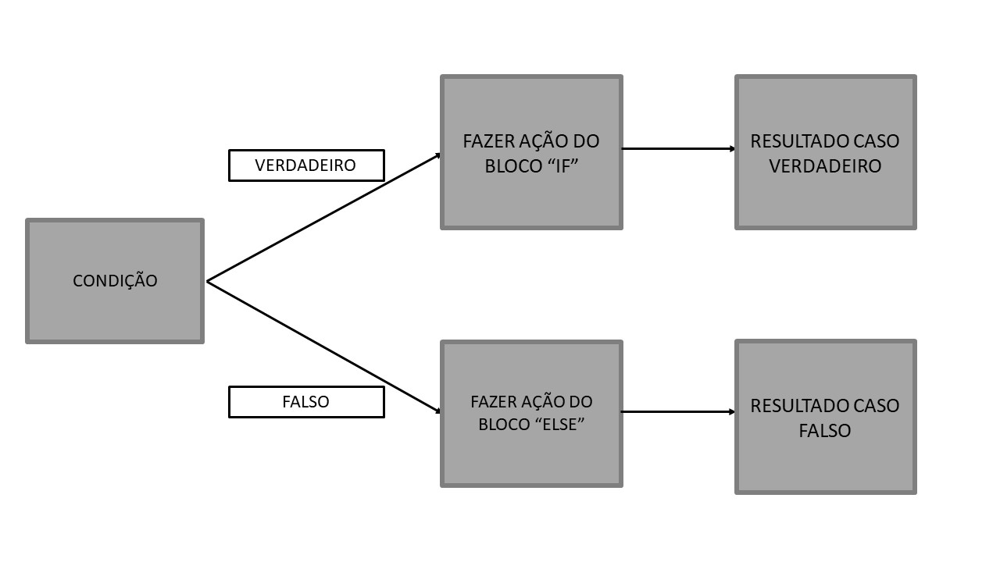

```{r setup, include=FALSE}
knitr::opts_chunk$set(echo = TRUE)
```

## 3.1 - Operações Lógicas

Para você realizar operações que os resultados são respostas lógicas, diversas operações podem ser realizadas. Veja abaixo exemplos dos chamados *Relational Operators*:

```{r}
#Maior que:
2>3
#Maior ou igual:
c(1:3) >= c(3:1)
#Menor que:
4<5
# Menor ou igual
#<=
# Igual à
# ==
# Diferente de
# !=
# Tem "match" ## Dar muitos exemplos pra %in%, colocar exemplo com data.frame
 2 %in% c(1:3)
```


#Talvez seja interessante colocar essa parte depois de ifelse. Pois fica mais claro (e mais aplicado) o que quer dizer.
Boolean


@@Citar uma página que explique teoria de conjuntos.

Veja abaixo alguns exemplos dos chamados *Logical Operators*

```{r, eval = FALSE}

# O eval= FALSE é temporário
#Fazer aqui o que eu fiz com os operadores lógicos.

#Usar não só vetores, mas também valores lógicos per se:


TRUE & FALSE
TRUE & TRUE
FALSE & FALSE

&&
|
||
xor(c(1:3), (2:4))
!
any
all


```


## 3.2 - Escolhas e Condições (If Statements)

Imagine que você queira fazer determinada operação somente no caso de certa condições são atendidas? Ou fazer uma sequência de operações de acordo com o resultado de etapas anteriores? Nessas situações, o uso das função `if`, `else` e `ifelse` podem ser úteis.



### 3.2.1 - if

```{r, eval = FALSE}

if (condição) {
  
  Execute esta operação caso a condição seja verdadeira

}


```


No modo como está escrito acima, para `if` retornar algum valor, é necessário que a condição seja igual à TRUE. Vamos ver abaixo:

```{r}
a <- 2
a==2

if(a == 2){
  "Condição válida"
}


b <- 3
b==2

if(b == 2){
 "Condição válida"
}
```

Quando usamos `a == 2` como Condição, `if` nos retorna o valor `"Condição válida"` expresso entre as chaves `{}`. No entanto quando usamos `b == 2`, como condição, não obtemos nenhum valor de retorno. Isso ocorre por dois motivos:

- O valor de `a==2` é `TRUE`, enquanto de `b ==2` é `FALSE`. Assim sendo,  apenas no caso de `a==2` é que temos que a Condição como verdadeira, de modo que o que vale entre as chaves será retornado.

- Não estabelecemos nada para retornar no caso da condição ser falsa. Por tanto, no caso de `b==2`, `if` não retornará nada.

De modo cru, pode-se entender `if` como:

```{r}
if(TRUE){
  "Condição Válida"
}

if(FALSE){
  "Condição válida"
}
```


```{r, eval = FALSE}
# eval == FALSE temporario
#dar exemplos com condições que sejam funções, por exemplo: is.character(), >=, is.data.frame(), %in%.

#Usar exemplos de ifs com duas condições usando &, &&, | e ||
```


### 3.2.2 - if e else

```{r, eval=FALSE}

if (condição){
  
  Execute esta operação caso a condição seja verdadeira
  }else{
    Caso contrário, faça esta outra operação
    }
```

Voltando ao exemplo usado em `3.2.2`, nesse caso teremos:

```{r}
a <- 2

if(a == 2){
  "Condição válida"
  }else{
  "Condição inválida"  
  }

b <- 3

if(b == 2){
  "Condição válida"
  }else{
    "Condição inválida"
  }
```

No caso acima os dois casos tem um retorno pois tem o else (....)

### 3.2.3 - A função ifelse

**ESCREVER ALGO COMO:** Existe a função ifelse que pode ser mais prática do que escrever o ifelse como foi feito.

```{r, eval=FALSE}

ifelse(condição, resultado se verdadeiro, resultado caso contrário)

```

```{r, eval = FALSE}
Fazer igual eu fiz em if e else, com o exemplo dos objetos a e b. E depois fazer um caso com ifelse(TRUE, "cond val", "cond inval")
```


Vamos rapidamente relembrar algumas funções que já usamos e que são da estrutura de condições, por exemplo: `is.character`, `is.matrix`.

Vamos primeiro criar 3 objetos de diferentes tipos: um vetor atômico `character`, um vetor atômico `double` e uma matriz `double`:

```{r, eval=T}
a <- c("a", "b", "c")
b <- c(1, 2, 3)
d <- matrix(1:9, 3, 3)
```

```{r, eval=T}
is.character2 <- function(x){ifelse(typeof(x) == 'character', TRUE, FALSE)}
is.character2(a)
is.character2(b)

```


## Fontes:

Hands-on Programming with R: https://rstudio-education.github.io/hopr/

R for Data Science: https://r4ds.had.co.nz/

Advanced-R: https://adv-r.hadley.nz/

