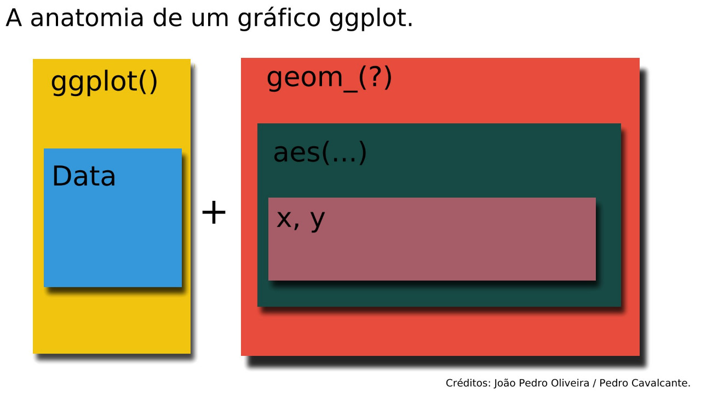

```{r setup, include=FALSE}
knitr::opts_chunk$set(eval = T, include = TRUE, warning = F)
# Todos os chunks em que estiver escrito "MT" quer dizer = Mensagem do Tonon. É um quadro dando dicas e etc... Use r = Mensagem do Felipe.
```

```{r MTcronograma_tonon, eval = F, include=F}

# O que eu penso em fazer para este topico é fazer uma decomposição aditiva, uma multiplicativa e uma com a decomposição da matriz de leontief. Vou repetir o exemplo do Dietzenbacher, Lahr e Los (2004) para 2010-2015 só que também focando na aditiva. Assim os passos serão:

# 1- Baixar os arquivos (pois é o primeiro)
# 2- Int
```

## Pacotes Necessários

```{r, warning=FALSE}
library(ggplot2)
library(readxl)
library(purrr)
library(stringr)
library(gtools)
library(tidyr)
library(dplyr)
```

```{r, include=F, warning=F}
#install.packages("rlang")
#install.packages("gridExtra")
library(rlang)
library(gridExtra)
```


## Objetivos do Tópico

Esse tópico irá introduzir tanto o tema de análise de decomposição estrutural quanto introduzir o uso do pacote `ggplot2` para a criação de gráficos.

Para a parte de decomposição estrutural, a bibliografia utilizada será o capítulo 13 do livro de Miller e Blair (2009), bem como os artigos de Dietzenbacher e Los (1998) e Dietzenbacher, Lahr e Los (2004).

Para a parte de criação de gráficos com o `ggplot2` a bibliografia utilizada será o 

**Importante:** Ambos os temas são de tal profundidade que este material não poderia nem presumir esgotar ambos os tópicos.

## Dados Necessários

Para realizar uma decomposição estrutural é necessário que as bases sejam compatíveis na sua estrutura em termos de linhas e colunas. No nosso caso, nós iremos comparar as bases de 2010 e 2015 com 12 setores cada uma.

Criando arquivos temporários[^1] para servirem de parâmetros em `destfile`:

[^1]: A vantagem de arquivos temporários é que eles não ficam permanentemente gravados no seu disco rígido. Para arquivos pequenos como os que estamos tratando, é bastante vantajoso.

```{r}
mip2010 <- tempfile(fileext = ".xls")
mip2015 <- tempfile(fileext = ".xls")
tbru <- tempfile(fileext = ".zip")
```

Definindo os links a serem baixados:[^2]

[^2]: Importante: Para diminuir a poluição visual na hora da leitura, este arquivo está configurado para ignorar os `warnings` dados pelo R. Assim, ao reproduzir esta e outras partes deste tópico você pode se deparar com `warnings` referentes a esta questão. A exceção é a função `read_xls` que sempre avisa quando cria novos nomes.

```{r}
link_2010 <- "ftp://ftp.ibge.gov.br/Contas_Nacionais/Matriz_de_Insumo_Produto/2010/Matriz_de_Insumo_Produto_2010_Nivel_12_20161019.xls"

link_2015 <- "ftp://ftp.ibge.gov.br/Contas_Nacionais/Matriz_de_Insumo_Produto/2015/Matriz_de_Insumo_Produto_2015_Nivel_12.xls"

link_tbru <- "ftp://ftp.ibge.gov.br/Contas_Nacionais/Sistema_de_Contas_Nacionais/2015/tabelas_xls/tabelas_de_recursos_e_usos/nivel_12_2000_2015_xls.zip"
```

Baixando os arquivos sendo os arquivos temporários os arquivos destino:

```{r}
download.file(url = link_2010, destfile = mip2010, mode = "wb")
download.file(url = link_2015, destfile = mip2015, mode = "wb")
download.file(url = link_tbru, destfile = tbru, mode = "wb")
```

Vamos ler com `readxl::read_xls` as partes que nos interessam dos arquivos de matriz insumo produto baixados. Vejamos a relação destes abaixo:

| **Nome do objeto** | **Descrição**                                           | **Aba** | **range**                         |
|--------------------|---------------------------------------------------------|---------|-----------------------------------|
| `nomesSetores`     | Nomes dos Setores                                       | 01      | ["B6:B17"]{style="color: green;"} |
| `Bn`               | Matriz dos Coeficientes Técnicos dos Insumos Nacionais  | 11      | ["C6:N17"]{style="color: green;"} |
| `Bm`               | Matriz dos Coeficientes Técnicos dos Insumos Importados | 12      | ["C6:N17"]{style="color: green;"} |
| `D_MS`             | Matriz de Market Share                                  | 13      | ["C6:N17"]{style="color: green;"} |
| `f_p`              | Demanda final ao nivel do produto                       | 03      | ["V6:V17"]{style="color: green;"} |

Vamos primeiro carregar os nomes dos setores:

```{r}
nomesSetores <- read_xls(mip2010, sheet = "01", range = "B6:B17", col_names = "Setores")

```

Vamos criar agora listas com os parâmetros de cada elemento:

```{r}
mipElements <- list("Bn", "Bm", "D_MS", "f_p")


nomesSetores <- list(nomesSetores$Setores, 
                     nomesSetores$Setores,
                     nomesSetores$Setores,
                     "Total") %>%
  setNames(mipElements)

mipRanges <- list("C6:N17", "C6:N17", "C6:N17", "V6:V17") %>%
  setNames(mipElements)

mipAbas <- list("11", "12", "13", "03")  %>%
  setNames(mipElements)
```

Vamos agora criar uma lista para cada ano:

```{r}
matrizes2010 <- list(mipAbas, mipRanges, nomesSetores) %>%
  pmap(function(x,y,z) readxl::read_xls(path = mip2010,
                                        sheet = x,
                                        range = y,
                                        col_names = z)) %>%
  map(as.matrix)

matrizes2015 <- list(mipAbas, mipRanges, nomesSetores) %>%
  pmap(function(x,y,z) readxl::read_xls(path = mip2015,
                                        sheet = x,
                                        range = y,
                                        col_names = z)) %>%
  map(as.matrix)
```

Vamos agora tratar das Tabelas de Recursos e Usos. Nós desejamos retirar os seguintes elementos delas:

| Nome do Objeto | Descrição                                           | tipo de arquivo | aba | range                              |
|----------------|-----------------------------------------------------|-----------------|-----|------------------------------------|
| `valorAd`      | Total de valor adicionado gerado em cada atividade  | tab2            | VA  | ["B6:M6"]{style="color: green;"}   |
| `W`            | Total de Salário gerado em cada atividade           | tab2            | VA  | ["B8:M8"]{style="color: green;"}   |
| `fatorL`       | Total do Fator Trabalho demandado em cada atividade | tab2            | VA  | ["B19:M19"]{style="color: green;"} |

Criando os parâmetros:

```{r}
truElements <- list("valorAd", "W", "fatorL")

truRange <- list("B6:M6", "B8:M8", "B19:M19") %>%
  setNames(truElements)
```

O arquivo `tbru` é um arquivo `zip` que contém vários arquivos, muito dos quais não nos interessam. Como já abordamos no tópico 5, vamos descompactar apenas os arquivos que nos interessam, que são os que contém a descrição `tab2` e são de 2010 e 2015:

```{r}
tab2_arquivos <-  tbru %>%
  unzip(list = T) %>%
  unlist %>%
  stringr::str_subset("tab2")
```

Vamos criar uma função que nos possibilite mais facilmente descompactar um arquivo do vetor `tab2_arquivos` diretamente apenas indicando o ano que queremos baixar.

```{r}
unzip_tab2 <- function(ano){
  .tab2_dir <- tempfile()
  
 .tab2_output <-  tab2_arquivos %>%
  stringr::str_subset(paste0("tab2_", ano, ".xls")) %>%
  unzip(zipfile = tbru,
        files = .,
        junkpaths = F,
        exdir = .tab2_dir)  
 return(.tab2_output)
}
```

Vamos então carregar para os dois anos em questão:

```{r}
tab2_2010 <- map(truRange, ~ read_xls(unzip_tab2("2010"),
                       sheet = "VA",
                       range = .x,
                       col_names = nomesSetores$Bn)
    ) %>%
  map(as.matrix)
  
tab2_2015 <-  map(truRange, 
                  ~ read_xls(unzip_tab2("2015"),
                    sheet = "VA",
                    range = .x,
                    col_names = nomesSetores$Bn)
    ) %>%
  map(as.matrix)
```

### Deflacionando os valores

Importante: nesse caso, os valores não estão deflacionados. Por isso precisamos deflacionar os valores. Como discutido durante o curso, existem várias formas de você fazer uma deflação de preços. Por questões de simplicidade, vamos usar aqui um deflator único. Para tanto, vamos comparar os valores correntes e do ano anterior da produção total da economia. Esse valor está disponível na célula `O19` da aba `producao` das tabelas 1 (valores correntes) e 3 (valores do ano anterior).

```{r}
tab_arquivos <- function(tab){
  .tab <- tbru %>%
    unzip(list = T) %>%
    unlist %>%
    stringr::str_subset(paste0(tab, "_", 201)) %>%
    as.list()
  return(.tab)
}

deflatorY2Y <- function(Corrente, Anterior){

  fileCor <- tempfile(fileext = ".xls")
  fileAnt <- tempfile(fileext = ".xls")

  unziptab <- function(x,y){
    unzip(zipfile = tbru,
        files = x,
        junkpaths = F,
        exdir = y,
        overwrite = T)
  }
  
  .Cor <- read_xls(path = unziptab(Corrente, fileCor),
                   sheet = "producao",
                   range = "O19",
                   col_names = "Total") %>%
    unlist()
  
  .Ant <- read_xls(path = unziptab(Anterior, fileAnt),
                   sheet = "producao",
                   range = "O19",
                   col_names = "Total") %>%
    unlist()
    
    return(.Cor/.Ant)
}

deflatores_Ano_a_Ano <- map2(tab_arquivos("tab1"),
                             tab_arquivos("tab3"),
                             deflatorY2Y)
```

Para gerar um deflator direto de 2010 a 2015, multiplicamos todos os deflatores de 2011 à 2015 (o deflator de 2010 é referente a deflação de preços de 2010 frente à 2009, por isso iremos exclui-lo), isso nos retorna a relação entre os preços de 2010 e 2015. Para tanto, vamos usar a função `purrr::reduce` do pacote purrr.

```{r}
deflator <- deflatores_Ano_a_Ano[-1] %>%
  reduce(`*`)
```

Agora, vamos deflacionar os valores que devem ser deflacionados:

```{r}
matrizes2015$f_p <- matrizes2015$f_p/deflator

tab2_2015$valorAd <- tab2_2015$valorAd/deflator
tab2_2015$W <- tab2_2015$W/deflator
```

Agora temos todos os nossos valores prontos para realizar uma decomposição.

## Análise de Decomposição Estrutural

**Atenção:** a parte a seguir vamos deixar as contas mais simples ocultas. É sugerido que se pegue um papel e caneta e faça as contas por si só.

A análise de decomposição estrutural ( *Structural Decomposition Analisys: SDA*) é uma forma de se decompor os motivos que explicam uma diferença entre dois períodos ou regiões de um determinado valor. Podemos dividir as decomposições em dois tipos: as aditivas e as multiplicativas. As aditivas são referentes as diferenças em termos absolutos, como $x_1 - x_0$, enquanto as multiplicativas são referentes as diferenças em taxa, $\frac{x_1}{x_0}$. Podemos também decompor as mudanças na Inversa de Leontief (ou em quaisquer multiplicadores similares).

**ATENÇÃO:** A notação neste tópico segue a seguinte lógica: um sobreescrito $i$ se refere ao período da variável, enquanto o subscrito $j$ é para denominar variáveis diferentes. Ou seja: $x^0_j$ e $x^1_j$ são a mesma variáveis porém de períodos/regiões diferentes. Enquanto isso, $x^i_1$ e $x^i_2$ são variáveis diferentes de um mesmo período/região.

### Decomposições Aditivas.

Como já dito, a decomposição aditiva se preocupa com a diferença entre dois resultados em termos absolutos, ou seja $\Delta x = X^1 - X^0$. Esse caso de decomposição é a mais simples de se efetuar *a priori*, porém ela contém nuances quando tratamos de casos com mais de duas variaveis. Vamos no entanto, começar por um caso justamente com apenas duas variáveis para podermos discutir essa questão.

Sejam $X^0$ e $X^1$ os valores bruto de produção dos períodos 0 e 1, que são dados a partir do modelo básico de Leontief:

$$X = L f$$

```{r}
matrizes2010$An <- matrizes2010$D_MS %*% matrizes2010$Bn
matrizes2010$Leontief <- solve(diag(nrow(matrizes2010$An)) - matrizes2010$An)
matrizes2010$f <- matrizes2010$D_MS %*% matrizes2010$f_p
matrizes2010$X <- matrizes2010$Leontief %*% matrizes2010$f

matrizes2015$An <- matrizes2015$D_MS %*% matrizes2015$Bn
matrizes2015$Leontief <- solve(diag(nrow(matrizes2015$An)) -     matrizes2015$An)
matrizes2015$f <- matrizes2015$D_MS %*% matrizes2015$f_p
matrizes2015$X <- matrizes2015$Leontief %*% matrizes2015$f

```

Sendo $L$ a inversa de Leontief e $f$ o vetor de demanda final. A definição de $X^0$ é $X^1$ é, respectivamente $X^0 = L^0f^0$ e $X^1 = L^1 f^1$. Desse modo, queremos agora saber qual foi a contribuição das variações tanto de $L$ quanto de $f$ para a variação final em $X$. Temos então que:

$$\Delta X = X^1 - X^0 = L^1f^1 - L^0f^0$$

```{r}
deltaX <- matrizes2015$X - matrizes2010$X
```

Seja $\Delta L = L^1 - L^0$ e $\Delta f = f^1 - f^0$, podemos substituir na equação acima os valores de modo:

$$\Delta X = L^1 (f^0 + \Delta f) - (L^1 - \Delta L) f^0 = \Delta L f^0 + L^1(\Delta f)$$

```{r}
deltaL <- matrizes2015$Leontief - matrizes2010$Leontief
deltaf <- matrizes2015$f - matrizes2010$f
```

```{r}
deltaX1 <- list(deltaL %*% matrizes2010$f,
                matrizes2015$Leontief %*% deltaf)

# Usando all.equall para testar se a soma das partes de deltaX1 é igual à deltaX
deltaX1 %>%
  reduce(`+`) %>%
all.equal( deltaX)
```

Podemos, no entanto, redistribuir isso de outra forma:

$$\Delta X = (L^0 + \Delta L) f^1 - L^0(f^1 -  \Delta f) = (\Delta L)f^1 + L^0 (\Delta f)$$

```{r}
deltaX2 <- list(deltaL %*% matrizes2015$f,
                matrizes2010$Leontief %*% deltaf)

deltaX2 %>%
  reduce(`+`) %>%
all.equal(deltaX)
```

*Relembrando:* Para ter certeza que compreendeu a álgebra, faça essas substituições e operações no papel.

Ambas as formas apresentadas agora são igualmente válidas, sendo ambas igualmente corretas.

```{r}
all.equal(reduce(deltaX1, `+`),
          reduce(deltaX2, `+`))
```

No entanto, é de certo modo óbvio que esperamos que $(\Delta L)f^1\neq(\Delta L) f^0$ e que $L^1(\Delta f) \neq L^0 (\Delta f)$.

```{r}
all.equal(deltaX1,
          deltaX2)
```

Podemos ver que a diferença de um é compensada na do outro:

```{r}
map2_dbl(deltaX1, deltaX2, ~sum(.y) - sum(.x))
```


Dietzenbacher e Los (1998), mostram que ao tirarmos os valores médios das decomposições aditivas temos um resultado aceitável:

$$\Delta X = (1/2) \Delta L (f^0 + f^1) + (1/2) (L^0 + L^1) \Delta f $$

```{r}
deltaX3 <- list((1/2) *deltaL %*% (matrizes2010$f + matrizes2015$f),
  (1/2)*(matrizes2010$Leontief + matrizes2015$Leontief) %*% deltaf)

deltaX3 %>%
  reduce(`+`) %>%
all.equal(deltaX)
```

Na equação acima, temos que a parcela $(1/2) \Delta L (f^0 + f^1)$ é referente à mudança tecnológica enquanto $(1/2) (L^0 + L^1) \Delta f$ é referente à mudanças na demanda final.

Graficamente podemos ver que:

```{r plotDeltaX, echo=F}
library(ggplot2)
library(rlang)
library(gridExtra)
#library(magrittr)

DLf0 <-   expression(Delta * L * f^{0})
DLf1 <-  expression(Delta * L * f^{1})
DLf01 <- expression( (1/2) * Delta * (f^{0} + f^{1}))

plotdeltaX_L <- data.frame("delta1" = sum(deltaX1[[1]]),
           "delta2" = sum(deltaX2[[1]]),
           "delta3" = sum(deltaX3[[1]]))  %>%
  pivot_longer(cols = starts_with("delta"),
               names_to = "Decomposição")  %>%
  ggplot(aes(x = Decomposição, y = value)) +
    geom_bar(stat = "identity", fill = c("blue", "green", "red")) +
  scale_x_discrete(labels = c("delta1" = DLf0,
                              "delta2" = DLf1,
                              "delta3" = DLf01)) +
  ggtitle("Contribuição de \u0394L para a \u0394 x") +
  theme(axis.title.x = element_blank(),
        axis.title.y = element_blank())

L1Df <-   expression(L^{1} * Delta *f)
L0Df <-  expression(L^{0} * Delta *f)
L01Df <- expression( (1/2) * (L^{0} + L^{1}) * Delta * f)

plotdeltaX_f <- data.frame("delta1" = sum(deltaX1[[2]]),
           "delta2" = sum(deltaX2[[2]]),
           "delta3" = sum(deltaX3[[2]]))  %>%
  pivot_longer(cols = starts_with("delta"),
               names_to = "Decomposição")  %>%
  ggplot(aes(x = Decomposição, y = value)) +
    geom_bar(stat = "identity", fill = c("blue", "green", "red")) +
  scale_x_discrete(labels = c("delta1" = L1Df,
                              "delta2" = L0Df,
                              "delta3" = L01Df)) +
  ggtitle("Contribuição de \u0394f para a \u0394 x") +
  theme(axis.title.x=element_blank(),
        axis.title.y = element_blank())

grid.arrange(plotdeltaX_L, plotdeltaX_f, ncol =2)
```


### Decomposições aditivas com mais de 2 variáveis

A decomposição anterior apresentou a forma aditiva com duas variáveis. Como vimos, há duas formas de se decompor $\Delta X = L^1f^1 - L^0f^0$. Como veremos a seguir isso se deve ao fator de que a quantidade de formas possíveis de se decompor é igual ao valor fatorial de variáveis da decomposição. Ou seja, se você tiver $n$ variáveis explicativas, de tal modo que $X = x_1 \dots x_n$, você terá $n!$ decomposições possíveis. A melhor forma de entender isso é olhando a forma abstrata da decomposição aditiva. Comecemos novamente por duas variáveis explicativas: $X = x_1 x_2$. Uma vez que temos $\Delta X = X^1 - X^0 = x_1^1x_2^1 - x_1^0x_2^0$ e que $\Delta x_1 = x_1^1 - x_1^0$ e $\Delta x_2 = x_2^1 - x_2^0$, podemos, como antes, substituir esses elementos. Como já vimos antes, temos DUAS formas de fazer essa substituição: começando por $x_1$ ou por $x_2$. Vamos primeiro começar por $x_1$.

Fazendo $x_1^1 = \Delta x_1 + x_1^0$, temos que:

$$\Delta X = (\Delta x_1 + x_1^0) x_2^1 - x_1^0x_2^0 = \Delta x_1 x^1_2 + x^0_1x^1_2 - x^0_1x^0_2$$ Podemos então substituir $x^1_2 = \Delta x_2 + x_2^0$ em $x^0_1 x^1_2$ e teremos:

$$\Delta X = \Delta x_1 x^1_2 + x^0_1(\Delta x_2 + x^0_2) - x^0_1x^0_2 = \Delta x_1 x^1_2 + x^0_1\Delta x_2 + x^0_1x^0_2 - x^0_1x^0_2$$ Como os dois últimos elementos se cancelam, temos que:

$$\Delta X = \Delta x_1 x_2^1 + x_1^0 \Delta x_2$$

Como já falamos, o mesmo processo pode ser feito, só que começando por $x_2$. Sendo $x_2^1 = x_2^0 +\Delta x_2$:

$$ \Delta X = x_1^1 (\Delta x_2 + x^0_2) - x_1^0x_2^0 = x^1_1\Delta x_2 + x^1_1 x_2^0 - x_1^0x_2^0 $$

Substituindo $x_1^1 = \Delta x_1 + x_1^0$ temos:

$$\Delta X = x_1^1 \Delta x_2 + (\Delta x_1 + x_1^0)x_2^0 - x_1^0x_2^0 = x_1^1 \Delta x_2 + \Delta x_1x_2^0 + x_1^0x_2^0 - x_1^0x_2^0$$

Com os dois últimos elementos se cancelando temos que:

$$\Delta X = x^1_1 \Delta x_2 = \Delta_1 x^0_2$$

Para quem quiser realmente **entender** essa substituição fica a sugestão de fazer essa decomposição substituindo $x^0_1 = x^1_1 - \Delta x_1$ e $x^0_2 = x^1_2 - \Delta x_2$ e ver que os resultados não se diferenciam. Assim, como sugerido por Dietzenbacher e Los (1997) podemos simplesmente tirar a média aritmética das duas decomposições e fazer sem problema.

Por se tratar de uma decomposição com apenas 2 variáveis, a decomposição irá eventualmente começar por um dos polos da equação. Ou seja, sendo $\Delta X = x_1^1x_2^1 - x_1^0x_2^0$, vamos começar inevitavelmente a decomposição por $x_1$ ou $x_2$. Além disso, se a decomposição começa por $x_1$ ela inevitavelmente termina por $x_2$ e vice e versa. Isso é importante, pois ajuda a entender o porque que teremos sempre $n!$ decomposições possíveis para $X = x_1 \dots x_n$. ]

Vamos agora vizualizar o caso de $X = x_1x_2x_3$. Primeiramente, podemos decompor em $x_1$, $x_2$ ou $x_3$, como podemos ver abaixo:

$$
\Delta X = \begin{cases} (x_1^0 + \Delta x_1) x_2^1 x_3^1 - x_1^0x_2^0x_3^0 = x_1^0 x_2^1 x_3^1 + \Delta x_1 x_2^1 x_3^1 - x_1^0x_2^0x_3^0\\ x_1^1(x_2^0 + \Delta x_2)x_3^1 - x_1^0x_2^0x_3^0 = x_1^1x_2^0 x_3^1 + x_1^1\Delta x_2x_3^1 - x_1^0x_2^0x_3^0 \\ x_1^1x_2^1(x_3^0 + \Delta x_3) - x_1^0x_2^0x_3^0 =  x_1^1x_2^1x_3^0 + x_1^0x_2^0\Delta x_3 - x_1^0x_2^0x_3^0 \end{cases}
$$

Ou seja, da mesma forma que no caso de duas variáveis, que podemos começar tanto por $x_1$ ou $x_2$, aqui podemos participar por $x_1$, $x_2$ ou $x_3$. Só que no caso de duas variáveis, se começarmos por $x_1$ temos que terminar por $x_2$ e vice e versa. No caso de três variáveis, se começarmos por $x_1$ podemos decompor tanto $x_2$ quanto $x_3$ logo em seguida. Aqui fica clara porque a quantidade de decomposições possiveis de uma equação com $n$ variáveis é igual à $n!$: primeiro pode-se começar por qualquer uma das $n$ variáveis, e em cada uma dessas decomposições pode-se decompor qualquer uma das outras $n-1$ variáveis disponíveis, e então temos $n-2$ variáveis restantes e assim por diante. Ou seja, o total de possibilidades é igual à $n(n-1)(n-2)\dots (n+1-n)$. No caso de $X= x_1x_2x_3$ temos primeiro 3 variáveis que podemos decompor, depois 2 (em cada uma das decomposições), e por fim a final. Neste contexto chamamos de ***decomposições polares*** as decomposições que partem de um polo e vão unilateralmente em direção ao outro, ou seja de frente para trás e de trás para frente. No primeiro caso, de frente para trás, se começa por $x_1$, depois $x_2$, $x_3$, $\dots$, $x_{n-1}$, $x_n$. No segundo caso, de trás para frente, se começa por $x_n$, $x_{n-1}$, $\dots$, $x_3$, $x_2$, $x_1$.

No caso de $X = x_1x_2x_3$ a decomposição polar, de frente para trás, é começar por $x_1$, depois decompor $x_2$ e enfim $x_3$:

$$\Delta X =\Delta x_1 x_2^1 x_3^1 +x_1^0 \Delta x_2 x_3^1 + x_1^0 x_2^0 \Delta x_3 $$

A outra decomposição polar (de trás para frente), é começar por $x_3$, depois para $x_2$, e depois $x_1$.

$$\Delta X = \Delta x_1x_2^0x_3^0 +x_1^1\Delta x_2x_3^0  + x_1^0x_2^0\Delta x_3 $$ No entanto, não há um motivo a priori pelo qual se deva tirar a média apenas dessas duas decomposições e desconsiderar as outras $n! - 2$ decomposições possíveis. No caso de 3 variáveis as 6 decomposições podem não parecer muito, mas quando se considera 5 variáveis já são 120 possíveis[^3]. Há de se concordar que fazer todas as todas as possibilidades disso na mão não parece ser uma tarefa possível[^4].

[^3]: Veja a função `factorial` para saber o fatorial de qualquer valor.

[^4]: Por isso mesmo, estamos a desenvolver uma solução prática para isso, criando uma rotina de programação que gera um conjunto de funções para cada decomposição possível.

$$\Delta X = \begin{cases} 
 \begin{cases} 
\begin{cases}\Delta x_1 x_2^1 x_3^1 + x_1^0\Delta x_2 x_3^1 + x_1^0x_2^0\Delta x_3 \end{cases} \\
\begin{cases}\Delta x_1x_2^1x_3^1 + x^0_1x^1_2\Delta x_3 + x_1^0 \Delta x_2 x_3^0 \end{cases}
\end{cases} \\ \\
\begin{cases}
\begin{cases}x_1^1 \Delta x_2 x_3^1 + \Delta x_1 x_2^0x_3^1 + x_1^0x_2^0\Delta x_3\end{cases} \\
\begin{cases}x_1^1 \Delta x_2 x_3^1 + x_1^1 x_2^0 \Delta x_3 + \Delta x_1 x_2^0 x_3^0 \end{cases}
\end{cases} \\ \\
\begin{cases}
\begin{cases}x_1^1 x_2^1\Delta x_3 + \Delta x_1 x_2^1 x_3^0 + x_1^0 \Delta x_2 x_3^0 \end{cases} \\
\begin{cases}x_1^1 x_2^1\Delta x_3 + x_1^1 \Delta x_2 x_3^0 + \Delta x_1 x_2^0 x_3^0 \end{cases}
\end{cases}
\end{cases}
$$

No sistema de equações acima, vemos as 6 decomposições possíveis, sendo o primeiro grupo de *sub-chaves* (que contém duas equações cada uma) referente a cada modo de iniciar possível as decomposições. Repare que isso é uma operação de permutação sem repetição. Uma forma de analisar isso é usando a função `permutations` do pacote `gtools`:

```{r}
decMatrix <- permutations(3,3, v=1:3, repeats.allowed = F) 

colnames(decMatrix) <- c("x_1", "x_2", "x_3")

rownames(decMatrix) <- c("Polar 1",
                          paste0("dec", 2:5),
                          "Polar 2")

decMatrix
```

As linhas da matriz gerada pela função `permutations` são referentes a cada uma das decomposições possíveis. Podemos interpretar que o valor de cada coluna é referente a ordem em que essa variável vai ser decomposta. Ou seja, na primeira linha, `Polar 1` de `decMatrix`, temos que $x_1$ é a primeira a ser decomposta, $x_2$ é a segunda, $x_3$ é a terceira. Já na quarta linha por exemplo, `decMatrix[4,]`, temos que $x_1$ é a segunda variável a ser decomposta, $x_2$ a terceira e $x_3$ a segunda.

Para deixar isso mais claro, vamos usar, para fins puramente didáticos, o simbolo $\Delta$ com os subscritos se referindo a ordem que cada variável será decomposta. Por exemplo, no caso de $\Delta_{(123)}$ $x_1$ é a primeira variável a ser decomposta, $x_2$ a segunda e $x_3$ a terceira. Vamos então reescrever o conjunto de decomposições sinalizando com um $\Delta_{(---)}$ na frente qual é a ordem da decomposição. (Repare que as linhas do sistema não segue a mesma ordem )

$$\Delta_{(---)} X = \begin{cases} 
 \Delta_{(1--)}  \begin{cases} 
\Delta_{(123)}  \begin{cases}\Delta x_1 x_2^1 x_3^1 + x_1^0\Delta x_2 x_3^1 + x_1^0x_2^0\Delta x_3 \end{cases} \\
\Delta_{(132)}\begin{cases}\Delta x_1x_2^1x_3^1 + x^0_1x^1_2\Delta x_3 + x_1^0 \Delta x_2 x_3^0 \end{cases}
\end{cases} \\ \\
\Delta_{(-1-)}\begin{cases}
\Delta_{(213)}\begin{cases}x_1^1 \Delta x_2 x_3^1 + \Delta x_1 x_2^0x_3^1 + x_1^0x_2^0\Delta x_3\end{cases} \\
\Delta_{(312)}\begin{cases}x_1^1 \Delta x_2 x_3^1 + x_1^1 x_2^0 \Delta x_3 + \Delta x_1 x_2^0 x_3^0 \end{cases}
\end{cases} \\ \\
\Delta_{(--1)}\begin{cases}
\Delta_{(312)}\begin{cases}x_1^1 x_2^1\Delta x_3 + \Delta x_1 x_2^1 x_3^0 + x_1^0 \Delta x_2 x_3^0 \end{cases} \\
\Delta_{(321)}\begin{cases}x_1^1 x_2^1\Delta x_3 + x_1^1 \Delta x_2 x_3^0 + \Delta x_1 x_2^0 x_3^0 \end{cases}
\end{cases}
\end{cases}
$$

Vamos agora fazer um exemplo prático para esse caso. Seja $\lambda$ a quantidade de emprego diretamente necessária por unidade de produção, ou seja para um determinado setor $i$, $\lambda_i = E_i/x_i$, com $E_i$ igual a quantidade de ocupações que cada setor da economia utilizou diretamente no total.

```{r}
matrizes2010$lambda <- t(tab2_2010$fatorL)/matrizes2010$X

matrizes2015$lambda <- t(tab2_2015$fatorL)/matrizes2015$X
```

Definimos a quantidade do emprego que cada setor gerou pelos efeitos diretos e indiretos como:

$$ \Psi = \hat{\lambda} L f$$

```{r}
matrizes2010$Psi <- diag(c(matrizes2010$lambda)) %*% matrizes2010$Leontief %*% matrizes2010$f

matrizes2015$Psi <- diag(c(matrizes2015$lambda)) %*% matrizes2015$Leontief %*% matrizes2015$f

deltaPsi <- matrizes2015$Psi - matrizes2010$Psi
```

Repare que `deltaPsi` não é um valor único, mas um **vetor**. Isso é importante, pois nos mostra que podemos fazer decomposições para partes do sistema (e não apenas para ele como um todo).

Sendo $\Delta \lambda = \lambda^1 - \lambda^0$.

```{r}
deltalambda <- matrizes2015$lambda - matrizes2010$lambda
```

As decomposições possíveis são[^5]:

[^5]: Repare que aqui vamos escrever elas sempre em ordem da variável, ou seja $\Delta \lambda$ será sempre a primeira parte da equação, $\Delta L$ a segunda e $\Delta f$ a terceira

$$\Delta_{123} \Psi = \Delta \hat{\lambda} L^1 f^1 + \hat{\lambda}^0\Delta L f^1 + \hat{\lambda}^0L^0\Delta f$$

```{r}
deltaPsi123 <- list(diag(c(deltalambda)) %*% matrizes2015$Leontief %*% matrizes2015$f,
                 diag(c(matrizes2010$lambda)) %*% deltaL %*% matrizes2015$f,
                 diag(c(matrizes2010$lambda)) %*% matrizes2010$Leontief %*% deltaf) %>%
  setNames(paste("delta", c("lambda", "L", "f")))
```

Podemos ver que `deltaPsi` e `deltaPsi123` são iguais tanto no total quanto em cada setor fazendo:

```{r}
#Totais
all.equal(sum(deltaPsi), sum(unlist(deltaPsi123)))

# Célula à célula
all.equal(deltaPsi, reduce(deltaPsi123, `+`))
```

$$\Delta_{132} \Psi = \Delta \hat{\lambda} L^1f^1 + \hat{\lambda}^0 \Delta L f^0 + \hat{\lambda}^0_1L^1\Delta f$$

```{r}
deltaPsi132 <- list(diag(c(deltalambda)) %*% matrizes2015$Leontief %*% matrizes2015$f,
                 diag(c(matrizes2010$lambda)) %*% deltaL %*% matrizes2010$f,
                 diag(c(matrizes2010$lambda)) %*% matrizes2015$Leontief %*% deltaf) %>%
  setNames(paste("delta", c("lambda", "L", "f")))


all.equal(sum(deltaPsi), sum(unlist(deltaPsi132)))
```

$$\Delta_{213} \Psi = \Delta \hat{\lambda} L^0f^1 + \hat{\lambda}^1 \Delta L f^1 +  \hat{\lambda}^0L^0\Delta f$$

```{r}
deltaPsi213 <- list(diag(c(deltalambda)) %*% matrizes2010$Leontief %*% matrizes2015$f,
                 diag(c(matrizes2015$lambda)) %*% deltaL %*% matrizes2015$f,
                 diag(c(matrizes2010$lambda)) %*% matrizes2010$Leontief %*% deltaf) %>%
  setNames(paste("delta", c("lambda", "L", "f")))


all.equal(sum(deltaPsi), sum(unlist(deltaPsi213)))
```

$$\Delta_{312} \Psi = \Delta \hat{\lambda} L^0 f^0 + \hat{\lambda}^1 \Delta L f^1 + \hat{\lambda}^1 L^0 \Delta f$$

```{r}
deltaPsi312 <- list(diag(c(deltalambda)) %*% matrizes2010$Leontief %*% matrizes2010$f,
                 diag(c(matrizes2015$lambda)) %*% deltaL %*% matrizes2015$f,
                 diag(c(matrizes2015$lambda)) %*% matrizes2010$Leontief %*% deltaf) %>%
  setNames(paste("delta", c("lambda", "L", "f")))
```

$$\Delta_{231} \Psi = \Delta \hat{\lambda} L^1 f^0 + \hat{\lambda}^0 \Delta L f^0 + \hat{\lambda}^1 L^1\Delta f$$

```{r}
deltaPsi231 <- list(diag(c(deltalambda)) %*% matrizes2015$Leontief %*% matrizes2010$f,
                 diag(c(matrizes2010$lambda)) %*% deltaL %*% matrizes2010$f,
                 diag(c(matrizes2015$lambda)) %*% matrizes2015$Leontief %*% deltaf) %>%
  setNames(paste("delta", c("lambda", "L", "f")))

```

$$\Delta_{321} \Psi = \Delta \hat{\lambda} L^0 f^0  + \hat{\lambda}^1 \Delta L f^0 + \hat{\lambda}^1 L^1\Delta f$$

```{r}
deltaPsi321 <- list(diag(c(deltalambda)) %*% matrizes2010$Leontief %*% matrizes2010$f,
                 diag(c(matrizes2015$lambda)) %*% deltaL %*% matrizes2010$f,
                 diag(c(matrizes2015$lambda)) %*% matrizes2015$Leontief %*% deltaf) %>%
  setNames(paste("delta", c("lambda", "L", "f")))

```

Podemos então somar todas as possibilidades, e tirando a média aritmética:

```{r}
deltaPsiMedia <- list(deltaPsi123, deltaPsi132, deltaPsi213,
     deltaPsi312, deltaPsi231, deltaPsi321) %>%
  transpose %>%
  map_df(~ reduce(.x, `+`)/6) %>%
  setNames(c("lambda", "L", "f")) %>%
  data.frame("Setores" = rownames(deltaL),
                            .)
```

```{r plotDeltaPsi, echo = FALSE}
library(ggplot2)
library(tidyr)

plotdeltaPsiMedia <- deltaPsiMedia %>%
  setNames(c("Setores", "\U03BB", "L", "f"))
plotdeltaPsiMedia$Setores <- as.character(c(1:12))
plotdeltaPsiMedia$Setores <- factor(plotdeltaPsiMedia$Setores,
                                    levels = as.character(c(1:12)))
plotdeltaPsiMedia <- plotdeltaPsiMedia %>%
  pivot_longer(-Setores, 
               names_to = "Variavel") %>% 
  ggplot(aes(y = value, x = Setores, fill = Variavel)) +
  geom_col(position = "stack") + 
  ggtitle("Decomposição do nível de emprego de cada setor") +
  theme(axis.title.y = element_blank())

plotdeltaPsiMedia  
```

Os números no eixo horizontal são a ordem do setor nas colunas de nomes. Basta fazer `rownames(DeltaX)`para saber qual é a qual.

Deve-se atentar que a média aritimética não é a única forma em que se pode tirar a média na decomposição de $\Delta \Psi$. Veja Dietzenbacher e Los (1998) para uma discussão extensa sobre esse tema.

### Decomposições Multiplicativas

Nós vimos até agora como realizar decomposições aditivas, que são as que olham a diferença em termos absolutos. As decomposições aditivas por sua vez entregam a diferença em taxa. Essa decomposição é apresentada no trabalho de Dietzenbacher, Lahr e Los (2004). Seja $v^1$ o valor de uma determinada quantidade no período $1$ dada por $v^1 = p^{1}q^1$, podemos decompor a sua variação em relação ao valor de $v^0 = p^{0}q^0$ como um índice de Paasche:

$$\frac{v^1}{v^0}= \left(\frac{p^{1}q^{1}}{p^{0}q^{1}} \right) \left(\frac{p^0q^1}{p^0q^0} \right)$$

Ou como um índice de Laspeyres:

$$ \frac{v^1}{v^0}= \left(\frac{p^{1}q^{0}}{p^{0}q^{0}} \right) \left(\frac{p^1q^1}{p^1q^0} \right)$$

Podemos então fazer um índice de Fisher, a partir da média geométrica delos dois índices anteriores:

$$\frac{v^1}{v^0} = \left(\frac{p^{1}q^{1}}{p^{0}q^{1}} \frac{p^0q^1}{p^0q^0} \right)^{0.5}
\left(\frac{p^{1}q^{0}}{p^{0}q^{0}}\frac{p^1q^1}{p^1q^0} \right)^{0.5}$$

Reorganizando para deixarmos em evidência a contribuição de cada parte:

$$\frac{v^1}{v^0} = \left(\frac{p^{1}q^{1}}{p^{0}q^{1}}  \frac{p^{1}q^{0}}{p^{0}q^{0}}\right)^{0.5}
\left(\frac{p^0q^1}{p^0q^0}\frac{p^1q^1}{p^1q^0} \right)^{0.5}$$

Nesse caso, o termo em primeiro parenteses representa a contribuição de $p$ para a variação em $v$ e o segundo a contribuição de $q$.

Essa mesma lógica pode ser aplicada para casos com mais de duas variáveis. No caso de algo ao estilo do Índice de Paasche:

$$\frac{X^1}{X^0} = \left(
\frac{x_1^1 x_2^1 \dots x_{n-1}^1x_n^1}{x_1^0 x_2^1 \dots x_{n-1}^1x_n^1} \right)
\left(\frac{x_1^0 x_2^1 \dots x_{n-1}^1x_n^1}{x_1^0 x_2^0 \dots x_{n-1}^1x_n^1} \right) 
\dots
\left(  \frac{x_1^0x^0_2\dots x_{n-1}^1 x_n^1}{x_1^0x^0_2\dots x_{n-1}^0 x_n^1}\right)
\left(  \frac{x_1^0x^0_2\dots x_{n-1}^0 x_n^1}{x_1^0x^0_2\dots x_{n-1}^0 x_n^0}\right)$$

E no caso de algo como o Índice de Laspeyeres:

$$\frac{X^1}{X^0} =
\left( \frac{x_1^1 x_2^0\dots x_{n-1}^0 x_n^0}{x_1^0 x_2^0\dots x_{n-1}^0 x_n^0} \right)
\left( \frac{x_1^1 x_2^1\dots x_{n-1}^0 x_n^0}{x_1^1 x_2^0\dots x_{n-1}^0 x_n^0} \right)
\dots
\left( \frac{x_1^1 x_2^1\dots x_{n-1}^1 x_n^0}{x_1^1 x_2^1\dots x_{n-1}^0 x_n^0} \right)
\left( \frac{x_1^1 x_2^1\dots x_{n-1}^1 x_n^1}{x_1^1 x_2^1\dots x_{n-1}^1 x_n^0} \right)$$

Basta então tirar a média geométrica de ambos. Um ponto relevante é que se atentarmos para a estrutura das duas equações acima, podemos ver que são ambas decomposições polares. Além disso, perceba que na primeira decomposição polar (Paasche), a parte de baixo do primeiro parênteses, $x_1^0 x_2^1 \dots x_{n-1}^1x_n^1$, é igual a parte de cima do segundo parênteses. Isso se repete de modo que o denominador, à exceção do último parênteses, vai sempre ser igual ao númerador do próximo parênteses. Desse modo ao cortarmos as partes igual teremos $\frac{v^1}{v^0}=\frac{x_1^1x_2^1\dots x_{n-1}^1 x_n^1}{x_1^0x_2^0\dots x_{n-1}^0 x_n^0}$. O mesmo ocorre com a segunda decomposição polar (Laspeyeres), porém são os numeradores, à exceção do último, que são iguais aos denominadores do próximo parênteses. O resultado final, como no caso do Paasche, é $\frac{v^1}{v^0}=\frac{x_1^1x_2^1\dots x_{n-1}^1 x_n^1}{x_1^0x_2^0\dots x_{n-1}^0 x_n^0}$.

Vamos voltar agora ao exemplo prático com $\Psi = \lambda L f$:

```{r}
txPsi <- sum(matrizes2015$Psi)/sum(matrizes2010$Psi)
```

A primeira decomposição polar é: $$\frac{\Psi_1}{\Psi0} = \left(\frac{\lambda^1 L^1 f^1}{\lambda^0 L^1 f^1}\right)
\left(\frac{\lambda^0L^1f^1}{\lambda^0L^0f^1}\right)
\left(\frac{\lambda^0L^0f^1}{\lambda^0L^0f^0}\right)  $$

```{r}
dec1_psi <- list(
  "lambda" = c((t(matrizes2015$lambda) %*% matrizes2015$Leontief %*% matrizes2015$f)/(t(matrizes2010$lambda) %*% matrizes2015$Leontief %*% matrizes2015$f)),
  "L" = c((t(matrizes2010$lambda) %*% matrizes2015$Leontief %*% matrizes2015$f)/(t(matrizes2010$lambda) %*% matrizes2010$Leontief %*% matrizes2015$f)),
  "f" = c((t(matrizes2010$lambda) %*% matrizes2010$Leontief %*% matrizes2015$f)/(t(matrizes2010$lambda) %*% matrizes2010$Leontief %*% matrizes2010$f))
     )

reduce(dec1_psi, `*`) %>%
  all.equal(txPsi)
```

A segunda decomposição é:

$$\frac{\Psi_1}{\Psi_0} = \left(\frac{\lambda^1L^0f^0}{\lambda^0L^0f^0}\right)
\left(\frac{\lambda^1L^1f^0}{\lambda^1L^0f^0} \right) 
\left( \frac{\lambda^1L^1f^1}{\lambda^1L^1f^0} \right)$$

```{r}
dec2_psi <- list(
  "lambda" =c((t(matrizes2015$lambda)%*%matrizes2010$Leontief%*%matrizes2010$f)/(t(matrizes2010$lambda)%*%matrizes2010$Leontief%*%matrizes2010$f)),
  "L" = c((t(matrizes2015$lambda) %*% matrizes2015$Leontief %*% matrizes2010$f)/(t(matrizes2015$lambda) %*% matrizes2010$Leontief %*% matrizes2010$f)),
  "f"=c((t(matrizes2015$lambda) %*% matrizes2015$Leontief %*% matrizes2015$f)/(t(matrizes2015$lambda) %*% matrizes2015$Leontief %*% matrizes2010$f))
            )

dec2_psi %>%
  reduce(`*`) %>%
  all.equal(txPsi)
```

Tirando a média geométrica:

```{r}
Psi_geoAv<- map2(dec1_psi, dec2_psi, ~ sqrt(.x*.y))

Psi_geoAv %>%
  reduce(`*`) %>%
  all.equal(txPsi)
```

### Decomposição  Não Linear

Essa parte é baseada no capítulo 13 do Miller e Blair (2009, p. 603-604), usando o termo de . Nela os autores chamam isso de decomposição da matriz de coeficientes diretos. No entanto esse ferramental também pode servir para decompor gastos endógenos (como o consumo induzido). Por isso, por falta de definição melhor, escolhemos usar o termo *matriz interna*[^6], que no fim se refere à uma matriz $M$ qualquer de matriz interna em relação à $N$ se ela define $N$ da seguinte forma: $$N = [I-M]^{-1}$$

[^6]: Esse nome foi criado por nós, logo pode ser mudado. Queremos apenas expressar aqui a relação.

Desse modo, temos que a matriz de coeficientes domésticos diretos da produção $A_n$ é uma matriz interna em relação a Inversa de Leontief.

**Na explicação da decomposição a seguir iremos nos referir a** $A_n$ como $A$, seguindo a notação de Miller e Blair(2009, p. 603-604) e para não deixar a notação mais carregada desnecessariamente. Suponha que queremos então saber os efeitos das mudanças de $A$ em $L$. Desse modo, seja $L^0 = (I-A^0)^{-1}$ e $L^1 = (I-A^1)^{-1}$, **pós-multiplicando** $L^1$ por $(I-A^1)$ teremos:

$$L^1 (I-A^1) = I = L^1 - L^1A^1$$

Rearranjando as partes finais:

$$L^1 - I = L^1A^1$$ E depois **pós-multiplicando** por $L^0$ teremos:

$L^1L^0 - L^0 = L^1A^1L^0$

Se fizermos uma **pré-multiplicação** de $L^0$ por $(I-A^0)$ teremos:

$$(I-A^0)L^0 = I = L^0 - A^0L^0$$ Podemos então (de forma similar ao feito para $L^1$) rearranjar a equação de $I = L^0 - A^0L^0$ e **pré-multiplicar** por $L^1$, de modo que teremos:

$$L^0 - I = A^0L^0 \Rightarrow L^1L^0 - L^1 = L^1A^0L^0$$

Subtraindo então $L^1L^0 - L^0$ por $L^1L^0-L^1$ teremos:

$$\left(L^1L^0 -L^0\right) - \left(L^1L^0 -L^1 \right) = L^1A^1L^0 - L^1A^0L^0$$ Rearranjando cada um dos lados, e lembrando das propriedades de matriz, teremos que:

$$L^1 - L^0 = \Delta L = L^1\left(A^1 - A^0 \right)L^0 = L^1 \Delta A L^0$$

De modo que temos por fim que $\Delta L = L^1 \Delta A L^0$.

```{r}
deltaL_int1 <- matrizes2015$Leontief %*% (matrizes2015$An - matrizes2010$An) %*% matrizes2010$Leontief

all.equal(deltaL, deltaL_int1)
```

#### Indo mais fundo

Como dissemos antes, o ganho desse ferramental não precisa ser apenas as variações finais da matriz de insumos domésticos diretos (no caso acima seguimas a notação de Miller e Blair(2009), nos referindo a ela como $A$, porém agora trataremos ela como $A_n$). Podemos fazer decomposições que decomponham os efeitos das mudanças de $A_n$ sobre $L = (I-A)^{-1}$. Seja $A_n = D B_n$, sendo $D$ a matriz de Market Share e $B_n$ a matriz de coeficientes técnicos dos insumos nacionais. Podemos fazer, uma decomposição aditiva para $A_n$ que resulta em[^7]:

[^7]: A derivação da conta fica como treino

$$\Delta A_n = \left(\tfrac{1}{2}\right) \Delta D \left(B_n^0 + B_n^1 \right) + \left(\tfrac{1}{2}\right) \left(D^0 + D^1\right) \Delta B_n$$

```{r}
deltaAn <- matrizes2015$An - matrizes2010$An

deltaBn <- matrizes2015$Bn - matrizes2010$Bn

deltaD_MS <- matrizes2015$D_MS - matrizes2010$D_MS


deltaAn2 <- list(1/2 * deltaD_MS %*%(matrizes2010$Bn+matrizes2015$Bn),
                 1/2 *(matrizes2010$D_MS + matrizes2015$D_MS)%*%deltaBn)

reduce(deltaAn2, `+`) %>%
  all.equal(deltaAn)
```

Com $\Delta A_n$ resolvido, podemos então substituir esses valores na decomposição de $\Delta L = L^1\Delta A_n L^0$:

$\Delta L = L^1 \left[\left(\tfrac{1}{2}\right) \Delta D \left(B_n^0 + B_n^1 \right) + \left(\tfrac{1}{2}\right) \left(D^0 + D^1\right) \Delta B_n \right] L^0$

```{r}
deltaL_int2 <- matrizes2015$Leontief %*% reduce(deltaAn2, `+`) %*% matrizes2010$Leontief

all.equal(deltaL, deltaL_int2)
```

Se fizermos as distribuições dos valores internos aos colchetes, $[]$, teremos que:

$$\Delta L = \left(\tfrac{1}{2}\right)\left[L^1 \Delta D \left(B_n^0 + B_n^1 \right) L^0\right] + \left(\tfrac{1}{2}\right)\left[L^1\left(D^0 + D^1\right) \Delta B_n L^0\right]$$

Sendo a primeira parte, $\left(\tfrac{1}{2}\right)\left[L^1 \Delta D \left(B_n^0 + B_n^1 \right) L^0\right]$ referente aos efeitos da variação de $D$ sobre $L$ e o segundo $\left(\tfrac{1}{2}\right)\left[L^1\left(D^0 + D^1\right) \Delta B_n L^0\right]$ referente aos efeitos da variação de $B_n$ em $L$.

```{r}
decL_1 <- deltaAn2 %>%
  map(~ matrizes2015$Leontief %*%.x %*% matrizes2010$Leontief)

reduce(decL_1, `+`) %>%
  all.equal(deltaL)
```

Se nós já substituimos os elementos que decompõe $\Delta A_n$ na decomposição de $\Delta L$, podemos ir num passo além e substituir isso em $\Delta X = \left(\tfrac{1}{2}\right) \Delta L \left(f^0 + f^1 \right) + \left(\tfrac{1}{2}\right) \left(L^0 + L^1\right) \Delta f$, de modo que fica:

$$\Delta X = \left(\tfrac{1}{2}\right) \left[\left(\tfrac{1}{2}\right)\left(L^1 \Delta D \left(B_n^0 + B_n^1 \right) L^0\right)
+ \left(\tfrac{1}{2}\right)\left(L^1\left(D^0 + D^1\right) \Delta B_n L^0\right] \right) \left(f^0 + f^1 \right)
+ \left(\tfrac{1}{2}\right) \left(L^0 + L^1\right) \Delta f$$

Rearranjando teremos:

$$\Delta X = \left[\left(\tfrac{1}{4} \right) L^1\Delta D \left(B_n^0 + B_n^1 \right) L^0  \left(f^0 + f^1 \right)\right] + 
\left[\left(\tfrac{1}{4} \right) L^1\left(D^0 + D^1\right)\Delta B_n L^0  \left(f^0 + f^1 \right)\right] + \dots \\
\dots + \left[\left(\tfrac{1}{2}\right)   \left(L^0 + L^1\right) \Delta f \right]$$

O termo no primeiro colchete se refere aos efeitos de $\Delta D$ sobre $X$, o segundo de $\Delta B_n$ sobre $X$ e o último o de $\Delta f$ sobre $X$.

```{r}
decX_2 <- map(decL_1, ~ 1/2 * .x %*% (matrizes2010$f + matrizes2015$f))


decX_2[[3]] <- deltaX3[[2]]

decX_2[1:2] %>%
  reduce(`+`) %>%
  all.equal(deltaX3[[1]])


decX_2 %>%
  reduce(`+`) %>%
  all.equal(deltaX)
```

Desse modo, podemos combinar de inúmeras formas as decomposições aditivas com as decomposições de matrizes internas. É possível realizar decomposições da Matriz de Miyazawa $c_W\omega'$ que estiver dentro de um multiplicador $X = [I-A-c_w \omega'] f_o$[^8]. Existe também outras possibilidades, para decompor uma matriz. Vejamos:

[^8]: Ver Krepsky(2019) para tanto

$$A_n =\begin{pmatrix} A_{n(1,1)} & A_{n(1,2)} \\
A_{n(2,1)} & A_{n(2,2)}\end{pmatrix}$$

Nesse caso, podemos fazer:

$$A_{n1} =\begin{pmatrix} A_{n(1,1)} & 0 \\
A_{n(2,1)} & 0\end{pmatrix}, A_{n2} =\begin{pmatrix} 0 & A_{n(1,2)} \\
0 & A_{n(2,2)}\end{pmatrix}$$

Podemos então fazer com que $A_n = A_{n1} + A_{n2}$. Como se trata de uma **soma**, a decomposição de $\Delta A_n$ é simplemente: $$\Delta A_n = \Delta A_{n1} + \Delta A_{n2}$$

```{r}
# Para fins de exemplo, vamos separar ao meio, mas a partição pode ser muito maleável.

matrix0 <- rep(0, (nrow(matrizes2010$An)^2)/2) %>% matrix(nrow = 12)

partAn2010 <- list("An1" = cbind(matrizes2010$An[,1:6], matrix0),
                   "An2"= cbind(matrix0, matrizes2010$An[,7:12])) 

partAn2015 <- list("An1" = cbind(matrizes2015$An[,1:6], matrix0),
                   "An2"= cbind(matrix0, matrizes2015$An[,7:12])) 

decAnpart <- map2(partAn2010, partAn2015, ~ .y - .x)

decAnpart %>%
  reduce(`+`) %>%
  all.equal(deltaAn, check.attributes = F)
```

Podemos então substituir $\Delta A_n = \Delta A_{n1} + \Delta A_{n2}$ em $\Delta L$ e novamente em $\Delta X$ novamente. Podemos também ao invés disso, ao invés de particionar $A_n$ particionar $B_n$ e ver qual o efeito das variações das partes de $B_n$ sobre $\Delta A_n$ (e repetir o processo até $\Delta X$).


<!-- ## Decompondo o conteúdo doméstico a partir da demanda total 

   Abrir citando a Joan Robinson e o Eatwell falando de demanda sem oferta e oferta sem demanda.
   Apresentar as 3 formas de se fazer a decomposição do conteudo doméstico a partir do conteúdo total:
      1. Subtração de x_m:
              $B_n = (B - B_m)$
              $F_n = F - f_m$
      2. multiplicação de um menos coeficientes de importação (igual eu estou fazendo na minha tese):
              $B_n = (1-\mu_B) \odot B$
              $F_n = (I-\hat{\mu_F}) F = (1-\mu_F) \odot F$
      3. multiplicação do coeficiente doméstico: 
              $B_n = \eta_B \odot B$
              $F_n = \hat{\eta} F = \eta \odot F$

#  Explicar as diferenças entre esses três tipos:

##        Apontar os problemas do modo 1 (valores da demanda intermediaria e final negativos...). Voltar nas questões de estabilidade e também no próprio sentido do que são as importações.
###       Mostrar como isso pode gerar um erro numa decomposição, em especial dentro da leontief...
###       Mostrar como que a proporção das importações aumenta neste sentido.
###       Falar da questão do problema de separar nível e composição na demanda setorial separadamente para F_m e F_n, e que no final uma análise mais rigorosa acaba indo para o modo 2.


###       Levantar a bola:
            Será que, para além de alguma praticidade, existe alguma justificativa para o método 1 em detrimento dos outros métodos? A principio o método 3 pode muito bem substituir o método 1. Uma possível justificativa é se partir da hipótese de que as importações tem um coeficiente próprio em detrimento da demanda total. Ou seja, o contéudo local se ajusta mais do que o conteúdo importado (no caso dos coeficientes técnicos). Ou que o volume das importações da demanda final não tem relação com o volume total da demanda final. Isso continuaria demandando que você confira as condições de estabilidade para $B_n$.

##        Colocar a questão Small block spliting para 1 e 2
###             Qualquer Soma ou Subtração(para além daquela que segue a matriz identidade na inversa de leontief)
###             multiplica por 2 o número de decomposições. Vamos chamar isso de blocos pequenos (smallBlocks).
###             Isso também vale por exemplo para coisas de 
###             Você vai ter um smallblock para o conteúdo total e outro para o conteúdo importado:
###             Explicar como que isso **não quer dizer** que tudo que está dentro de um bloco seja necessariamente contribuição disso.

##        Falar de como o método 2 e 3 partem do mesmo princípio como na equação abaixo para o caso de $B$:
$$ \eta_B \odot B = (1-\mu_B) \odot B \Rightarrow \eta_B = 1-\mu_B$$

Porém a depender do que você vá fazer as escolhas não são tão triviais. Se você for decompor ainda mais, por exemplo, se abrirmos $\eta$ e $\mu$ por preços relativos e volume, é _bye bye_ qualquer correspôndencia, veja:
                $$(\eta_B^p \odot \eta_B^v) \odot B = (1-(\mu_B^p \odot \mu_B^v))\odot B \Rightarrow \eta_B^p \odot \eta_B^v = (1-(\mu_B^p \odot \mu_B^v))$$
Não dá para fazer nenhuma correspondência direta apenas entre $\eta_B^p$ e $\mu_B^p$ sem passar por $\eta_B^v$ e $\mu_B^v$, e vice-versa. Veja, vamos tentar definir $\eta_B^p$:
$$\eta_B^p = \eta_B^p \odot (\eta_B^v \oslash \eta_B^v) = (1-(\mu_B^p \odot \mu_B^v)) \oslash \eta_B^v$$
O que nos leva à:
$$\eta_B^p = ((1 \oslash \eta_B^v) - (\mu_B^p \odot \mu_B^v) \eta_B^v)= (1 \oslash \eta_B^v) - \mu_B^p \odot (\mu_B^v \oslash \eta_B^v)$$
Ou seja não há como fazer um correspondência entre as contribuições dos preços relativos do conteúdo domeśtico com as dos preços relativos do contéudo importado sem passar por volume. O mesmo pode ser visto para o caso do volume, dada as propriedades cumulativas das operações de Hadamard:

$$
\eta_B^v = \eta_B^p \oslash \eta_B^p \odot \eta_B^v = (1-(\mu_B^p \odot \mu_B^v)) \oslash \eta_B^p
$$

$$
\eta_B^v = ((1 \oslash \eta_B^p) - (\mu_B^p \odot \mu_B^v) \eta_B^p)= (1 \oslash \eta_B^p) - \mu_B^v \odot (\mu_B^p \oslash \eta_B^p)
$$

Como vimos a ánalise dos efeitos dos preços relativos dos dois casos não pode ser diretamente traduzida para a da outra sem passar por outras variáveis. Desse modo, qual das duas será realizada vai depender de qual é a pergunta feita. Se tratar explicitamente as importações ou o padrão do comércio de modo geral tem que estar em sua análise, então o método 2 é com certeza o mais indicado. Por outro lado, se você quer olhar o comportamento do conteúdo domeśtico _per se_ frente a demanda total, então o método 3 é uma escolha melhor. Além disso, por não criar _smallBlocks_, o método 3 é facilmente inserido em decomposições multiplicativas, APESAR de decomposições da Leontief não são facilmente inseridas em decomposições multiplicativas. Assim, muito provavelmente a avaliação seria mais para variáveis da demanda final por exemplo.


-->
<!--

## Os problemas com a variação de estoque! 

Pergunte a qualquer um que desagrega os componentes institucionais da demanda final e quer separar os efeitos nível daqueles de composição setorial na hora de fazer uma decomposição e ele te falará como variação de estoque é um estraga prazer. O problema se encontra na própria natureza da variação do estoque enquanto vetor de demanda final, uma vez que esta não tem necessariamente um sinal homogêneo, podendo ter setores que no mesmo período acumularam estoques enquanto outros se desfizeram dos seus. Decomposição de um vetor $f$ em nível e quantidade é geralmente feito como:

$$\Gamma = i'f \\
a_f = \frac{f}{i'f} \\
f = a_f \Gamma
$$

Em que $\Gamma$ é um escalar referente ao nível do gasto da demanda final e $a_f$ é um vetor de composição setorial, de modo que $i'a_f= 1$. Para os outros componente $f$ da demanda final que não seja $\Delta e$, podemos considerar três caracteristicas garantidas para qualquer período do tempo em que ele possuí, dado que ele seja um vetor de sinal homogênio^[O que pode se considerar o caso, dado que apenas a variação dos estoques é que possuí sinais negativos.] que contenha pelo menos um elemento $j$ maior do que `0`:
 $$\Gamma > 0 \\
i'|a_f| = 1 \\
1 \geq a_{f_{(j)}} \geq 0$$

A consequência disso é que comparar níveis e composições ao longo do tempo pode ser feito de forma consistente e segura. Agora vamos supor os seguintes casos de $\Delta e$ no `tibble` `estoque_casos` abaixo:

```{r}
estoque_casos <- tibble::tibble(Caso1= c(2,3,4),
                        Caso2 = c(-1,-5,-7),
                        Caso3 = c(-1,2, 0),
                        Caso4 = c(0, -1.5, 2),
                        Caso5 = c(1, 0, -3),
                        Caso6 = c(15, -20, 4.9999),
                        Caso7 = c(1.5, -2, 0.5))
estoque_casos
```

Repare que no código, o terceiro elemento de `caso6` não é `5` como aparece arredondado no documento agora, mas sim `4.9999`. O porquê da escolha desses valores no exemplo ficará claro mais para frente. Vamos fazer então a separação composição setorial do nível da demanda final:

```{r}
Gamma_estoque_casos <- estoque_casos %>% colSums() %>% as.list
Gamma_estoque_casos %>% print

a_estoque_casos <- purrr::map2_dfc(estoque_casos, Gamma_estoque_casos, `/`)
a_estoque_casos
```

Fazendo $i'|a_f| = 1$:
```{r}
a_estoque_casos  %>% colSums()
a_estoque_casos %>% abs %>% colSums()
```
A primeira coisa que podemos perceber é que em `a_estoque_casos$Caso7` existem elementos `Inf` e `-Inf` e isso faz com que a soma em módulo de seus valores seja `Inf` ao invés de 1. Isso se dá pois `Gamma_estoque_casos$Caso7` é igual à 0, e qualquer número divido por 0 é `Inf` ou `-Inf`. Repare também que `estoque_casos$Caso7` não possuí **nenhum** elemento igual `0`. Ou seja, mesmo um vetor não nulo pode ter sua soma igual à `0` se ele for não homogêneo e a soma dos elementos negativos em módulo foram iguais à soma dos elementos positivos. Pode-se argumentar no entanto que essa última condição é relativamente difícil de ocorrer. Porém, ele vamos à um caso com valores quais idênticos em `estoque_casos$Caso6`.

Nesse caso, você tem que  `sum(a_estoque_casos$Caso6)` é igual à 1, porém veja que os elementos de `a_estoque_casos$Caso6` são todos tais que por folga fazem: $1 < |a_i|$. Ou seja, qualquer pequena alteração de $\Gamma$ gera uma grande alteração em todos esses setores.

-->
## ggplot2

Vamos agora aproveitar os dados elaborados para a decomposição e visualizá-los aplicando o pacote `ggplot2`. Trata-se de um pacote com várias possibilidades de configurações, de forma que será impossível explorar todo o pacote, mas ao menos as principais configurações possíveis.

### Como criar gráficos no ggplot2

A ideia central é formar os gráficos por camadas, adicionando elementos sequencialmente. Em todos os casos, o primeiro passo é usar a função `ggplot()` em conjunto com a base de dados que você deseja trabalhar. Em seguida é que você adicionará elementos ao gráfico, usando o símbolo de soma (+), entre os mais importantes temos:

-   **geom\_(?)**: aqui você vai indicar a forma que seu gráfico terá, modificando o final da função com, por exemplo, "point", "line", "bar", entre outros.
-   **aes(x,y)**: representam a estética dos gráficos (aesthetics) onde se inclui os elementos que formarão os nossos eixos e também possíveis outros elementos estéticos (cores, tamanhos, traços, etc) .

A figura abaixo traz uma representação de como se estrutura um gráfico pelo ggplot:



No console do R, qualquer representação gráfica no ggplot2 é formada por, pelo menos duas linhas. A primeira, representada pela primeira caixa na figura acima, com a base de dados, e a segunda com as variáveis que você deseja relacionar. A representação do código é da seguinte maneira:

```{r, eval=F}

ggplot(dados))+
aes(x = valores eixo x, y = valores do eixo y, outros elementos)+
geom_tipografico()  

```

### Elementos gráficos

Diversos aspectos podem ser modificados, podemos definir a cor dos pontos, das linhas, das barras; definir se uma linha será tracejada ou sólida; entre diversas outras questões. Vamos aqui citar alguma das opções, mas é importante destacar que o ggplot2 é pacote amplo com diversas opções de configurações. Para essa parte será usada a `vignette` "aesthetics specifications" do próprio ggplot, de forma que, caso queiram, lá existe um conteúdo mais completo sobre as possibilidade de configurações estéticas.

#### Cores e Preenchimento

Para escolher a cor das bordas, do preenchimento, ou ambas, existem algumas opções a serem inseridos na opção `colour=`:

- Pode ser através do __nome__ da cor, tal como "red", "blue", etc. Lembrando que a lista de cores possíveis pode ser obtida por `colours()`.

- Pode ser uma especificação RGB (red, green and blue) por meio de uma string da forma "#RRGGBB", com cada par representando a escala de cada cor. 

- Para deixar sem cor (transparente), usar o `NA`.

#### Linhas

Os tipos de linhas são configurados pela opção `linetype=`, que podem ser um número inteiro ou um nome na seguinte lista:

0 = blank, 1 = solid, 2 = dashed, 3 = dotted, 4 = dotdash, 5 = longdash, 6 = twodash

Esses tipos de linha podem ser visualizados tal como figura inspirada na vignette do aesthetics:

```{r, echo=F, fig.height=4,fig.width=4,fig.align='center'}

lty <- c("solid", "dashed", "dotted", "dotdash", "longdash", "twodash")
linetypes <- data.frame(
  y = seq_along(lty),
  lty = lty
) 
ggplot(linetypes, aes(0, y)) + 
  geom_segment(aes(xend = 5, yend = y, linetype = y)) + 
  scale_linetype_identity() + 
  geom_text(aes(label = lty), hjust = 0, nudge_y = 0.2) +
  scale_x_continuous(NULL, breaks = NULL) + 
  scale_y_reverse(NULL, breaks = NULL)
```

Já o tamanho da linha é determinado pelo item `size=` que determinará a largura (width) da linha em milímetros. No gráfico abaixo temos exemplo de diferentes larguras:

```{r, echo=F, fig.height=4,fig.width=4,fig.align='center'}
width <- c("0.1", "0.5", "1", "2", "3")
linetypes <- data.frame(
  y = c(0.1,0.5,1,2,3),
  width = width
) 
ggplot(linetypes, aes(0, y)) + 
  geom_segment(aes(xend = 5, yend = y, size = width)) + 
  scale_linetype_identity() + 
  geom_text(aes(label = width), hjust = 0, nudge_y = 0.2) +
  scale_x_continuous(NULL, breaks = NULL) + 
  scale_y_reverse(NULL, breaks = NULL)
```

#### Ponto

Para definir o tipo de ponto escolhido usamos a opção `shape=`, que recebe 5 tipos de comandos diferentes:

-   Primeiramente pode ser um número inteiro no intervalo [0,25] com o resultado dos 25 primeiros (exceto o último, dado que o zero está contido):

```{r, echo=F, fig.height=4,fig.width=4,fig.align='center'}

shapes <- data.frame(
  shape = c(0:19, 22, 21, 24, 23, 20),
  x = 0:24 %/% 5,
  y = -(0:24 %% 5)
)
ggplot(shapes, aes(x, y)) + 
  geom_point(aes(shape = shape), size = 5, fill = "red") +
  geom_text(aes(label = shape), hjust = 0, nudge_x = 0.15) +
  scale_shape_identity() +
  expand_limits(x = 4.1) +
  theme_void()
```

-   Usando o nome do tipo de ponto que você deseja, conforme a figura abaixo também extraído da vignette do aesthetics:

```{r, echo=F, fig.height=4,fig.width=7,fig.align='center'}

shape_names <- c(
  "circle", paste("circle", c("open", "filled", "cross", "plus", "small")), "bullet",
  "square", paste("square", c("open", "filled", "cross", "plus", "triangle")),
  "diamond", paste("diamond", c("open", "filled", "plus")),
  "triangle", paste("triangle", c("open", "filled", "square")),
  paste("triangle down", c("open", "filled")),
  "plus", "cross", "asterisk"
)

shapes <- data.frame(
  shape_names = shape_names,
  x = c(1:7, 1:6, 1:3, 5, 1:3, 6, 2:3, 1:3),
  y = -rep(1:6, c(7, 6, 4, 4, 2, 3))
)

ggplot(shapes, aes(x, y)) +
  geom_point(aes(shape = shape_names), fill = "red", size = 5) +
  geom_text(aes(label = shape_names), nudge_y = -0.3, size = 3.5) +
  scale_shape_identity() +
  theme_void()
```

-   Algum caracter para usá-lo como o símbolo no plot.

-   Um `.` para o menor retângulo que é visível, em geral equivalente a 1 pixel.

-   Por fim, `NA` para não ter nenhum símbolo.

#### Tipos de Gráficos

Vamos então explorar diferentes tipos de gráficos. Destacamos que o maior foco está nos gráficos de pontos e de colunas, dada suas relevâncias na análise de insumo-produto. No entanto, na literatura econômica gráficos de linha também são muito comuns, e também podem ser usados na análise insumo-produto caso, por exemplo, você tenha séries de tempo mais longo (como, por exemplo, as tabelas de recursos e usos, ou até mesmo as estimativas de matrizes de insumo-produto anuais).

#### Gráficos de Pontos

Um gráfico muito usado no pacote `ggplot2` é o `geom_point()`. Ele permite apresentar as relações entre duas variáveis (que estão no eixo x e y) com as observações sendo pontos no gráfico. Isso é particulamente útil para avaliar se os dados estão concentrados em alguma parte do quadrante, se apresenta alguma tendência, etc.

Vamos, por exemplo, ver a relação entre os multiplicadores entre os anos 2010 e 2015 da variável emprego já apresentada anteriormente.


- A single character, to use that character as a plotting symbol.

- A . to draw the smallest rectangle that is visible, usualy 1 pixel.

- An NA, to draw nothing.

#### Tipos de Gráficos

Vamos então explorar diferentes tipos de gráficos:

#### Gráficos de Pontos

Um gráfico muito usado no pacote `ggplot2` é o `geom_point()`. Ele permite apresentar as relações entre duas variáveis (que estão no eixo x e y) com as observações sendo pontos no gráfico. Isso é particulamente útil para avaliar se os dados estão concentrados em alguma parte do quadrante, se apresenta alguma tendência, etc.

Vamos, por exemplo, ver a relação entre os anos 2010 e 2015 da variável emprego já apresentada anteriormente.

```{r}
PsiDF <- tibble::tibble("y2010" = matrizes2010$Psi,
                        "y2015" = matrizes2015$Psi)

ggplot(PsiDF, aes(y2010, y2015)) + geom_point()
```

Era de se esperar uma correlação positiva e próxima de uma reta com inclinação de 45 graus, dado que o perfil de emprego refletem informações estruturais que demoram mais tempo para apresentarem mudanças significativas. Vamos agora fazer outro exercício, que é comparar, para o ano de 2015, a quantidade emprego com o VA e o os Salários. Somente lembrando que essas variáveis estão nos dados da TRU.

A relação entre VA e Emprego:

```{r}
PsiVA <- tibble::tibble("Emprego" = matrizes2015$Psi,
                        "VA" = t(tab2_2015$valorAd))

ggplot(PsiVA, aes(VA, Emprego)) + geom_point()
```

E entre o Salário e o Emprego:

```{r}
PsiW <- tibble::tibble("Emprego" = matrizes2015$Psi,
                        "W" = t(tab2_2015$W))

ggplot(PsiW, aes(W, Emprego)) + geom_point()
```

Perceba que apesar de ainda parecer ter uma correlação positiva, ela já não é mais tão clara. Um dos principais usos desse tipo de gráfico é a apresentação inicial de uma relação que será explorada ao longo de um trabalho, tendo já visualizar alguma relação clara entre as variáveis.

#### Gráficos de Colunas

Este é decerto o principal gráfico para análises de decomposição, tendo em vista que é a melhor forma de se avaliar contribuições para um total. Inclusive, os gráficos já visualizados anteriormente (e que serão replicados aqui de forma simplificada) são gráficos de colunas e gerados por `geom_col`.

Agora explorando um dos outros gráficos criados. No exemplo original apresentamos dois gráficos lado a lado, mas para focalizar no ggplot2 não iremos explorar esse recurso, que advém do pacote `gridExtra` e a função `gridArrange()`. 

```{r plotDeltaX2}
# Essa primeira parte é para colocar fórmulas matemáticas no título e não será explorada aqui
DLf0 <-   expression(Delta * L * f^{0})
DLf1 <-  expression(Delta * L * f^{1})
DLf01 <- expression( (1/2) * Delta * (f^{0} + f^{1}))


plotdeltaX_L <- data.frame("delta1" = sum(deltaX1[[1]]),
           "delta2" = sum(deltaX2[[1]]),
           "delta3" = sum(deltaX3[[1]]))  %>%
  pivot_longer(cols = starts_with("delta"),
               names_to = "Decomposição")  %>%
  ggplot(aes(x = Decomposição, y = value)) +
    geom_bar(stat = "identity", fill = c("blue", "green", "red")) +
  scale_x_discrete(labels = c("delta1" = DLf0,
                              "delta2" = DLf1,
                              "delta3" = DLf01)) +
  ggtitle("Contribuição de \u0394L para a \u0394 x") +
  theme(axis.title.x = element_blank(),
        axis.title.y = element_blank())

plotdeltaX_L
```


O segundo exemplo é o gráfico da decomposição do emprego em três componentes, inserindo comentários ao longo do código indicando a tarefa que está sendo realizada para obter o gráfico.

```{r plotDeltaPsi2}

# Criação dos dados
plotdeltaPsiMedia <- deltaPsiMedia %>%
  setNames(c("Setores", "\U03BB", "L", "f"))
plotdeltaPsiMedia$Setores <- as.character(c(1:12))
# Para que os setores não sejam ordenados pelo primeiro elemento do character (que ficaria 1, 10, 11, etc)
plotdeltaPsiMedia$Setores <- factor(plotdeltaPsiMedia$Setores,
                                    levels = as.character(c(1:12)))

# Gerando o gráfico
plotdeltaPsiMedia <- plotdeltaPsiMedia %>%
  pivot_longer(-Setores, 
               names_to = "Variavel") %>% # transformar a base de wider para long
  ggplot(aes(y = value, x = Setores, fill = Variavel)) +
  geom_col(position = "stack") + #Essa opção é para empilhar as
  ggtitle("Decomposição do nível de emprego de cada setor") + # Inserindo o título do gráfico
  theme(axis.title.y = element_blank()) # eliminando o título do eixo y

plotdeltaPsiMedia  
```


#### Gráficos de Linhas

Este é um dos gráficos mais utilizados na economia, principalmente para representar séries temporais. Como já citado, a análise de insumo-produto, em geral, não trabalhamm com séries muito longas. Iremos aqui usar uma base de dados nativa do R para representar esse tipo de gráfico, que é a `economics` com dados da economia estadunidense. Este exemplo é semelhante ao realizado em Wickham, Navarro e Pedersen (2016). Para criar gráficos de linha usamos a função `geom_line()`, tal como será apresentada a série de desempregados nos Estados Unidos:

```{r}
ggplot(economics)+
  aes(date,unemploy)+
  geom_line()
```

Lembrando que no caso de uma série temporal, o eixo x deverá ser sempre o índice com a frequência temporal da sua série.

Podemos também criar um gráfico com mais de uma série e estabelecer diferentes cores, tipos de linha, etc. Vamos usar um dado que já consta na base de dados economics, a taxa de poupança (psavert) e criar a taxa de desemprego (unemploy/pop):

```{r}
economics$tx_desemp <- 100*economics$unemploy/economics$pop
```

As séries podem ser inseridas sequencialmente, tal como o exemplo a seguir:
```{r}
ggplot(economics)+
  geom_line(aes(date, tx_desemp), color="blue")+
  geom_line(aes(date, psavert), color="red")+
  labs(x='tempo',y='percentual')
```

No entanto, a melhor forma de se trabalhar no ggplot2 é com uma base longa, com os dados empilhados. Uma potencial maneira de ajustar os seus dados do formado `wide` para `long` é pela função `pivot_longer()`. No caso da base `economics` já existe essa base de forma nativa no banco de dados do R como `economics_long`, mas iremos rapidamente explicar o uso da pivot_longer:

```{r}
economics_long2 <- economics %>% select(date, tx_desemp, psavert) %>% pivot_longer(-date, names_to = "Variavel")
```

Agora gerando o mesmo gráfico

```{r}
ggplot(economics_long2)+
  geom_line(aes(x=date, y=value, colour=Variavel))
```

Perceba que agora a configuração do gráfico, inclusive incluindo a legenda e ajustando as cores foi feita de forma automática. Essa é uma maneira de apresentar múltiplos gráficos de forma mais estruturada e automática.

Ainda seguindo o exemplo do "ggplot2: Elegant Graphics for Data Analysis" um gráfico interessante é o de `geo_path()` que vai apresentar a sequência das observações de uma relação.

```{r}
year <- function(x) as.POSIXlt(x)$year + 1900 # Esta é uma função extrairá o valor do ano

ggplot(economics)+
  aes(psavert,unemploy)+
  geom_path(colour= "grey")+
  geom_point(aes(colour=year(date)))
  
```


#### Guardando e Salvando os Resultados

Assim como uma base de dados, você pode guardar um gráfico em um objeto e visualiza-lo depois. Para isso basta realizar o mesmo procedimento indicando qual será o nome do objeto que receberá o gráfico:

```{r, eval=F}
objeto <- ggpplot(base)+
          geom_?()+
          aes(x,y)
```

No entanto, não é possível visualizar o gráfico somente colocando o nome do objeto no console, mas fazendo também uso da função `print()`:

```{r, eval=F}
print(objeto)
```

Agora que já aprendemos algumas possibilidades para a criação de gráficos no `ggplot2`, o passo final é você salvar seus gráficos, caso queiram tranferi-los para alguma outra plataforma (por exemplo, colocar no seu artigo ou algum trabalho de conclusão). A função responsável por isso é a `ggsave()`, que é da forma:

```{r, eval=F}
# Salvando um arquivo png
ggsave("gráfico.png", gráfico, width = ?, height = ?)
```

Perceba que para salvar um gráfico a criação de um objeto para o gráfico é particulamente útil pois, caso contrário, seria necessário replicar todo o código que gerou o gráfico dentro da função `ggsave()`. Como forma de minimizar erros e deixar o código mais limpo, é sempre interessante criar objetos para os gráficos que você for salvar ao final. Mas, obviamente, caso não for salvá-lo ao final é melhor evitar encher seu `environment` com arquivos indesejados.

## Agradecimentos

Os autores agradecem [João Pedro Oliveira](https://github.com/kimjoaoun) por amavelmente ceder a imagem feita por ele e [Pedro Cavalcante](https://github.com/pedrocava).

## Bibliografia usada neste material

### Análise de Decomposição Estrutural

DIETZENBACHER, Erik; LAHR, Michael L.; LOS, Bart. The decline in labor compensation's share of GDP: a structural decomposition analysis for the United States, 1982 to 1997. Wassily Leontief and Input-Output Economics, p. 138-185, 2004.

DIETZENBACHER, Erik; LOS, Bart. Structural decomposition techniques: sense and sensitivity. Economic Systems Research, v. 10, n. 4, p. 307-324, 1998.

MILLER, Ronald E.; BLAIR, Peter D. Input-output analysis: foundations and extensions. Cambridge university press, 2009.

### ggplot2

WICKHAM, Hadley; NAVARRO, Danielle; and PEDERSEN, Thomas Lin. ggplot2: elegant graphics for data analysis. springer, 2016. Acesse a versão online em: <https://ggplot2-book.org>

## Confira também!

Outras bibliografias de artigos e sites para você acessar e aprender mais coisas de formas mais profunda.

### Decomposição Estrutural

DE BOER, Paul. Additive structural decomposition analysis and index number theory: an empirical application of the Montgomery decomposition. Economic Systems Research, v. 20, n. 1, p. 97-109, 2008.

DIETZENBACHER, Erik; LOS, Bart. Structural decomposition analyses with dependent determinants. Economic Systems Research, v. 12, n. 4, p. 497-514, 2000.

KREPSKY, Camila. Output growth and household consumption in Brazil from 2000 to 2016: a structural decomposition analysis, 2019. Dissertação de Mestrado. UFRJ


LAHR, Michael L.; DIETZENBACHER, Erik. Structural decomposition and shift-share analyses: let the parallels converge. In: Regional Research Frontiers-Vol. 2. Springer, Cham, 2017. p. 209-220.


### ggplot2

[How to make any plot in ggplot2?](http://r-statistics.co/ggplot2-Tutorial-With-R.html)

[The R Graph Gallery](https://www.r-graph-gallery.com/)


