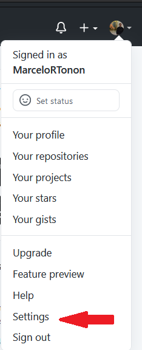
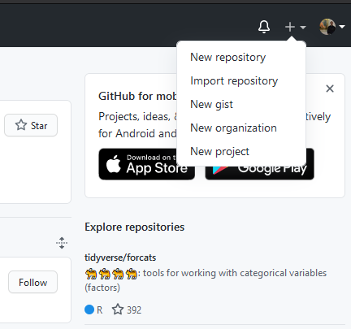
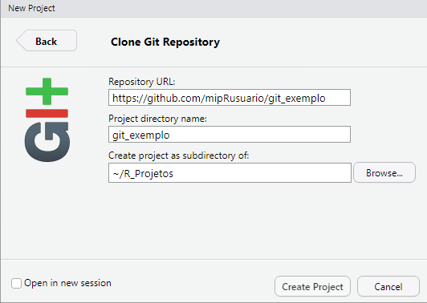
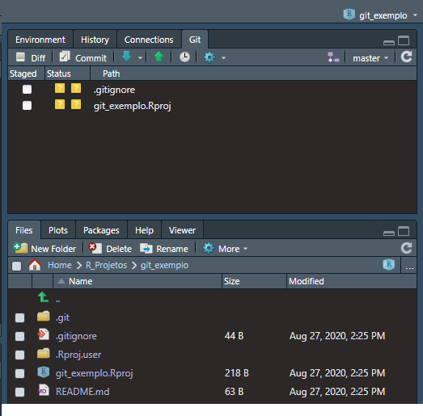
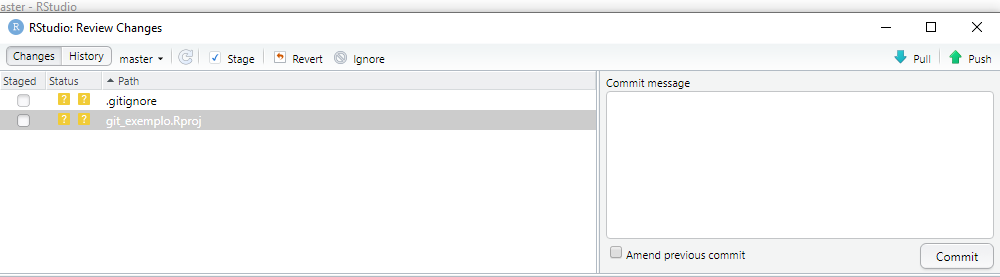
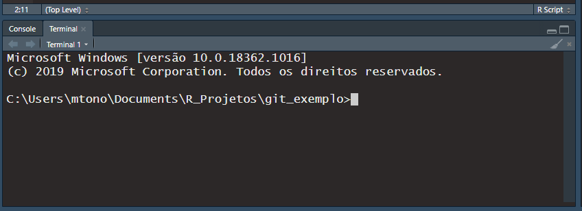
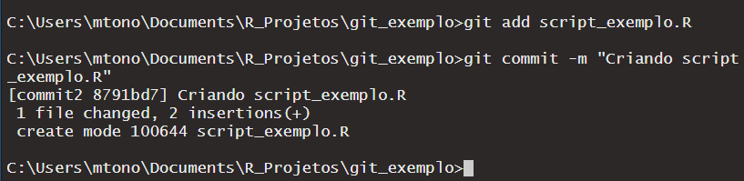
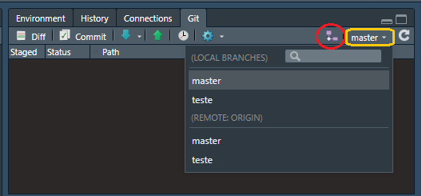

```{r setup, include=FALSE}
knitr::opts_chunk$set(include = T, eval=F)
```

No mundo atual, é prática comum, e recomendada, que você tenha um backup na nuvem do seu projeto atual. Parece obvio, mas muita gente acaba sendo displicente em relação a manter um backup online do seu trabalho. Assim, a melhor forma de lidar com isso, é deixar o processo de backup o mais cômodo possível. E após alguma prática, o uso do Git/Github irá te proporcionar exatamente isso!

Além disso usar o Git ideal para quem mexe com códigos, uma vez que ele te permite realizar controles de alteração. Isso para projetos muito longos e/ou que você irá trabalhar em equipe. Foi pensando nisso que o Git foi concebido, por ninguém menos que Linus Torvalds, o criador do Linux! **Porém calma**, antes de você *Microsoftista radical* fechar essa página pensando que isso é uma coisa de Linux, saiba que vamos aqui usar o Github (mais disso no próximo parágrafo). E sabe quem comprou o Github em 2018? A Microsoft. Houve um alvoroço na época, especialmente entre os Linuxeiros mais velhos (e mais desconfiados), porém a Microsoft investiu muito no Github e hoje usar o Git é cada vez mais uma prática mesmo no mundo corporativo.

O aproveitamento do Git é muito fortalecido quando usado com o Github, por se tratar do site mais popular e abrangente a oferecer o serviço Git. Assim, aqui irei usar as duas coisas juntas, porém há outras opções. Neste guia eu vou me basear muito, mas não só, no [capítulo escrito pelo Hadley Wickham](http://r-pkgs.had.co.nz/git.html). Existe uma grande infinidade de tutoriais na internet que ensinam isso.

# Criando uma conta no Github

Antes de tudo, o melhor é você criar uma conta no Github. Não tem muito segredo:

Entre no [site](https://github.com/) e terá já na página inicial os campos para você cadastrar:


Coloque seu  usuário ( _Username_), seu email e a sua senha ( _Password_). Veja que sua senha deve ter ao menos 15 caracteres ou 8 caracteres incluindo números e letras minusculas. Aí se der tudo certo, no email que você colocou lá, você vai receber uma mensagem para confirmar o cadastro. E pronto. Podemos ir para a instalação do Git! Pense num nome legal e minimamente sério para o seu usuário, pois todos os outros verão você a partir dele.

Para fins de **exemplo**, vamos considerar aqui que o seguinte que os três são:

**Usuário:** mipRusuario
**Email:** mipRusuario@mip.R
**Senha:** UmaSenhaQualquer

***É muito importante*** que você troque o desses exemplos pelos *SEUS*! E dê um jeito de lembrar a sua senha!

# Instalando o Git!

Se você nunca usou e instalou o Git, a primeira coisa a fazer é instalar o Git no seu computador. Isso irá variar de sistema para sistema. Você pode baixa-los da seguinte forma:


 - Windows: https://gitforwindows.org/
 - OS X: http://git-scm.com/download/mac
 - Debian/Ubuntu: ```sudo apt-get install git```
 - Outras distros do Linux: http://git-scm.com/download/linux


Entrarei em mais detalhes sobre o download e instalação de cada sistema operacional nas próximas subseções. Já apontei acima os links para para que o download possa ocorrer enquanto você lê os procedimentos. Vou me basear muito na parte de instalação no material deste [site](https://www.hostinger.com.br/tutoriais/tutorial-do-git-basics-introducao/). Não vou falar da instalação de outras distros do Linux que não sejam baseadas em Debian/Ubuntu, até porque, quem usa uma que não seja estas está mais bem do que mestrado no _The SeViration_^[Vulgo, V.S. é um herói, ou uma heroína, para este que vos escreve.]. 

## No windows

Se você tem um Windows, você <s> deveria repensar a sua vida e migrar para o Linux</s>, pode baixar o arquivo [aqui](https://gitforwindows.org/). Depois de baixar o arquivo, inicie o assistente de instalação e vá clicando em `Next >` até chegar em `Finish`. Depois disso, [abra o Prompt de Comando](https://www.oficinadanet.com.br/tecnologia/26006-10-maneiras-diferentes-de-abrir-o-prompt-de-comando-no-windows-10) e escreva os seguintes comandos não se esquecendo de alterar para o seu nome de verdade:

```{bash, eval = F}
git config --global user.name "mipRusuario"
git config --global user.email "mipRusuario@mip.R"
```

Os dois comandos acima servem  para colocar o usuário e o email desejados nas configurações do Git de modo que qualquer ação que você faça no futuro estará associada à esses dados. Essa configuração ocorre da mesma forma em qualquer sistema operacional.

Importante notar que no Windows (pelo link passado aqui) você vai instalar não só o Git mas também outro programa chamado Git Bash. O Git Bash serve como um Terminal próprio para o Git no Windows para algumas coisas especificas, em especial para _SSH Keys_ como veremos mais a frente

Antes de ir para a próxima parte, é sugerido que o usuário de Windows reflita sobre a esse [link](https://www.oficinadanet.com.br/sistemas_operacionais/24690-12-razoes-para-migrar-do-windows-para-o-linux) e então acesse esse [daqui](https://www.techtudo.com.br/dicas-e-tutoriais/noticia/2016/01/como-instalar-o-ubuntu.html).


## No Linux (Debian/Ubuntu)

Se você tem uma distribuição ativa de Debian ou Ubuntu^[Guerreiro], basta abrir o Terminal (acesse via `Ctrl` + `Alt` + `T`) e escrever:


```{bash, eval = F}
sudo apt-get update
sudo apt-get install git
```

Verifique se a instalação foi um sucesso fazendo:

```{bash, eval = F}
git --version
```

Se retornou a versão do git que você instalou (positivo) então faça:

```{bash, eval = F}
git config --global user.name "mipRusuario"
git config --global user.email "mipRusuario@mip.R"
```

Os dois comandos acima servem  para colocar o usuário e o email desejados nas configurações do Git de modo que qualquer ação que você faça no futuro estará associada à esses dados. Essa configuração ocorre da mesma forma em qualquer sistema operacional.


## No Mac 
Se você tem um Mac é capaz de você já ter o git instalado na sua máquina sem saber. Para conferir isso, abra o Terminal (`Control` + `Option` + `Shift` + `T`) e digite

```{bash, eval=F}
git --version
```

Se você obteve alguma resposta como ```git version 2.7.0 (Apple Git-66)```, então você já tem o Git instalado no seu Mac. 

Caso não retorne isso, vá neste [site](https://sourceforge.net/projects/git-osx-installer/files/) e baixe a versão mais recente. Quando o instalador e siga as instruções de instalação. Abra de novo o terminal (`Control` + `Option` + `Shift` + `T`) e tente de novo o comando ```git --version```. Se você obtiver uma resposta positiva, então faça:


```{bash, eval = F}
git config --global user.name "mipRusuario"
git config --global user.email "mipRusuario@mip.R"
```

Os dois comandos acima servem  para colocar o usuário e o email desejados nas configurações do Git de modo que qualquer ação que você faça no futuro estará associada à esses dados. Essa configuração ocorre da mesma forma em qualquer sistema operacional.


## Git Clients

Usar o Terminal recorrentemente pode ser muito intimidadora para as pessoas que estão começando na programação. Isso é extremamente compreensível. Assim sendo, muita gente usa Git Clients para usar o Git de forma mais amigável e menos dependente do terminal. Eu não uso nem nunca usei nenhum programa do tipo, porém, apesar do que dizem por aí não existe forma certa de usar Git. Eu acho o Terminal (que pode ser acessado pelo RStudio) muito prático (e mais rápido), porém pode não ser o caso de quem começa. Um tempo atrás, quando comecei a usar Git, a reputação desses programas era muito negativa, mas ultimamente tem melhorado. O próprio Github tem um programa desse tipo, o Github Desktop. De novo, eu nunca usei. 

Como eu nunca usei algo do tipo, não tenho condições de instruir ninguém nisso, por isso essa parte é apenas um disclosure: existe e não tem problema nenhum usar (apesar de ser consenso que via o Terminal tudo é mais rápido). Eu leria [esta parte](https://happygitwithr.com/git-client.html) do _Happy git with R_ se você quer saber mais disso.

Apenas um adendo, há como fazer as coisas dentro do RStudio sem precisar recorrer ao Terminal, apesar de ser consideravelmente lento para algumas coisas. Inclusive, quando começarmos a ensinar os conceitos mais básicos, vamos ensinar primeiro sem o terminal.


# Conectando Git ao Github

É importante frisar que o Git não é a mesma coisa que o Github. O Github é um servidor remoto que você pode acessar a partir do Git. A questão toda é como configurar para que o seu usuário do Git no seu computador envie o que ele está fazendo para o Github. E mais importante: como fazer isso com segurança! Nesse caso, são usados os protocolos [SSH](https://en.wikipedia.org/wiki/Secure_Shell) para fazer o login no Github.

As _SSH Keys_ são as senhas que fazem essa conexão. **É importante** notar que se sua conta no Github ficar mais de um ano inativa, este irá apagar das suas configurações. Ou seja, você terá que reconfigurar isso. Essa parte abaixo é muito baseada no [material](https://docs.github.com/en/github/authenticating-to-github/connecting-to-github-with-ssh) presente no próprio Github.

### Gerando SSH Keys

Essa parte pode ser um pouco árida de entender apenas pelo texto, em especial nas partes dentro do site do Github e na ora de acessar a _SSH Key_. Assim, você pode querer acompanhar por este [vídeo](https://youtu.be/OuOb1_qADBQ?t=5591) entre 1:33:11 e 1:40:40, se você tiver dificuldade por este material. O comando a ser executado no Terminal ou Git Bash que mostra no video está presente neste texto.

Para criar uma _SSH Keys_ você deve:

 - Abrir o Git Bash se você for usuário do Windows
 - Abrir o Terminal se você for usuário Linux (`Ctrl` + `Alt` + `T`)
 - Abrir o Terminal se você for usuário Mac (`Control` + `Option` + `Shift` + `T`)
 
 Então escreva abaixo (substituindo `"mipRusuario@mip.R"` pelo seu email de cadastro do github):
 
```{bash, eval = F}
ssh-keygen -t rsa -b 4096 -C "mipRusuario@mip.R"
```

Irá aparecer então a seguinte mensagem `Generating public/private rsa key pair` dizendo que as _SSH Keys_ foram geradas (nos interessa aqui a pública). Na linha de baixo terá escrito algo como `Enter a file in which to save the key (/c/Users/you/.ssh/id_rsa):[Press enter]`^[Para Windows] só que com a parte em parênteses algum diretório especifico do seu computador em que será criada uma pasta **oculta** chamada ``.ssh`. **Aperte Enter**.

Vá no diretório em que foi criada a pasta `.ssh` e veja que tem uma [pasta oculta](https://www.tudocelular.com/curiosidade/noticias/n139348/ensina-como-exibir-pastas-arquivos-ocultos-windows.html) chamada `.ssh`. Nela haverá dois arquivos chamados `id_rsa`. Um deles é apenas `id_rsa` mesmo, sem nenhuma extensão, e o outro se chama `id_rsa.pub`. O primeiro é a sua chave privada e o segundo é a sua chave pública. Abra a sua chave pública como um arquivo de texto^[Para isso basta clicar com o mouse direito em cima do arquivo e selecionar *Abrir com* e selecionar um aplicativo como Bloco de Notas.]. Quando você conseguir abrir, você terá uma linha de texto que começa com `ssh-rsa ` e aí tem vários caracteres e bem no final tem o seu email `mipRusuario@mip.R`. Essa é a sua `SSH Key` pública. *Não modifique nada* e copie toda essa linha, do inicio ao fim.

No site do Github faça o [login](https://github.com/login).^[A opção para o login na página inicial é em `Sign in`.] Você deve então ir nas configurações ( _Settings_) do seu perfil adicionar a _SSH Keys_. Para entrar no _Settings_ você vai no canto superior direito da página e clique na imagem que terá a sua imagem de perfil (quando você colocar) onde abrirá um menu em que uma das opções é _Settings_ (veja a imagem logo abaixo. Na página de configurações terá no menu na esquerda página uma opção escrita `SHH and GPG Keys`. Clique nela. Você pode também, depois de logado, ir direto a essa página [clicando aqui](https://github.com/settings/keys).



Na página vai aparecer um botão verde escrito `New SSH Key`, clique nele (ou [aqui](https://github.com/settings/ssh/new)). Lá aparecerão dois campos, `Title` e `key`. No primeiro coloque um nome para o computador que você está usando, que você vá saber qual é, como por exemplo `notebook_marca`, `computador_trabalho`, `pc_cidade`. Assim, você vai poder saber de qual computador você está trabalhando. No campo `key` cole toda a `ssh key` que você copiou de `id_rsa.pub`. Clique no botão verde escrito `Add SSH Key`.

Com a `SSH Key` configurada tanto no Github quanto no seu computador, você não irá precisar ficar confirmando a sua identidade toda vez que for alterar algo no Github direto do seu computador


## Repositório Git

Na computação um repositório é um local onde você reune as informações, histórico de alterações, os arquivos relacionados e etc... Assim podemos entre um repositorio Git e um arquivo com controle de alteração. Podemos rastrear quem e quando alterou o o quê dentro dele. Isso vale para qualquer arquivo. O repositorio Git portanto pode armazenar dentro dele dados sobre diversas versões do projeto como veremos mais a frente.

Assim como há uma forma de você criar um arquivo Word com controle de alteração no seu computador localmente, você também pode criar um repositorio Git local, sem precisar se conectar ao Github nem nenhum outro servidor remoto. Esse porém não é o foco desta apostila. Se for do seu interesse você pode ver essa parte nesse 
[vídeo  a partir de 27:08](https://www.youtube.com/watch?v=OuOb1_qADBQ&t=1628s). 

### Criando um repositório pelo Github

O foco deste material é auxiliar no uso conjunto entre o Git, Github e o Rstudio. Assim sendo, aqui vamos mostrar como criar um repositório pelo Github e então clonar ele para o seu computador. Vamos então como se cria um repositorio no Github. Estando logado, no canto superior direito da página do Github vai ter um botão com o sinal de + que ao clicar nele vai aparecer um menu em barra em que a primeira opção é `New Repository` (veja a imagem abaixo para tirar quaisquer dúvidas). Você também pode [clicar direto aqui](https://github.com/new). 



Na hora de criar o seu repositório você deve dar a ele um nome, uma descrição, escolher se ele é público ou privado, e escolher se cria um arquivo `README` e um arquivo `.gitignore`. Para fins de exemplo vamos criar um repositorio público, com o nome `git_exemplo`, com a descrição "Hello-world" e criando um arquivo `README` tanto um `.gitignore`. Veja o [exemplo que eu criei no meu perfil](https://github.com/MarceloRTonon/git_exemplo), só que sem o `.gitignore`. 

Se deu tudo certo você criou o seu primeiro repositório no Github! Simples, não é?

## Conectando o Rstudio ao Github

Existem várias formas de você conectar o RStudio a um repositorio do Github. Você pode:

 - Criar um repositorio local, conectar ele ao RStudio e então conectar ele ao Github.
 - Criar um repositorio local, conectar ele ao Github e então conectar ele ao Rstudio.
 - Criar um repositorio no Github, conectar ele ao RStudio e de quebra criando um clone desse repositorio no seu computador.
 
 A primeira opção dá um trabalho imenso, sem contar na dor de cabeça. A segunda é de certo modo pragmática. A terceira é a **melhor de todas em termos de praticidade.** Por isso é a que vamos ensinar aqui. Clique nos hyperlinks para saber mais sobre a [primeira](https://happygitwithr.com/existing-github-last.html) [segunda](https://happygitwithr.com/existing-github-first.html) opções.


Para clonar o seu repositorio do Github no seu repositório local, vá na página do seu repositório `git_exemplo` criado e copie o endereço URL dele. Com o link copiado, vá para o RStudio e no canto superior esquerdo da tela e clique em File -> New Project -> Version Control -> Git. Cole o link do repositório que você tinha copiado  no campo de `Repository URL:`, e o restante deve preencher automaticamente.



Clique em `Create Project` e você criará um projeto do zero. Porém agora você pode reparar que na janela do canto direito superior, onde ficam as abas `Environment` e `History` agora tem também a aba `Git`. Perceba também que na janela logo abaixo, na aba `Files`, aparecem elementos  que não apareciam originalmente no seu Repositório do Github. Veja na imagem abaixo:



A pasta `.git` existe no repositório no Github, só que ela é uma pasta oculta. Por sua vez, você criou o projeto `git_exemplo.Rproj` e a pasta `.Rproj.user`. Se você notar na aba Git da imagem acima, você tem dois elementos lá apenas: `.gitignore` e `git_exemplo.Rproj`. Isso ocorre porque a aba Git é a que rastreia quais foram as modificações nos seus arquivos rastreados. Essa aba também mostra os arquivos que são novos e ainda não estão sendo rastreados pelo Git. Isso explica porque ambos os arquivos estão com o simbolo amarelode ?, uma vez que o Git não está controlando as modificações deles ainda, apesar de estarem no diretorio do repositório. Como `git_exemplo.Rproj` não existe no repositorio remoto no Github, o Git está pergutando o que fazer com ele.

Porém, você pode estar se perguntando o por quê a pasta `.Rproj.user` não aparece na aba Git se ela não existia no repositorio remoto? Isso se deve ao `.gitignore` que lista todos os arquivos que o Git deve ignorar. Você pode ver e alterar essa lista abrindo o arquivo `.gitignore` clicando nele dentro da aba `Files` do RStudio, em que vai abrir uma lista em que você verá que contém entre outras coisas a pasta `.Rproj.user`.

>>Muitas pessoas gostam de colocar o arquivo do projeto na lista de arquivos ignorados. Eu não tenho esse costume, mas há uma certa sabedoria nisso, pois te treina para deixar sempre tudo muito arrumadinho.  

O `.gitignore` é muito utíl também para quando você tem uma base de dados privada, mas quer deixar o seu repositorio público. Basta você adicioanar a pasta de dados ou os arquivos que você não quer que se torne público na lista do `.gitignore` que o Git não irá torna-la adiciona-la nos seus registros.

A seguir vamos praticar o controle de alteração do repositório Git remoto dentro do RStudio.

# Praticando o Github.

Vamos agora introduzir os comandos Gits para você alterar o repositorio remoto do Github direto do RStudio. Vamos fazer de duas formas: Primeiro, um modo sem usar o Terminal, e depois usando o terminal.

No fim, vamos discutir quais medidas podem ser o procedimento padrão na sua rotina.

## Commit

O comando de commit serve para rastrear as modificações que você fez. No caso de `git_exemplo` nós criamos alguns arquivos e isso não está sendo rastreado pelo Git. Na aba de `Git` clique no Botão `Commit` e irá aparecer uma janela em que a parte superior é desse modo:



Se você clicar no campo em branco da coluna `Staged` você verá que mudará de `?` para `A`, o que quer dizer (Added) Adicionado. Ou seja agora o Git vai ter nos registros dele que foi nesse commit que você adicionou esses arquivos no rastreio dele. Clique nos dois campos em branco e escreve uma mensagem no campo `Commit Message`. Algo que possibilite você, ou outra pessoa, identificar facilmente o que foi feito nesse caso. Aqui uma boa mensagem seria "Criando os arquivos iniciais do R após conectar o RStudio com o Github."

Irá aparecer uma janela de terminal realizando o commit, e depois que a barra sumir, terminando a operação, você verá que na aba `Git` não tem mais nada lá. Se você não selecionasse os dois, mas apenas um, o outro permaneceria lá com o simbolo de ? de `Untracked`.

Vamos agora criar um script R, chamado `script_exemplo.R`. Coloque nele:

```{r}
a <- 2
b <- 2 + a
```

Salve o Rscript na pasta do Git e perceba depois que na aba Git ele apareceu com o simbolo ? de que não foi adicionado ainda ao rastreio do Git. Podemos fazer o mesmo processo que antes de clicar na aba, ou fazer pelo Terminal. Para usar o Terminal você não precisa sair do RStudio. Na janela do canto esquerdo inferior (abaixo do editor de texto), tem no geral duas abas `Console` e `Terminal`.



Pode acontecer de você sem querer fechar aba do Terminal. Se isso ocorrer não se desespere. No conta esquerdo superior da janela do RStudio você pode ir em `Tools` > `Terminal` > `New Terminal` para abrir um novo (ou usar o atalho `Alt`+`Shift`+ `R`). Para dar o commit agora nós devemos fazer dois comandos: um para adicionar o arquivo ao rastreio do git e outro para realizar o commit. 

Pense que tal qual você clicou nos campos em branco para depois dar o commit, você primeiro adiciona o arquivo ao rastreio e então dá o commit. Isso serve para quando você vai adicionar muitos arquivos de uma vez só para um mesmo commit. O comando para adicionar um arquivo especifico (nesse caso `script_exemplo.R`) é:

```{bash}
git add script_exemplo.R
```

Por outro lado, você pode adicionar todos os arquivos de uma vez fazendo:

```{bash, eval = F}
git add -A
```

Pense em `-A` como `All` que você vai se lembrar mais fácil disso. Agora você vai dar um novo commit para esse arquivo, só que pelo terminal.

```{bash, eval = F}
git commit -m "Criando script_exemplo"
```

O resultado é algo mais ou menos assim:



Novamente, a aba Git está vazia. Vamos agora mudar o Git e fazer uma modificação no arquivo `script_exemplo.R` colocando uma terceira linha escrita `b - 2`:

```{r}
a <- 2
b <- 2 + a
b-2
```

Salve isso e veja que na aba Git o arquivo `script_exemplo.R` reapareceu, mas agora com o simbolo M de _Modified_ (Modificado). Isso é o Git percebendo que o arquivo teve uma modificação que foi salva. Faça o exercicio de excluir a linha 3 e salvar novamente o arquivo do jeito que ele tava antes.

```{r}
a <- 2
b <- 2 + a
```

Repare que quando você salva do jeito antigo, o arquivo desaparece de novo da aba Git, uma vez que o Git compara o seu arquivo atual com como ele estava no último commit. Se ele estiver igual (mesmo que tendo sido modificado por um momento), o Git simplesmente não verá diferença se você não deu um outro commit no meio do caminho. Inclusive se você tentar dar um commit agora, sem nenhuma modificação visivel, com `git commit -m "teste"` você receberá uma mensagem dizendo que você está atualizado e não há nada para dar commit.


Vamos adicionar uma terceira linha `b+2` de novo no arquivo `script_exemplo.R` e então salvar ele:

```{r}
a <- 2
b <- 2 + a
b-2
```

Agora, com a mudança sendo percebida pelo Git vá na aba Git, clique em commit e veja como as mudanças são rastreadas pelo Git. Você pode fazer o commit por nessa janela mesmo, ou pode fazer pelo Terminal da seguinte forma:

```{bash}
git commit -m "Adicionando 3a linha em script_exemplo"
```

Você pode ver o seu histórico de commits clicando no ícone de relógio na aba Git.

## Push

Até agora, você fez os commits para rastrear as alterações que você fez no seu projeto. Porém se você entrar agora na página do repositorio no Github você vai ver que nada mudou. Isso porque você fez tudo localmente. Para fazer o repositorio Git remoto (do Github) ficar igual o seu local (do seu PC), você deve dar um push ( _empurrão_). Você pode apertar a seta **verde** na aba Git ou então dar o comando no terminal:

```{bash}
git push
```

Trabalhando em equipe, é de bom tom que sempre que você terminar o seu trabalho do dia dê um commit final e um push para que o outro saiba o que fez.

Depois de dado o push, vá na página do seu repositório no Github para conferir se houve modificações. Se deu tudo certo, você deve esperar modificações sim. Repare que na lista dos arquivos, as mensagens do último commit que você deu referente a cada arquivo aparecem do lado destes. Ou seja, do lado de `git_exemplo.Rproj` e `script_exemplo.R` você tem, respectivamente as mensagens "Criando os arquivos iniciais do R após conectar o RStudio com o Github." e "Adicionando terceira linha em script_exemplo". Repare que você pode clicar tanto no arquivo quanto na mensagem do commit (para visualizar o que ocorreu).

Na pagina inicial do repositorio também tem o número de commits que você deu nele que é um link para o seu histórico de commits.


## Pull

Por se tratar de um repositorio remoto pode ocorrer situações em que você quer igualar o seu repositorio local ao remoto e não o contrario. Motivos para isso podem ser:

 - Você trabalhou de outro computador no repositorio remoto e agora o seu repositorio local está defasado frente ao seu trabalho  (que você colocou no repositorio remoto);
 
 - Você está trabalhando em equipe e quer atualizar o seu repositorio local com as mudanças feitas pelos seus colegas.

No caso do segundo, é bom  que sempre que você vá começar uma nova jornada de trabalho você dê um pull (sendo que você deu um commit antes de ir dormir) para trabalhar sobre a versão mais recente do trabalho de todos.

Para dar um pull basta que você aperte a seta azul na aba Git ou dê o seguinte comando no Terminal:

```{bash}
git pull
```

No caso do exemplo que estamos dando aqui, vamos receber a resposta de que está tudo atualizado. Para ver como ocorre, crie um arquivo dê o upload num arquivo qualquer no seu repositorio Git. Para tanto basta clicar no botão `Add file` e ou criar um arquivo ou upar um. Com o arquivo adicionado, ao usar o comando `git pull` no terminal aparecerá uma mensagem sumarizando as modificações dos arquivos e quais arquivos novos tem.

## Rotina do Git- sem ramificação (multiplos  _branches_)

Agora você aprendeu os quatro comandos mais básicos e essenciais do git: add, commit, push e pull. Porém, qual é um bom uso que você deve dar a eles na sua rotina do dia a dia? Importante notar que o que está aqui são dicas e não leis sagradas. Não precisa se matar para cumprir tudo a risco. Porém, o hábito faz o monge.

Em primeiro lugar, **procure sempre fazer boas mensagens de commit**. Não precisam ser imensas, mas elas devem servir para identificar mais ou menos o que você estava trabalhando. Bons exemplos de commits podem ser coisas como "corrigindo a leitura da base de dados", "criando funções basicas", "adicionando slides", "corrigindo erros de gramatica" e etc... Mensagens ruins seriam coisas como "mexi em algumas coisas", "aa", "adicionei linhas" e etc... Porém, não se martirize para criar excelentes mensagens. Se não vier, tente escrever sobre algo que você fez e tá valendo.

Em segundo lugar, tente dar commits em blocos que fazem sentido. Ou seja, dê um commit se você revisou uma parte especifica do seu código (como por exemplo a seleção de variáveis). Isso inclusive vai facilitar sua vida na hora de pensar nas mensagens.

Em terceiro lugar, você não precisa por outro lado dar um commit por linha modificada. Existe um meio termo ótimo entre o céu e o inferno.

Por fim, em termos de trabalho individual, é que você não precisa dar um push para cada commit que você fizer. Não deixe de atualizar o seu repositorio remoto sempre que der.

### Quando trabalhando em equipe

Se você estiver trabalhando em equipe as alterações que você e seus colegas fizerem podem sobrepor uma a outra e ser um desastre. Para isso servem múltiplos branches (que falaremos mais a frente), mas algumas boas práticas já ajudam em muitas questões.

Quando estiver trabalhando em equipe no Git (sem branches) é sempre pensar que o repositorio está modificado. Assim, você deve sempre fazer algumas medidas de segurança. A primeira coisa é sempre dar um pull toda vez que começar a trabalhar. **Importante dizer** que isso pressupõe que você colocou no repositorio remoto tudo que você fez no local.

A segunda coisa a se atentar quando estiver trabalhando em equipe é a ordem entre o commit, pull e push. A depender das mudanças que os seus colegas colocaram no repositório, quando você der push, você pode criar uma série de erros. Por outro lado, se você der o Pull inadvertidamente pode perder tudo o que você fez. Por isso é importante que você siga a seguinte ordem ao dar um push:

```{bash}
git Add -A
git commit -m "A mensagem a ser dada"
git pull
git push
```

Se você deu um commit antes de dar o pull, o seu git irá manter no seu repositorio local as mudanças que você fez ao longo do tempo. E como você vai ter no seu repositorio local todas as modificações que os seus colegas fizeram (por conta do pull), o seu push dificilmente dará erro. Pode no entanto ocorrer, especialmente se você e seu colega estiverem mexendo no mesmo arquivo no mesmo intervalo de tempo.

Para não deixar de falar o óbvio: evite a todo custo mexer ao mesmo tempo e no mesmo arquivo que o seu colega está mexendo.

Por fim, apesar de ser melhor commits facilmente identificados por tópico, sempre dê um commit e um push no fim da sua jornada de trabalho. Seja às 4 da tarde ou as 3 da madrugada, seu colega pode pegar isso no dia seguinte e acabar mexendo num arquivo que você também mexeu no dia anterior, mas como você não deu push, pode dar problema quando os dois derem lá na frente. Ou seja, nesse caso vale você fazer um commit com uma mensagem como `commit -m "Mexendo no arquivo xxxx.R, commit de fim de noite"`

## Criando e Deletando multiplos Branches

Nós acabamos de dar dicas sobre como trabalhar em equipe sem multiplos branches, mas em trabalhos muito grandes e de muitas atividades em paralelo pode ser dificil seguir a risca algumas daquelas práticas. Especialmente em trabalhos que podem envolver mais de 5 pessoas. Por isso, pode ser interessante ramificar o seu repositório. Isso quer dizer criar várias versões dele. Aqui vamos usar as palavras _branch(es)_ e _ramo(s)_ como idênticas. O branch principal do seu repositorio, é chama-se de `master`. Você pode criar um ramo do seu repositorio muito facilmente, basta fazer os comandos abaixo:

```{bash}
git branch -d teste
git push -u origin teste
```

**É importante notar** que com esses comandos, você apenas criou um _branch_ (ramo) novo, **você ainda está no mesmo** **_branch_** **de antes**. Tal qual na imagem abaixo, repare que na aba Git, você tem um botão escrito `master` (destaque amarelo) indicando que é esse o branch em que você está. Se você clicar no botão com o símbolo amarelo, você verá uma barra onde estão listados os branches locais, bem como os remotos.



**Importante:** Abaixo vamos falar sobre como se troca de um branch para outro. Antes de fazer isso (com algum projeto relevante), salve tudo e dê um commit. Se não fizer isso pode ocasionar erros. 

Se nessa barra você clicar, **na parte dos repositorios locais**, em `teste` você irá mudar para o ramo `teste`. Você pode fazer isso pelo terminal também, usando o comando `checkout <branch>`, que no nosso caso seria:
```{bash}
git checkout teste
```

Na imagem que mostramos também tem um outro botão, com destaque vermelho. Esse serve para você adicionar um branch. Na prática ele faz a mesma coisa que os dois comandos usados anteriormente (`git checkout -d ``git push -u origin <branch>`).

Você pode listar os seus branches pelo terminal também. Basta fazer `git branch` e aparecerá uma lista com cada um dos ramos. Aquela que aparecer em cor diferente e com um asterisco `*` na frente é o ramo em que você está trabalhando. Vale notar que se você fizer `git branch teste2` você irá criar um branch local, sem equivalente no repositório remoto. Para excluir um repositorio localmente basta dar o comando `git branch -d <branchlocal>`, no caso de `teste2` seria:
```{bash}
git branch -d teste2
```

Para forçar um branch local no remoto basta fazer:

```{bash}
git push -u origin teste2
```

Repare que é a mesma coisa que feita originalmente, porém com as partes decompostas.

No caso de você querer excluir um branch no seu repositório remoto o comando é `git push origin --delete <remoteBranchName>`. No caso de ter um branch remoto chamado `teste3`, o comando seria:

```{bash}
git push origin --delete teste3
```

Aqui está boa parte do que há para aprender sobre como criar e deletar branches.

## Merge

Na última seção aprendemos como criar e deletar branches. O que nos interessa agora é aprender a fundir dois branches. Para isso serve o comando merge. Vamos criar um branch chamado `code1` (veja [aqui](https://github.com/MarceloRTonon/git_merge) o resultado final do repositorio `git_merge` que será o exemplo nesta parte.):

```{bash}
git branch -d code1
git push -u origin code1
git checkout code1
```

Vamos então agora criar um código, dentro do branch `code1` chamado `codigo1.R`. Nele vai ter escrito:

```{r}
## Codigo 1
a <- "Criando um código para todos"

d <- list("A"= 10,
          "B"=20,
          "C"=30,
          "D"=40,
          "F"=50
          )
```

Importante, o branch `master` não vai ter esse código. Agora dê os comandos para dar o commit:

```{bash}
git add -A
git commit -m "codigo1"
```

Agora, volte para o branch master, usando `git checkout master`, e crie um documento chamado `codigomaster.R` que tem escrito:

```{r}
#Codigomaster

H <- "Controle geral sobre os dados"
```

Repare que o arquivo `codigomaster.R` não existe no branch `code1` e o arquivo `codigo1.R`, não existe no branch `master`. Para unir os dois vamos usar o comando `git merge`:

```{bash}
git merge code1
```

Nesse caso, você pode reparar que o arquivo `codigo1.R` está agora também no branch principal. 
e dê como comando `git merge <branch>`. Repare porém que não há o `codigomaster.R` no branch `code1`.

Agora, vamos voltar para o branch `code1` e criar um branch `code2` a partir do `code1`:

```{bash}
git checkout code1
git checkout -b code2
```

Vamos abrir o `codigo1.R` e fazer a seguinte alteração:

```{r}
## Codigo 1
a <- "Criando um código para todos"

d <- list("A"= 10,
          "B"=20,
          "C"=30,
          "D"=40,
          "F"=55,
          "G"=60
          )
```

Repare que alteramos a linha em que definimos "F" e passamos a definir o elemento "G=60". Agora, vamos voltar para o branch `code1`. Nele altere a linha que tem `"A"= 10` para `"A" = 15`. Repare que agora, temos algumas informações novas no branch `code1` e outras em `code2`. Vamos dar então um merge a partir de `code1`:

```{bash}
git merge code2
```

Disso coisas importantes devem ser ditas:

 - O branch escrito no comando é o branch que você  fundirá com o branch que você está mexendo nesse exato momento. Então, se você tiver no branch master e escrever `git merge code1` você irá fundir o branch `master` com o `code1` e isso ficará *gravado no `master`*.
 - O merge confere as linhas de cada código. Dessa forma, quando criamos o elemento` "G" = 60`, o git não entenderá isso como uma nova linha, e sim você alterando a linha que antes tinha o `)`. No caso, ele entenderá como uma nova linha o `)` que está na linha abaixo, uma vez que ela não existia antes.^[Estamos aqui considerando que não existe linha nenhuma depois de `)` em nenhum dos casos.]
 
Desse modo, o merge permite que você e outras pessoas trabalhem de modo paralelo num mesmo projeto. Porém nem tudo é flores e podem existir conflitos.

### Conflitos entre branches

No nosso mesmo exemplo, pode acontecer que você e outra pessoa alteraram o mesmo arquivo nas mesmas linhas enquanto trabalhavam. Isso pode ser bastante problemático, pois dará conflitos entre os branches.  Para testar vamos fazer o seguinte (dando o add e commit em todas as alterações feitas):
 1. Em code1 coloque uma linha vazia antes de `a`. Dê commit nas alterações.
 2. Em code2 troque o valor de `G=60` para `G=95`. Dê commit nas alterações.
 3. Volte para code1 e tente fazer o merge com code2.
 
 É importante notar que em `code1`, quando você adicionou um linha em branco você fez várias alterações, pois agora, o conteudo da linha 5 foi para a linha 6, o da 6 para a 7 e assim por diante. Você alterou tudo que estava abaixo da nova linha em branco que você adicionou. Logo, o commit que você deu em 1 envolve todas essas linhas. Por sua vez, em 2 você também deu um commit com uma mudança de uma das linhas alteradas em 1. Desse modo, você tem dois commits conflitantes. Será de tal modo que o Terminal irá avisar com algo como:
 
```
Auto-merging code1.R
CONFLICT (content): Merge conflict in code1.R
Automatic merge failed; fix conflicts and then commit the result.
```
 E se você abrir o arquivo `codigo1.R` vai ter algo como:
 
```{r}
<<<<<<< HEAD
          "G"=60
          )
=======
          "G"=95
          )
>>>>>>> code2
```

Ou seja, você vai ter que alterar e dizer qual dos valores de G você quer. Assim, você mantém só as linhas que você quer, excluindo as com `<<<`, `===` e `>>>>` também. Depois de resolvido, dê o git add e commit para finalizar o problema. Se não há solução para o conflito, você pode abortar o merge com `git merge --abort`.

Acima demos um exemplo simples, porém quando as coisas escalonam podem ficar monstruosas e dar uma dor de cabeça imensa. Por conta disso, muitas vezes é melhor evitar os conflitos de merge, adotando algumas boas práticas (algumas delas valem para equipe e outras para sozinho mesmo):

 - **Comunicação!** Se você e seus colegas estão trabalhando numa mesma parte em diferentes branches e isso pode dar ruim, converse com eles. Falem um para o outro que estão fazendo e onde. Sabendo onde o seu colega está mexendo, você naturalmente terá mais cuidade. Pode até avisar ele que vai fazer uma alteração especifica.
 - **Confira as diferenças** antes de dar o merge. Como? Simples, use o comando `git diff branch1..branch2` no terminal e vá dando enter no terminal que isso fará você ver qual a diferença do `branch1` para o `branch_2` (sim, tem dois pontos finais `..` entre eles). **Importante:** vá dando enter toda vida pois as diferenças vão aparecendo aos poucos no terminal do RStudio. **Ao final, escreva Q no terminal para sair.** Com as informações das diferenças em mão, você já tem condições de ver o que fazer com cada uma.
 - **Faça mais scripts curtos.** Ao invés de escrever um código imenso, dê prefêrencia para fazer vários códigos mais curtos. Isso irá evitar que mudar uma parte do código altere todo o resto. Além disso, fica muito mais fácil e organizado em vários códigos menores. A função `source()` do R te permite rodar um outro script diretamente. Ou seja, você pode criar uma cadeia de scripts sem problemas.
 - **Combinem quando for dar um merge.** Dar o merge será a grande hora da verdade muitas vezes. Assim é interessante que todos da equipe fiquem preparados para ele, de modo que se algo acontecer, ninguém esta desavisado (e vocês podem pensar em uma saída).
 - **Deixe o merge para quem se sente confortável!** É aquela, nem sempre a gente vai ficar confiante de que vai dar tudo certo. Se você acha que algo pode dar errado e que tem alguém mais capaz que você, deixe para essa pessoa. A depender do conflito, vale a pena você especificar o que é cada coisa.
 - **Teste antes de fazer!** _Veja a próxima seção._
 
#### Testando conflitos e resultados

Por fim, você pode testar se haverá conflitos e qual vai ser o resultado final. Isso evita que você faça um `merge` e o resultado final não seja bom. Para evitar isso, vale fazer o seguinte hábito. Suponha que você quer fazer o merge no `branch1` com o `branch2`. Estando em `branch1`, faça um clone de `branch1`, nesse caso `branch1a`:

```{bash}
git checkout -b branch1a
```

Com o `branch1a` feito dê então o merge:

```{bash}
git merge branch2
```

Nesse caso, você vai testar em `branch1a` como vai ser o merge de `branch1`com `branch2`. Se vai dar erro, se não vai, qual vai ser o erro. Tudo isso pode ser resolvido lá. Com isso tudo já feito, você pode simplesmente fazer 

# Pacotes fora do CRAN

Além de tudo, uma das vantagens de usar o Github é usar a função `install_github` do pacote `devtools`. Sem ele, para você instalar um determinado pacote você baixa direto do CRAN da seguinte forma:

```{r, eval = FALSE}
install.packages("pacoteTAL")
```

Porém, como muitos pacotes estão em desenvolvimento constante, pode haver um delay entre a última versão no CRAN e a última versão desenvolvida pelo desenvolvedor. Para instalar essa versão podemos fazer:

```{r, eval = FALSE}
require(devtools)
devtools::install_github("pacoteTAL")
```

Esse delay muitas vezes é apenas o tempo dos pareceristas avaliarem as mudanças feitas no pacote. **É importante frisar no entanto,** que as versão no CRAN são no geral mais seguras que as do Github, uma vez que elas passaram pelo crivo de um parecerista. A versão no Github pode ter alguma melhoria de performance ou uma nova função, mas **por outro lado** também tem mais chances de ter algum _bug_ que passou desapercebido pelo desenvolvedor do pacote.

Existem também pacotes que foram completamente recusados pelo CRAN do R. "Qual seria o motivo de se querer um pacote que foi recusado pelo CRAN?", alguém poderia perguntar. A resposta é que cada repositório oficial das linguagens (CRAN) tem uma política própria em relação a aprovação de um pacote especifico. No caso do R por exemplo, esse tem uma política em relação a pacotes de base de dados muito pesadas ou em relação a forma como esses podem estar estruturados. Assim, pode te interessar ter um pacote que não está no CRAN, mas cumpre uma missão que nenhum outro que você já viu lá cumpre.


## Bibliografia

WICKHAM, HADLEY. R Packages. Link: http://r-pkgs.had.co.nz/git.html. Acesso em 26/08/2020.

https://www.hostinger.com.br/tutoriais/tutorial-do-git-basics-introducao/

## Tutoriais

Livro do próprio Git https://git-scm.com/book

Mais de 2 horas de video, muito completo: https://www.youtube.com/watch?v=OuOb1_qADBQ


Um bookdown de Git voltado para R e Rstudio: https://happygitwithr.com
