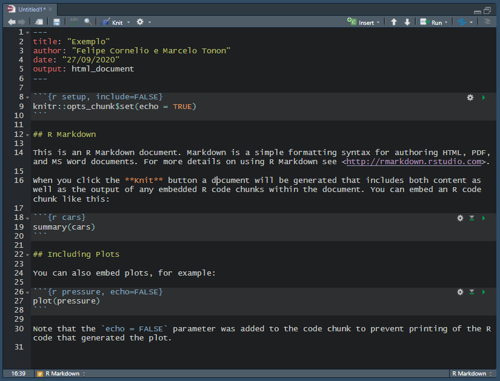

```{r setup, include=FALSE}
knitr::opts_chunk$set(include = T, eval=F)
```

# Introdução {#intro}

Vamos aqui apresentar uma introdução de como escrever documentos usando o `R MarkDown`. Com ele podemos criar documentos interativos ou também apresentar de forma estruturada algum código do R. Serão apresentadas a ideia geral do que é e como funciona o `R MarkDown`, bem como os principais comandos e cuidados na elaboração do seu arquivo.

As principais referências para o material elaborado aqui são:

- As seções 27 e 29 dp R for Data Science [(R4DS)](https://r4ds.had.co.nz/r-markdown.html).
- A [Cheatsheet do R Markdown](https://github.com/rstudio/cheatsheets/raw/master/rmarkdown-2.0.pdf) também pode ser útil.
- Para um conteúdo extenso e detalhado ver [R Markdown: The Definitive Guide](https://bookdown.org/yihui/rmarkdown/).


# O que é?

O `R MarkDown` é uma alternativa para você escrever o seu código no R. Um arquivo do `R MarkDown` (com extensão .Rmd) é útil para apresentar não apenas os comandos usados para realizar a sua pesquisa ou trabalho, mas também uma descrição para explicar o que você está fazendo. Nesse caso, o processo de reprodutibilidade do seu trabalho é facilitado, pois, ao mesmo tempo, o arquivo .Rmd nos fornece um código funcional e também um arquivo que pode ser disponibilizado para alguém interessado. Há possibilidade de, a partir de um arquivo .Rmd, criar um arquivo para outras plataformas como um html, um pdf ou até mesmo um arquido do MS Word. 

# O básico de R Markdown

Na elebaração de arquivo `.Rmd` existem três tipos de conteúdo que podem ser usados: o **YAML header**, os **chunks** e os a parte **textual**. Vamos falar rapidamente sobre cada um.

No **YAML header** temos as configurações gerais para o seu documento. A sigla YAML representa "yet another markup language", diferenciando essa parte do restante do texto que seguirá a ideia do markdown. Nessa parte temos a programação dos elementos e as características dos seu documento, onde poderão ser incluídos ou excluídos, elementos para o funcionamento do `.Rmd`. Este item é iniciado e fechado por `---`, e se encontra logo no início do código. Sua representação simplificada é da forma:

```{r, eval=F}

---
title: "Introdução ao R MarkDown"
author: "Marcelo Tonon e Felipe Cornelio"
date: "24/09/2020"
output:  
  html_document:
    number_sections: true
---

```

Esse é, por exemplo, o YAML header do código que gerou esse arquivo. Nessa parte também podem ser incluídos outros parâmetros e pacotes que mudam a configuração do arquivo, tais como mudanças na aparência do arquivo gerado, inclusão de sumários, padrões de numeração de tabelas, gráficos e sessões, entre outras.

Uma segunda categoria são os **chunks**. São espaços reservados para escrever os códigos propriamente ditos, os quais podem ser tanto tarefas a serem realizadas, quanto exemplos a serem usados como ilustração. A sessão ["Usando os chunks"](#chunks) apresentará mais detalhes sobre as configurações que podem ser realizadas em um chunk.

Por fim, o terceiro elemento é um dos principais benefícios de usar um markdown, que é a possibilidade de incluir **textos livres** para deixar o código mais autoexplicativo. A sessão ["Como escrever"](#escrever) apresentará os principais recursos para a edição do texto, como uso de negrito, itálico, criação de tabelas, títulos e sessões, dentre outros.

Caso você criar um arquivo `.Rmd` no RStudio, você retornará um arquivo inicial tal como a imagem abaixo:



O texto básico apresentado apresenta alguma sugestõe e explica como inserir alguns elementos que serão explorados mais a frente.


# Usando os chunks {#chunks}

Vamos começar pelos **chunks** que representam a parte do seu arquivo que o software irá ler como um código do R propriamente dito. Podemos criar um chunk de três formas:

1. Manualmente ao se escrever os delimitadores de um chunk ` ```{r} e ``` `.
1. Usando o cursor do mouse e indo em "Insert" na barra edição no topo do código.
1. Por fim, o mais prático é usando o atalho ctrl+alt+i.


Na primeira linha estão as configurações do chunk em questão. Perceba que entre colchetes temos o termo "r", o qual pode ser renomeado para formar um grupo de chunks. Por exemplo, você pode nomear chunks de leitura de dados como algo `{r leitura}` ou uma decomposição por `{r decomposicao}`. Além dessa, as principais configurações de um chunk são:

- **eval** - (default = TRUE) indica se o chunk será rodado como um código do R, realizando as taredas e armazenando os resultados caso seja requerido. 
- **include** - (default = TRUE) determina se o chunk será apresentado no documento final. Pode ser que um chunk seja avaliado (`eval=T`), mas que não esteja disponível para visualização no documento gerado.
- **echo** - (default = TRUE) define se o código será visualizado no arquivo final.
- **message** - (default = TRUE) decide se mensagens que aparecem no console do R serão visualizadas no markdown.
- **warning** - (default = TRUE) o mesmo para avisos que podem surgir no console do R
- **error** - (default = FALSE) define se possíveis erros no código apareçam no arquivo final (TRUE) ou se a leitura do `.Rmd` seja pausada em caso de erro (FALSE).
- **results** (default = 'markup') indica a forma como serão apresentado resultados de tarefas, o default é apresentar os dados como sairiam no console do R. Outras opções são:
  - **'asis'** - apresenta os resultados com configurações textuais inseridas^[por exemplo, modificações textuais como ensinadas no tópico sobre strings (`"\n"`, `"\t"`, entre outros).].
  - **'hide'** - o código será lido, mas os resultados não serão apresentados.
  - **'hold'** - os resultados serão apresentados apenas ao final do código (chunk).

Uma lista com outros elementos que podem ser usados na configuração do chunk, mas que não são usuais como os citados anteriormente, podem ser encontradas na sessão 2.6 do [R Markdown: The Definitive Guide](https://bookdown.org/yihui/rmarkdown/r-code.html) e também na [Cheatsheet do R Markdown](https://github.com/rstudio/cheatsheets/raw/master/rmarkdown-2.0.pdf). 

# Como escrever {#escrever}

Já explicado como funcionam os chunks, agora vamos discutir a edição da parte textual dedicada à explicações mais detalhadas sobre o código ou também sobre a tarefa que você está realizando. Por exemplo, caso você esteja trabalhando com uma teoria ou modelo econômico, você pode usar esses elementos para deixar o seu código mais intuitivo ou dar uma interpretação econômica para o código.

Vamos apresentar uma estrutura muito semelhante ao apresentado na sessão 27.3 do [R4DS](https://r4ds.had.co.nz/r-markdown.html#text-formatting-with-markdown), no qual há um resumo das principais formas de editar essa parte do seu arquivo `.Rmd`. 

## Títulos

O primeiro passo é como inserir os títulos para as sessões. Para isso usamos o símbolo `#`, e sua repetição indicará o nível que deseja: `##` (segundo nível) e assim por diante. Esse é o mesmo símbolo usado para inserir comentários quando feitos num script do R ou em um `chunk` de um `.Rmd`.

```{r, eval=FALSE}

# 1º Nível

## 2º Nível

### 3º Nível
```

## Formatação de texto livre

Já para formatar a parte de texto livres, podemos incluir elementos como *itálico*, **negrito**, entre outros. Uma modificação útil é o `code` que é separado por crases "`". Teríamos:

```{r, eval=F}

*itálico*  or _itálico_  
**negrito**   __negrito__  
`código`  
sobrescrito^2^ and subscrito~2~  
~~Tachado~~ 
> Inserir bloco de citação
  
```

O texto acima fora do chunk ficaria assim:

*itálico*  ou _itálico_  
**negrito** ou  __negrito__  
`código`  
sobrescrito^2^ and subscrito~2~  
~~Tachado~~

> Inserir Bloco de Citação  


Para você ter um parágrafo novo você pode precisa ter uma linha vazia entre os parágrafos e para pular a linha é praciso dar um espaço duplo ao término da palavra ou frase. Existem outras formas de sintaxe que não serão apresentadas aqui e estão disponíveis nas referências já apresentadas ao longo do texto.

## Listas e Tópicos

Outra ferramenta muito útil na criação de textos é a insertação de tópicos ou listas usando marcadores ou números.

```{r, eval=FALSE}
# Listas com marcadores

## Existem duas formas
### Com "*"
*   Marcadores Item 1

*   Marcadores Item 2

    * Item 2a

    * Item 2b

### Com "-"
- Marcadores Item 1

- Marcadores Item 2

    - Item 2a

    _ Item 2b


# Lista numerada


1.  Lista Numerada item 1

1.  Lista Numerada Item 2. Perceba que os números aumentam automaticamente.

```

As listas criadas pelos comandos acima poderiam ser visualizadas da seguinte forma.

A Lista usando o "*":

*   Marcadores Item 1

*   Marcadores Item 2

    * Item 2a

    * Item 2b

Agora com "-" (o resultado deve ser igual ao anterior):

- Marcadores Item 1

- Marcadores Item 2

    - Item 2a

    - Item 2b

Por fim, a lista numerada:

1.  Lista Numerada item 1

1.  Lista Numerada Item 2. Perceba que os números aumentam automaticamente.


## links e imagens

Para a inserção de algum link para alguma página da internet, inserir uma imagem ou fazer uma referência interna a outro elemento do seu arquivo.

```{r, eval=FALSE}

# Inserindo links
<www.ibge.gov.br>

# Inserindo um hiperlink em uma palavra
[Site do IBGE](www.ibge.gov.br)

# Inserindo uma imagem a partir de algum diretório


# Fazendo um link interno
[Introdução](#intro)
```

- Links para o site do IBGE:  
<https://www.ibge.gov.br>  
[Site do IBGE](https://www.ibge.gov.br)

- Lendo uma imagem:  
{width=100, height=100}

- Referência à uma outra sessão do arquivo:  
[Introdução](#intro)


## Tabelas

Agora para inserir uma tabela no corpo do texto ()

```{r, eval=FALSE}

   Título 1   |   Título 2
------------- | -------------
   Conteúdo   |   Conteúdo
   Conteúdo   |   Conteúdo
```


   Título 1   |   Título 2
------------- | -------------
   Conteúdo   |   Conteúdo
   Conteúdo   |   Conteúdo


## Equações

Equações na linha: $x=(I-A)^{-1}f$
Equações separadas
$$x=(I-A)^{-1}f$$


Para inserir uma matriz precisamos além da equação, inserir um comando para criar a forma de uma matriz


# Rodando o código

Por fim, com seu arquivo `.Rmd` completo o passo final é gerar seu arquivo. Existem três formas de ler:

1. Na barra de edição no topo de onde escrevemos o código, temos o botão "knit". Basta clicar nele e em seguida na opção "knit to HTML"^[Obs: existe a opção de gerar outros tipos de arquivo como você verá no botão knit, tais como os mais usuais pdf e word.]. 
1. pelo console chamando o pacote `rmarkdown` e usando a função `render()`, tal que: `rmarkdown::render("Local e nome do arquivo")`
1. Por fim, o mais rápido e simples é usando o atalho `ctrl + alt + k` em alusão ao knit.

Com isso você consegue ter o básico para criar um relatório, apresentação ou arquivo dinâmico usando o R Markdown. O uso de documentos desse tipo é essencial para quem trabalha com pesquisa acadência, além de ser capaz de contribuir para que seu trabalho ou pesquisa seja mais acessível para outras pesssoas.

# Bibliografia

R for Data Science: https://r4ds.had.co.nz/

Cheatsheet do R Markdown:https://github.com/rstudio/cheatsheets/raw/master/rmarkdown-2.0.pdf

R Markdown: The Definitive Guide(https://bookdown.org/yihui/rmarkdown/).
