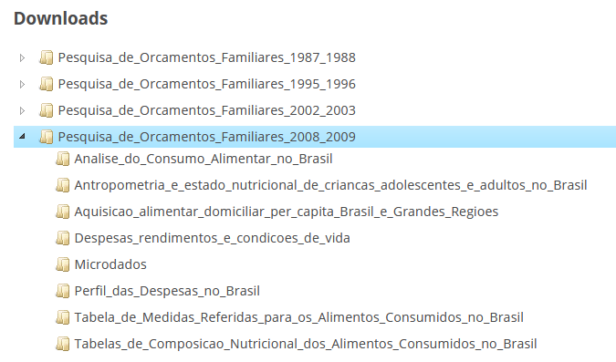
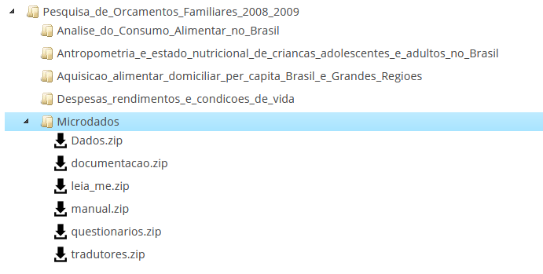

```{r setup, include=FALSE}
knitr::opts_chunk$set(echo = TRUE)
```

Por uma questão de exemplificação iremos tratar a principio aqui da POF feita entre 2008 e 2009. Numa outra ocasião podemos passar para a POF feita entre 2017 e 2018.

Esse material usa muitas partes dos scripts feitos por Ana Camila e Pedro Gomes Andrade ao longo do Curso da POF fornecido por IPEA/ENCE/UFRJ/UFF.


# Pacotes Necessários


```{r message=FALSE, warning=FALSE}
library(tidyverse)
library(survey)
library(foreign)
library(data.table)
library(gtools)
library(srvyr)

options(survey.lonely.psu="adjust")

```

# Os arquivos disponibilizados da POF

Neste documento vamos tratar de como mexer com os **microdados** da POF. O IBGE disponibiliza outros produtos provenientes da Pesquisa, muitas vezes apresentando os resultados calculados com os microdados. Assim, se você entrar na seção de [Downloads da POF](https://www.ibge.gov.br/estatisticas/sociais/populacao/24786-pesquisa-de-orcamentos-familiares-2.html?=&t=downloads), e clicar na pasta da versão `2008-2009`, você verá o seguinte:



À exceção de `Microdados` todas as pastas aí contém dados já trabalhados, apresentando resultados mais agregados ou subdividios por algum recorte. 

Aqui, nos interessa aprender a mexer nos `Microdados` pois nada garante que a resposta para a nossa pergunta está disponível, ou mesmo foi feita, no site do IBGE. Assim, seja para desagregar mais os cálculos ou mudar o recorte, o caminho para produzir novos, ou replicar resultados passa pelos `Microdados`. Assim, na pasta de `Microdados` temos:



Vamos tratar aqui, rapidamente, de cada um desses arquivos compactados. De modo geral, o conteúdo de apoio permanece relativamente o mesmo em todas as edições da pesquisa, mas os arquivos que o compõem podem estar organizados de forma diferente. Na pesquisa de 2008-2009 por exemplo, temos que o arquivo `manual.pdf` está compactado sozinho em `manual.zip`, enquanto para a versão de 2017-2018 ele está compactado junto à documentação.

## Questionários

A POF é estruturada em 7 Questionários ao longo de 9 dias.

 - POF 1 – Características do Domicílio e dos Moradores

      A POF 1 serve para identificar o domicilio, levantar suas características e composição, investigar as caracterísitcas dos moradores. Esse questionário é preenchido no primeiro dia da pesquisa. A POF 1 possuí 4 quadros:
      
      - **Quadro 1:** Identificação e controle do questionário
      - **Quadro 2:** Características do domicílio
      - **Quadro 3:** Relação dos moradores
      - **Quadro 4:** Características do morador

 - POF 3 - Caderneta de Aquisição Coletiva 

      Na POF 3 estão registradas as aquisições de alimentos, bebidas, artigos de limpeza e outros produtos cuja aquisição ocorre com frequência e servem a todos os moradores do domicílio. A caderneta deverá ser preenchida, diariamente, durante sete dias consecutivos, a partir do dia seguinte ao primeiro dia da entrevista no domicílio (abertura da POF1), e deve ser feita por cada Unidade de Consumo do domícilio.
      
      - **Quadro 62:** Identificação e Controle do Questionário
       
      - **Quadros 63 a 69:** Destinados ao registro das aquisições diárias de alimentos (inclusive refeição pronta), bebidas, artigos de higiene pessoal e de limpeza, artigos de papel, artigos de iluminação e pilha, flores naturais, combustíveis de uso doméstico

 - POF 2 - Questionário de Aquisição Coletiva 
 
      A POF 2, tal qual a POF 3, diz respeito aos produtos que são adquiridos e que servem de modo geral à todos os moradores. No entanto, os produtos a serem considerados neste questionário tiveram sua aquisição no período de refêrencia (últimos 90 ou dias ou 12 meses) de cada Quadros. Os quadros dessa pesquisa são:
      
      - **Quadro 8:** Conservação, manutenção e pequenos reparos com habitação, jazigo e jardinagem.
       
      - **Quadro 9:** Consertos e manutenção de móveis, aparelhos, máquinas e utensílios de uso doméstico.
      - **Quadro 10:** Aluguel, impostos e outras taxas do domicílio principal
      - **Quadro 11:** Construção e reforma de habitação e jazigo
      - **Quadro 12:** Outros itens do domicílio principal com serviços públicos, privados e habitação
      - **Quadro 13:** Aluguel de aparelhos e utilidades de uso doméstico
      - **Quadro 14:** Inventário de bens duráveis do domicílio principal
      - **Quadro 15:** Aquisição de aparelhos, máquinas e outras utilidades de uso doméstico
      - **Quadro 16:** Aquisição de ferramentas, animais domésticos,
equipamentos musicais e de acampamento
      - **Quadro 17:** Aquisição de móveis
      - **Quadro 18:** Aquisição de artigos de decoração e forração
      - **Quadro 19:** Serviços domésticos

O POF 2 deverá ser preenchido para cada Unidade de Consumo. Os
Quadros deste questionário deverão ser pesquisados a partir do primeiro dia de preenchimento do POF 3 - Caderneta de Aquisição Coletiva.     

 - POF 4 - Questionário de Aquisição Individual 

      Neste questionário serão pesquisadas aquisições de produtos e serviços que são em geral de utilização pessoal de que modo a não serem pesquisadas no POF 2 e no POF 3. Isso pode incluir mercadorias como produtos farmacêuticos, transportes, alimentação fora do domicílio, veículos,
vestuário, etc... Os quadros da POF 4 são:
      - **Quadro 21:** Identificação e Controle do Questionário;
      - **Quadro 22:** Comunicações no Período de Referência de 7 Dias
      - **Quadro 23:** Transportes Coletivos e Próprios no Período de Referência de 7 Dias
      - **Quadro 24:** Alimentação Fora de Casa no Período de Referência de 7 Dias
      - **Quadro 25:** Aquisição de Artigos de Fumo no Período de Referência de 7 Dias
      - **Quadro 26:** Jogos e Apostas no Período de Referência de 7 Dias
      - **Quadro 27:** Aquisição de Jornais, Revistas e Passatempos Impressos no Período de Referência de 7 Dias
      - **Quadro 28:** Diversões, Aquisição de Ingressos para Eventos Esportivos e Culturais, Diversões e Uso de Celulares no Período de Referência de 30 Dias
      - **Quadro 29:** Aquisição de Produtos Farmacêuticos no Período de Referência de 30 Dias
      - **Quadro 30:** Aquisição de Artigos de Higiene Pessoal e Maquiagem no Período de Referência de 30 Dias
      - **Quadro 31:** Serviços de Cuidados Pessoais e Outros no Período de Referência de 90 Dias
      - **Quadro 32:** Aquisição de Artigos de Papelaria, Livros Não-didáticos e Assinatura de Periódicos no Período de Referência de 90 Dias
      - **Quadro 33:** Aquisição de Brinquedos e Material de Recreação no Período de Referência de 90 Dias
      - **Quadro 34:** Aquisição e Aluguel de Roupas de Homem no Período de Referência de 90 Dias
      - **Quadro 35:** Aquisição e Aluguel de Roupas de Mulher no Período de Referência de 90 Dias
      - **Quadro 36:** Aquisição e Aluguel de Roupas de Criança até 14 Anos no Período de Referência de 90 Dias
      - **Quadro 37:** Aquisição de Artigos de Armarinho, Tecidos e Roupas de Banho, Cama e Mesa no Período de Referência de 90 Dias
      - **Quadro 38:** Aquisição e Aluguel de Bolsas, Calçados, Cintos e Outros Acessórios no Período de Referência de 90 Dias
      - **Quadro 39:** Aquisições de Utensílios Avulsos e Artigos de Banheiro, Copa e Cozinha no Período de Referência de 90 Dias
      - **Quadro 40:** Outras Aquisições no Período de Referência de 90 Dias
      - **Quadro 41:** Viagens no Período de Referência de 90 Dias
      - **Quadro 42:** Serviços de Assistência à Saúde no Período de Referência de 90 Dias
      - **Quadro 43:** Acessórios e Manutenção de Veículos no Período deReferência de 90 Dias
      - **Quadro 44:** Serviços Bancários, de Cartório, de Advogado, de Despachante e Similares no Período de Referência de 90 Dias
      - **Quadro 45:** Cerimônias Familiares, Práticas Religiosas, Outras Festas e Recepções no Período de Referência de 12 Meses
      - **Quadro 46:** Aquisições de Jóias, Relógios, Aparelhos e Acessórios de Telefonia Celular no Período de Referência de 12 Meses
      - **Quadro 47:** Outros Imóveis no Período de Referência de 12 Meses
      - **Quadro 48:** Contribuições, Transferências e Encargos Financeiros noPeríodo de Referência de 12 Meses
      - **Quadro 49:** Cursos, Livros Didáticos, Revistas Técnicas e Outros Itens Referentes à Educação no Período de Referência de 12 Meses
      - **Quadro 50:** Veículos: Documentação, Seguro e Outros no Período deReferência de 12 Meses
      - **Quadro 51:** Aquisição de Veículos no Período de Referência de 12 Meses.

      A POF 4 é pesquisada a partir do 1º dia de preenchimento do POF 3 - Caderneta de Aquisição Coletiva, menos os Quadros de 22 a 27, com período de referência de 7 dias, que são preenchidos no 9º dia de pesquisa com base nos registros feito pelo informante no Bloco de Aquisição Pessoal.

 - POF 5 - Questionário de Trabalho e Rendimento Individual

      A POF 5 registra as informações sobre cada membro da Unidade de Consumo que é considerado como Unidade de Orçamento-Trabalho e/ou Rendimento. Desse modo, preenche-se um questionário da POF 5 para cada Unidade de Orçamento-Trabalho e/ou Rendimento encontrada na Unidade de Consumo do domicílio. A POF 5 é estruturada a partir dos seguintes quadros:

      - **Quadro 52:** Identificação e controle do questionário
      - **Quadro 53:** Trabalhos, rendimentos e deduções no período de referência de 12 meses
      - **Quadro 54:** Aposentadoria, pensões, auxílios, outros rendimentos habituais e deduções no período de referência de 12 meses
      - **Quadro 55:** Outros rendimentos, receitas, empréstimos e deduções esporádicas no período de referência de 12 meses
      - **Quadro 56:** Depósito/aplicação de ativo financeiro no período de referência de 12 meses
      - **Quadro 57:** Retirada/resgate de ativo financeiro no período de referência de 12 meses

      Na **versão 2017-2018**, o Quadro 53 foi dividido da seguinte forma:
      
      - **Quadro 53 A:** Trabalhos/Pessoas Ocupadas.
      - **Quadro 53 B:** Trabalhos, rendimentos e deduções no período de referência de 12 meses do trabalho principal.
      - **Quadro 53 C:** Trabalhos, rendimentos e deduções no período de referência de 12 meses do outro trabalho.

      O preenchimento da POF 5 tem início a partir do primeiro dia de preenchimento do POF 3 - Caderneta de Aquisição Coletiva.

 - POF 6 – Avaliação das Condições de Vida

      O questionário da POF 6 registra as condições de vida, efetuando perguntas de caráter subjetivo, de modo que elas dependem da opinião/avaliação do entrevistado sobre as perguntas apresentadas e é preenchido para cada Unidade de Consumo do domicílio no fim da entrevista. 

      - **Quadro 60:** Identificação e Controle do Questionário
      - **Quadro 61:** Avaliação das Condições de Vida

Essas respostas registram a percepção/sentimento do entrevistado a respeito das condições de vida de sua família na atual situação que ela vive.

 - POF 7 - Bloco de Consumo Alimentar Pessoal

      A POF 7 é feita sobre um **subamostra de domicílios** selecionados aleatoriamente da amostra da POF. O questionário é aplicado em todos os individuos moradores com 10 anos ou mais de idade, pertencentes à(s) Unidades(s) de Consumo existente(s) no domicílio. Os quadros dessa POF são:
      
      - **Quadro 70:** Identificação e Controle do Questionário
      - **Quadros 71 e 72:** Destinados ao registro do consumo diário dos alimentos (inclusive refeição pronta) e bebidas. Nesses Quadros serão registrados o horário, os alimentos e as quantidades consumidas, além da fonte (domicílio ou fora do domicílio) do alimento. Cada indivíduo morador do domicilio e com 10 anos ou mais de idade registrará, em dois dias não consecutivos, seu consumo individual.


## Manual

Este arquivo contém o Manual do Agente de Pesquisa (`manual.pdf`). Na versão de 2008-2009, ele é dividido em 6 capítulos para além da seções iniciais.

 1. **Introdução à Pesquisa de Orçamentos Familiares**
 
      Este capítulo introduz a POF e lista os instrumentos disponíveis para os pesquisadores para a realização daquela pesquisa.
 
 2. **Conceitos Fundamentais**
 
       Neste capítulo são definidos os conceitos fundamentais que balizam a pesquisa: Domicilio, Morador, Unidade de Consumo (UC), Unidade de Orçamento (UO) e Familia. 

 3. **O Trabalho de Campo**
 
      Encontram-se neste capítulo as orientações para a conduta do entrevistador ao longo da realização do trabalho de campo para a coleta de informações
 
 4. **O Formulário de Controle da Entrevista**
 
      Fala sobre o formulário de Controle da Entrevista, que serve para registrar:
 
       - A Identificação do domicilio
       - Se este foi selecionado para aplicação do consumo alimentar pessoal
       - O entrevistador e supervisor responsáveis pelo domicilio
       - A situação final da entrevista
       - A situação final dos questionários
       - A frequencia de visitas (pelo entrevistador)
       - A avaliação da entrevista (feita pelo supervisor)
 
 5. **Preenchimento dos Instrumentos de Coleta**
 
      Esse capítulo discute como o preenchimento dos questionários deve ser feito. Assim, ele especifica o significado e o procedimento de cada quadro a ser preenchido.

 6. **Instrumentos Auxiliares**
 
      Esse capítulo lista os instrumentos auxiliares que estão disponíveis para ajudar os entrevistadores.
 
 
É importante notar que essa estrutura vale para a versão de 2008-2009. No caso de 2017-2018, o capítulo IV está dentro do capítulo III, e o capítulo VI não está presente.


## Documentação, Tradutores e Leia_Me

A parte sobre a documentação diz respeito a agrupamentos, medidas e classificações usadas ao longo do registro da POF. Lá também estão disponíveis informações gerais sobre as variáveis de cada POF (arquivo `Descrição dos Registros POF 2008-2009.pdf`). Além disso, registra alguns indices sobre o que quer dizer cada elemento para tópicos como religião (`Cadastro de Religião POF 2008-2009`) e produtos (`Cadastro de Produtos POF`).

Nos arquivos compactos em `tradutores.zip` temos as classificações dos produtos em categorias mais agregado e um tradutor para os produtos de consumo alimentar.

O arquivo `Leiame_MicrodadosPOF08_09.doc`, que está presente tanto em `leia_me.zip` quanto `tradutores.zip`, apresenta todas as variáveis que estão na base de cada arquivo dos microdados.

## Microdados: Baixando as bases de dados

Como os arquivos das bases de dados da POF são **muito pesados**, não iremos baixar ele diretamente pelo *R*, uma vez que isso seria complicado demais para quem tem uma conexão com a internet mais instável. Para baixar eles, basta ir no site do [IBGE](https://www.ibge.gov.br/estatisticas/sociais/rendimento-despesa-e-consumo/9050-pesquisa-de-orcamentos-familiares.html?=&t=downloads) de Downloads da POF, e clicar em  escolher a versão da pesquisa que você deseja baixar, clicar em `Microdados` e então em `Dados.zip`.

No nosso caso temos: 

`Pesquisa_de_Orçamentos_Familiares_2008_2009`
    `Microdados`
        `Dados.zip`

Um detalhe que pode ser útil a quem quiser baixar pelo `R` (para fins de automatização), para conseguir o link do download do arquivo, vá na parte de downloads do seu navegador^[Funciona para o Firefox.], clique com o botão direito do mouse sobre o arquivo baixado e depois clique em algo como: `Copiar link do Download`e você terá então o link do download^[No caso, o link do download de `Dados.zip` é: "ftp://ftp.ibge.gov.br/Orcamentos_Familiares/Pesquisa_de_Orcamentos_Familiares_2008_2009/Microdados/Dados.zip"].


Estando `Dados.zip`  baixado e localizado no Diretório de Trabalho, podemos então descompacta-lo parcialmente pelo R.

```{r, eval = T}
unzip("Dados.zip")
```

Infelizmente, o responsável pela compactação dos arquivos escolheu o formato `.7z` que é bem chato para vários sistemas (algumas distribuições do Linux em especial) descompactar. O mesmo vale para o R^[Existe um pacote chamado [`archive`](https://github.com/jimhester/archive), porém ainda não foi atualizado para ser usado na versão 4.0 do R.]. Assim, a descompactação vai ter que ser feita na mão mesmo.

**Importante:** Extraia os arquivos no mesmo local do arquivo, de modo que o arquivo `T_ALUGUEL_ESTIMADO_S.txt` esteja em `Dados/T_ALUGUEL_ESTIMADO_S.txt` e não em `Dados/T_ALUGUEL_ESTIMADO_S/T_ALUGUEL_ESTIMADO_S.txt`.

Assim, vamos usar `list.files` em conjunto com `stringr::str_subset` para criar um vetor excluindo os arquivos compactados em `7z`^[Veja]:

```{r}
arquivos_dados <- list.files("Dados", full.names = T) %>%
  str_subset(".7z", negate = TRUE)
```

Como você pode perceber a POF está dividida em vários arquivos, dado o seu tamanho.

Para ler os dados da POF iremos usar a função `read.fwf`, que serve para ler arquivos de texto, cujos valores são separados pelo comprimento (*width*) de cada variável. Assim, precisamos dos dados que especifiquem nomes das variáveis e os seus comprimentos. Para tanto serve os dicionarios fornecidos por Ana Camila e o Pedro Lourenço no curso sobre a POF. Você pode acessa-lo na pasta da [monitoria do curso](https://drive.google.com/drive/folders/1CjlDiFpr0AWC2hwv36Up4aNp1UivjGIX?usp=sharing).

Baixe a pasta `dicionarios` e coloque-a no seu diretorio de trabalho.

## Lendo os arquivos

Ler os arquivos da POF leva bastante tempo. Pois se trata de muitos arquivos e num formato não muito convidativo (`.txt`). Assim vamos usar aqui a função `read_fwf` (indicada para esse caso) e a `fwf_widths`, que controla o tamanho de cada variável. Isso ocorre pois os arquivos em `.txt` não tem um separador de colunas e células como no caso de `.csv`. Assim, precisamos avisar ao `R` qual é o comprimento das celulas de cada coluna. Além disso, os nomes das variáveis não estão de uma forma que vai nos agradar, e portanto, vamos indicar isso também. Por fim, como se trata de uma base de dados que ao todo tem mais de 800 mb de tamanho, vamos carregar os arquivos um por um, e não usando alguma função como `map`. No entanto, quem tiver mais de 8 gb de memória RAM pode se aventurar em automatizar todo o processo.

Como pode ser visto no arquivo do `Leiame_Microdados08_09`, os arquivos possuem as seguintes variáveis em comum:

     
     TIPO DE REGISTRO                  
     CÓDIGO DA UF
     NÚMERO SEQUENCIAL
     DV DO SEQUENCIAL
     NÚMERO DO DOMICÍLIO
     NÚMERO DA UC (tipo_reg=02 a 16)                       
     NÚMERO DO INFORMANTE (tipo_reg=02 a 04 e 12 a 16)              
     ESTRATO GEOGRÁFICO
     FATOR DE EXPANSÃO 1 (DESENHO AMOSTRAL)  (tipo_reg=01 a 15)
     FATOR DE EXPANSÃO 2 (AJUSTADO P/ ESTIMATIVAS) (tipo_reg=01 a 15)
     RENDA MONETÁRIA MENSAL DO DOMICÍLIO (tipo_reg=01)
     RENDA NÃO MONETÁRIA MENSAL DO DOMICÍLIO (tipo_reg=01)
     RENDA TOTAL MENSAL DO DOMICÍLIO (tipo_reg=01)
     RENDA MONETÁRIA MENSAL DA UC   (tipo_reg=02 a 16) 
     RENDA NÃO MONETÁRIA MENSAL DA UC (tipo_reg=02 a 16)  
     RENDA TOTAL MENSAL DA UC (tipo_reg=02 a 16)                
 
  Os valores entre parentêses indicam em qual dos registros essas variáveis estarão presentes. Vários desses dados podem ser juntados (para formar o ID da Unidade de Consumo por exemplo), ou descartados a depender de qual análise queremos fazer. Importante notar que o `Fator de Expansão 1` serve para expandir (e balancear) a amostra da pesquisa, enquanto o `Fator de Expansão 2` serve para ajustar as estimativas do consumo para todo o período.
  Além dessas, existem as variáveis especificas para cada base de dados.

Vamos começar lendo a base de despesas de 90 dias, disponível na POF2 - Quadro 6 a 9 - Registro 6.

####  Base: Despesas de 90 dias - POF2 - Quadro 6 a 9 - Registro 6

Os nomes das variáveis **especificas** desta base são:

    NÚMERO DO QUADRO                 
    CÓDIGO DO ITEM                   
    FORMA DE AQUISIÇÃO               
    VALOR DA DESPESA / AQUISIÇÃO                
    FATOR DE ANUALIZAÇÃO                
    DEFLATOR FATOR               
    VALOR DA DESPESA DEFLACIONADO      
    VALOR DA DESPESA ANUALIZADO E EXPANDIDO (FATOR2)  
    CÓDIGO DE IMPUTAÇÃO     
    QUANTIDADE DO ITEM
    CÓDIGO DA UNIDADE DE MEDIDA
    CÓDIGO DO PESO OU VOLUME
    QUANTIDADE FINAL
    CÓDIGO DE IMPUTAÇÃO – QUANTIDADE
    CÓDIGO DO LOCAL DE AQUISIÇÃO


Os dicionários estão em csv2, e usamos `type_convert()` para mudar os tipos de algumas colunas:
```{r, eval = T}
pof2.reg6.desp.90.dias <- read.csv2("dicionarios/pof2.reg6.desp.90.dias.csv",
                                    header=TRUE) %>%
  type_convert()
```

Considerado as variáveis **comuns mais as especificas** dessa base em questão temos:

```{r, echo = F, results='asis'}
library(knitr)
kable(pof2.reg6.desp.90.dias[,1:2], caption = "Variáveis presentes em pof2.reg6.desp.90.dias")
```

Vamos então associar o tamanho das colunas de `pof2.reg6.desp.90.dias` com as variáveis `tamanho` e os nomes das colunas com a coluna `variavel`. Isso tudo usando a função `fwf_widths`:

```{r}
col.pos <- fwf_widths(pof2.reg6.desp.90.dias$tamanho,
                      col_names = pof2.reg6.desp.90.dias$variavel)
```

Vamos então carregar os dados da POF. Importante notar, que vamos usar o *mesmo nome* que usamos para o dicionário, porém já pegamos as informações que queriamos e alocamos em `col.pos`:

```{r}
pof2.reg6.desp.90.dias <- read_fwf(file = "Dados/T_DESPESA_90DIAS_S.txt",
                                   col_positions = col.pos)

```

Como vemos acima, as variáveis de `pof2.reg6.desp.90.dias` estão todas como `character` à exceção de `uf`, `dv_seq` e `n_uc`. Neste caso, `type_convert()` não será de muita ajuda, porém podemos usar uma função do `dplyr` chamada `mutate`^[`mutate` cria, modifica e deleta colunas.] que nos permite modificar com mais agilidade os tipos de cada coluna.

```{r}
pof2.reg6.desp.90.dias <- pof2.reg6.desp.90.dias %>%
                          dplyr::mutate(fator_exp = as.numeric(fator_exp), 
                                        fator_exp_2 = as.numeric(fator_exp_2),
                                        desp_anu_exp= as.numeric(desp_anu_exp),
                                        valor_despe = as.numeric(valor_despe))
```

Vamos então criar o código da unidade de consumo `UniConsumoID` (9 digitos) a parte da `uf` (2 digs.), `n_seq` (3 digs.), `dv_seq` (1 dig.), `n_dom` (2 digs.), `n_uc` (1 digs.):

```{r}
pof2.reg6.desp.90.dias <- pof2.reg6.desp.90.dias %>%
                          dplyr::mutate(UniConsumoID = paste0(uf, n_seq, dv_seq, n_dom, n_uc))
```

Vamos então pegar o valor das despesas anualizadas `valor_defl_anu`  e dividir pelo o fator de expansão `fator_exp_2`:

```{r}
pof2.reg6.desp.90.dias <- pof2.reg6.desp.90.dias %>%
                          dplyr::mutate(valor_defl_anu = (desp_anu_exp/fator_exp_2))
```

Vamos agora criar um código do IBGE `codeIBGE` para identificar os itens das despesas. Para tanto, vamos pegar os 3 primeiros números da coluna `cod_item` e contanetar com o número do quadro.

```{r}
pof2.reg6.desp.90.dias <- pof2.reg6.desp.90.dias %>%
                          dplyr::mutate(codeIBGE = paste0(n_quadro, substr(cod_item, 1, 3)))
```

Vamos conferir aPrecisamos conferir qual é o tipo da variável `UniConsumoID`. Essa variável terá em **todas** as bases. E elas precisam ser todas do mesmo tipo para podermos juntas as bases.

```{r}
str(pof2.reg6.desp.90.dias$UniConsumoID)
```


Vamos então selecionar as variáveis de interesse dessa base de dados em especifico. No nosso exemplo, vamos selecionar o código da Unidade de Consumo `UniConsumoID`, os códigos dos produtos pelo IBGE `codeIBGE`, os fatores de expansão, `fator_exp` e `fator_exp_2` e os valores das despesas deflacionadas e anualizadas sem o fator de expansão.

```{r}
pof2.reg6.desp.90.dias <- pof2.reg6.desp.90.dias %>%
                          dplyr::select(UniConsumoID, codeIBGE, fator_exp, fator_exp_2, valor_defl_anu)
```

Depois iremos juntar as despesas dos ultimos 90 dias com as despesas dos últimos 12 meses.

#### Lendo as demais bases

Vamos agora ler as demais bases de dados presentes em dados. O processo é muito similar ao que foi feito para `pof2.reg6.desp.90.dias`. Vamos pegar a próxima base que é a base da despesa dos ultimos 12 meses: pof2.reg7.desp.12.meses.

##### Base: Despesas de 12 meses - POF2 - Quadro 10 e 13 - Registro 7

  Os nomes das variáveis especificas deste questionário são:

    NÚMERO DO QUADRO               
    CÓDIGO DO ITEM                 
    FORMA DE AQUISIÇÃO             
    VALOR DA DESPESA / AQUISIÇÃO              
    MÊS DA ÚLTIMA DESPESA
    NÚMERO DE MESES 
    FATOR DE ANUALIZAÇÃO              
    DEFLATOR FATOR             
    VALOR DA DESPESA DEFLACIONADO   
    VALOR DA DESPESA ANUALIZADO E EXPANDIDO (FATOR2)  
    CÓDIGO DE IMPUTAÇÃO                
    CÓDIGO DO LOCAL DE AQUISIÇÃO


###### Dicionário e posição das colunas

```{r}
pof2.reg7.desp.12.meses <- read.csv2("dicionarios/pof2.reg7.desp.12.meses.csv",
                                     header=TRUE) %>%
  type_convert()
  
col.pos1 <- fwf_widths(pof2.reg7.desp.12.meses$tamanho, col_names = pof2.reg7.desp.12.meses$variavel)

```


Considerado as variáveis **comuns mais as especificas** dessa base em questão temos:

```{r, echo = F, results='asis'}
library(knitr)
kable(pof2.reg7.desp.12.meses[,1:2], caption = "Variáveis presentes em pof2.reg7.desp.12.meses")
```

###### Lendo a base

```{r}
pof2.reg7.desp.12.meses <- read_fwf(file = "Dados/T_DESPESA_12MESES_S.txt", col_positions = col.pos1) %>%
  dplyr::mutate(fator_exp = as.numeric(fator_exp),
                fator_exp_2 = as.numeric(fator_exp_2),
                desp_anu_exp= as.numeric(desp_anu_exp),
                num_meses = as.numeric(num_meses))
```

###### Criando `UniConsumoID`

```{r}
#Identifica??o da Unidade de Consumo;
pof2.reg7.desp.12.meses <- pof2.reg7.desp.12.meses %>%
                           dplyr::mutate(UniConsumoID = paste0(uf, n_seq, dv_seq, n_dom, n_uc))
```


###### Criando `codeIBGE`

```{r}
pof2.reg7.desp.12.meses <- pof2.reg7.desp.12.meses %>%
                           dplyr::mutate(code = substr(cod_item, 1, 3)) %>%
                           dplyr::mutate(codeIBGE = paste0(n_quadro, code))
```

###### Conferindo o tipo de `UniConsumoID`

```{r}
str(pof2.reg7.desp.12.meses$UniConsumoID)
```

###### Criando valor anualizado deflacionado

```{r}
pof2.reg7.desp.12.meses <- pof2.reg7.desp.12.meses %>%
                           dplyr::mutate(valor_defl_anu = (desp_anu_exp/fator_exp_2))
```


###### Escolhendo as variáveis de interesse

```{r}
pof2.reg7.desp.12.meses <- pof2.reg7.desp.12.meses %>%
                           dplyr::select(UniConsumoID, codeIBGE, fator_exp, fator_exp_2, valor_defl_anu)
```

##### Base: Outras Despesas - POF2 - Quadro 15 e 18 - Registro 8

Os nomes das variáveis especificas deste questionário são:

    NÚMERO DO QUADRO                  
    CÓDIGO DO ITEM                    
    FORMA DE AQUISIÇÃO                
    VALOR DA DESPESA / AQUISIÇÃO                 
    ESTADO DE AQUISIÇÃO                  
    FATOR DE ANUALIZAÇÃO                 
    DEFLATOR FATOR                
    VALOR DA DESPESA DEFLACIONADO      
    VALOR DA DESPESA ANUALIZADO E EXPANDIDO (FATOR2)     
    CÓDIGO DE IMPUTAÇÃO                   
    CÓDIGO DO LOCAL DE AQUISIÇÃO


###### Dicionário e posição das colunas

```{r}
pof2.reg8.outras.desp <- read.csv2("dicionarios/pof2.reg8.outras.desp.csv", header=TRUE) %>%
  type_convert()

col.pos2 <- fwf_widths(pof2.reg8.outras.desp$tamanho, col_names = pof2.reg8.outras.desp$variavel)
```


Considerado as variáveis **comuns mais as especificas** dessa base em questão temos:

```{r, echo = F, results='asis'}
library(knitr)
kable(pof2.reg8.outras.desp[,1:2], caption = "Variáveis presentes em pof2.reg8.outras.desp")
```


###### Lendo a base

```{r}
pof2.reg8.outras.desp <- read_fwf(file = "Dados/T_OUTRAS_DESPESAS_S.txt", col_positions = col.pos2)

pof2.reg8.outras.desp <- pof2.reg8.outras.desp %>%
  dplyr::mutate(fator_exp = as.numeric(fator_exp),
                                       fator_exp_2 = as.numeric(fator_exp_2),
                                       desp_anu_exp= as.numeric(desp_anu_exp))
```

###### Criando `UniConsumoID` e `codeIBGE`

```{r}
pof2.reg8.outras.desp <- pof2.reg8.outras.desp %>%
                         dplyr::mutate (UniConsumoID = paste0(uf, n_seq, dv_seq, n_dom, n_uc)) %>%
                         dplyr::mutate(code = substr(cod_item, 1, 3)) %>%
                         dplyr::mutate(codeIBGE = paste0(n_quadro, code))

  
```

###### Conferindo o tipo de `UniConsumoID`

```{r}
str(pof2.reg8.outras.desp$UniConsumoID)
```


###### Criando valor anualizado deflacionado

```{r}
pof2.reg8.outras.desp <- pof2.reg8.outras.desp %>%
                         dplyr::mutate(valor_defl_anu = (desp_anu_exp/fator_exp_2))
```


###### Escolhendo as variáveis de interesse

```{r}
pof2.reg8.outras.desp <- pof2.reg8.outras.desp %>%
                      dplyr::select(UniConsumoID, codeIBGE, fator_exp,
                                    fator_exp_2, valor_defl_anu)
```

##### Base: Despesa Serviços Domésticos - POF2 - Quadro 19 - Registro 9

Os nomes das variáveis especificas desta base são:

    NÚMERO DO QUADRO                   
    CÓDIGO DO ITEM                     
    FORMA DE AQUISIÇÃO                 
    VALOR DA DESPESA / AQUISIÇÃO                  
    CÓDIGO DO INSS
    VALOR DO INSS
    CÓDIGO DA ESPÉCIE
    MÊS DA ÚLTIMA DESPESA
    NÚMERO DE MESES       
    FATOR DE ANUALIZAÇÃO                  
    DEFLATOR FATOR                 
    VALOR DA DESPESA DEFLACIONADO       
    VALOR DO INSS DEFLACIONADO     
    VALOR DA DESPESA ANUALIZADO E EXPANDIDO (FATOR2)      
    VALOR DO INSS ANUALIZADO E EXPANDIDO (FATOR2)      
    CÓDIGO DE IMPUTAÇÃO DA DESPESA                    
    CÓDIGO DE IMPUTAÇÃO DO INSS 

Essa base de dados será dividida em duas partes: uma 

###### Dicionário e posição das colunas

```{r}
pof2.reg9.serv.dom <- read.csv2("dicionarios/pof2.reg9.serv.dom.csv", header=TRUE) %>%
  type_convert()

col.pos3 <- fwf_widths(pof2.reg9.serv.dom$tamanho, col_names = pof2.reg9.serv.dom$variavel)
```

Considerado as variáveis **comuns mais as especificas** dessa base em questão temos:

```{r, echo = F, results='asis'}
library(knitr)
kable(pof2.reg9.serv.dom[,1:2], caption = "Variáveis presentes em y(knitr)
kable(pof2.reg9.serv.dom")
```

###### Lendo a base

```{r}

pof2.reg9.serv.dom <- read_fwf(file = "Dados/T_SERVICO_DOMS_S.txt", col_positions = col.pos3) %>%
                      dplyr::mutate(fator_exp = as.numeric(fator_exp),
                                    fator_exp_2 = as.numeric(fator_exp_2),
                                    desp_anu_exp= as.numeric(desp_anu_exp))

```

###### Criando `UniConsumoID`, `CodeIBGE` e o valor Deflacionado

```{r}
pof2.reg9.serv.dom <- pof2.reg9.serv.dom %>%
                         dplyr::mutate (UniConsumoID = paste0(uf, n_seq, dv_seq, n_dom, n_uc)) %>%
                         dplyr::mutate(code = substr(cod_item, 1, 3)) %>%
                         dplyr::mutate(codeIBGE = paste0(n_quadro, code)) %>%
                        dplyr::mutate (valor_defl_anu = (desp_anu_exp/fator_exp_2))


str(pof2.reg9.serv.dom$UniConsumoID)
```


###### Escolhendo as variáveis de interesse

```{r}
pof2.reg9.serv.dom <- pof2.reg9.serv.dom %>%
                      dplyr::select(UniConsumoID, codeIBGE, fator_exp, fator_exp_2, valor_defl_anu)

```


##### Base: Despesa Serviços Domésticos - INSS - POF2 - Quadro 19 - Registro 9

É a mesma base de dados que `pof2.reg9.serv.dom`, só que agora iremos extrair os valores referentes ao INSS.


###### Dicionário e posição das colunas

```{r}
pof2.reg9.serv.dom.inss <- read.csv2("dicionarios/pof2.reg9.serv.dom.csv", header=TRUE) %>%
  type_convert()

col.pos3a <- fwf_widths(pof2.reg9.serv.dom.inss$tamanho, col_names = pof2.reg9.serv.dom.inss$variavel)
```


###### Lendo a base

```{r}
pof2.reg9.serv.dom.inss <- read_fwf(file = "Dados/T_SERVICO_DOMS_S.txt", col_positions = col.pos3a)

#vari?veis numericas
pof2.reg9.serv.dom.inss <- pof2.reg9.serv.dom.inss %>%
                           dplyr::mutate(fator_exp = as.numeric(fator_exp),
                                         fator_exp_2 = as.numeric(fator_exp_2),
                                         val_inss_anu_exp = as.numeric (val_inss_anu_exp))
```

###### Criando `UniConsumoID`, `CodeIBGE` e valor deflacionado

```{r}
pof2.reg9.serv.dom.inss <- pof2.reg9.serv.dom.inss %>%
                         dplyr::mutate (UniConsumoID = paste0(uf, n_seq, dv_seq, n_dom, n_uc)) %>%
                         dplyr::mutate(code = substr(cod_item, 1, 3)) %>%
                         dplyr::mutate(codeIBGE = paste0(n_quadro, code))  %>%
                           dplyr::mutate(valor_defl_anu = (val_inss_anu_exp/fator_exp_2))

#str(pof2.reg9.serv.dom$UniConsumoID)
```


###### Escolhendo as variáveis de interesse


```{r}
pof2.reg9.serv.dom.inss <- pof2.reg9.serv.dom.inss %>%
                           dplyr::select(UniConsumoID, codeIBGE, fator_exp, fator_exp_2, valor_defl_anu)
```


##### Base: Aluguel Estimado - POF1 - Quadro 2 - Registro 10

Os nomes das variáveis especificas deste questionário são:

    NÚMERO DO QUADRO                   
    CÓDIGO DO ITEM                     
    FORMA DE AQUISIÇÃO                 
    VALOR DA DESPESA / AQUISIÇÃO            
    MÊS DA ÚLTIMA DESPESA
    NÚMERO DE MESES                    
    FATOR DE ANUALIZAÇÃO                  
    DEFLATOR FATOR                 
    VALOR DA DESPESA DEFLACIONADO       
    VALOR DA DESPESA ANUALIZADO E EXPANDIDO (FATOR2)      
    CÓDIGO DE IMPUTAÇÃO      


###### Dicionário e posição das colunas

```{r}
pof1.reg10.aluguel <- read.csv2("dicionarios/pof1.reg10.aluguel.csv", header=TRUE) %>%
  type_convert()

col.pos4 <- fwf_widths(pof1.reg10.aluguel$tamanho, col_names = pof1.reg10.aluguel$variavel)
```

Considerado as variáveis **comuns mais as especificas** dessa base em questão temos:

```{r, echo = F, results='asis'}
library(knitr)
kable(pof1.reg10.aluguel[,1:2], caption = "Variáveis presentes em pof1.reg10.aluguel")
```

###### Lendo a base de dados

```{r}
pof1.reg10.aluguel <- read_fwf(file = "Dados/T_ALUGUEL_ESTIMADO_S.txt", col_positions=col.pos4) %>%
                      dplyr::mutate(fator_exp = as.numeric(fator_exp),
                                    fator_exp_2 = as.numeric(fator_exp_2),
                                    desp_anu_exp= as.numeric(desp_anu_exp),
                                    num_meses = as.numeric(num_meses))

```

###### Criando `UniConsumoID`, `CodeIBGE`, valor anualizado e selecionando as de interesse


```{r}
pof1.reg10.aluguel <- pof1.reg10.aluguel %>%
                         dplyr::mutate (UniConsumoID = paste0(uf, n_seq, dv_seq, n_dom, n_uc)) %>%
                         dplyr::mutate(code = substr(cod_item, 1, 3)) %>%
                         dplyr::mutate(codeIBGE = paste0(n_quadro, code)) %>%
                         dplyr::mutate(valor_defl_anu= (desp_anu_exp/fator_exp_2)) %>%
                         dplyr::select(UniConsumoID, codeIBGE, fator_exp, fator_exp_2, valor_defl_anu)
  
str(pof1.reg10.aluguel$UniConsumoID)
```


#####  Base:  Caderneta de Despesas - POF3 - Quadro 63 a 69 - Registro 11

Os nomes das variáveis especificas deste questionário são:

    NÚMERO DO QUADRO                  
    NÚMERO DO GRUPO DE DESPESA
    CÓDIGO DO ITEM                    
    FORMA DE AQUISIÇÃO                
    VALOR DA DESPESA / AQUISIÇÃO
    FATOR DE ANUALIZAÇÃO                 
    DEFLATOR FATOR                
    VALOR DA DESPESA DEFLACIONADO      
    VALOR DA DESPESA ANUALIZADO E EXPANDIDO (FATOR2)     
    CÓDIGO DE IMPUTAÇÃO   
    MÉTODO DA QUANTIDADE ADQUIRIDA
    QUANTIDADE ADQUIRIDA
    CÓDIGO DO LOCAL DE AQUISIÇÃO
    QUANTIDADE DO ITEM
    CÓDIGO DA UNIDADE DE MEDIDA         
    CÓDIGO DO PESO OU VOLUME                         

```{r}
pof3.reg11.caderneta.desp <- read.csv2("dicionarios/pof3.reg11.caderneta.desp.csv", header=TRUE) %>% type_convert()

col.pos5 <- fwf_widths(pof3.reg11.caderneta.desp$tamanho, col_names = pof3.reg11.caderneta.desp$variavel)
```

Considerado as variáveis **comuns mais as especificas** dessa base em questão temos:

```{r, echo = F, results='asis'}
library(knitr)
kable(pof3.reg11.caderneta.desp[,1:2], caption = "Variáveis presentes em pof3.reg11.caderneta.desp")
```


```{r}
pof3.reg11.caderneta.desp <- read_fwf(file = "Dados/T_CADERNETA_DESPESA_S.txt", col_positions = col.pos5) %>%
                             dplyr::mutate(fator_exp = as.numeric(fator_exp),
                                           fator_exp_2 = as.numeric(fator_exp_2),
                                           desp_anu_exp= as.numeric(desp_anu_exp)) %>%
                             dplyr::mutate(valor_defl_anu = (desp_anu_exp/fator_exp_2)) %>%
                             dplyr::mutate(UniConsumoID = paste0(uf, n_seq, dv_seq, n_dom,n_uc)) %>%
                             dplyr::mutate(code = substr(cod_item, 1, 3)) %>%
                             dplyr::mutate (codeIBGE = paste0(n_gru_despe, code)) %>%
                             dplyr::select(UniConsumoID, codeIBGE, fator_exp, fator_exp_2, valor_defl_anu)

```


##### Base: Aluguel Estimado - POF1 - Quadro 2 - Registro 10

Os nomes das variáveis especificas deste questionário são:

    NÚMERO DO QUADRO                   
    CÓDIGO DO ITEM                     
    FORMA DE AQUISIÇÃO                 
    VALOR DA DESPESA / AQUISIÇÃO
    MÊS DA ÚLTIMA DESPESA
    NÚMERO DE MESES
    FATOR DE ANUALIZAÇÃO
    DEFLATOR FATOR
    VALOR DA DESPESA DEFLACIONADO
    VALOR DA DESPESA ANUALIZADO E EXPANDIDO (FATOR2)
    CÓDIGO DE IMPUTAÇÃO      


```{r}
pof3.reg11.caderneta.desp <- read.csv2("dicionarios/pof3.reg11.caderneta.desp.csv", header=TRUE) %>%
  type_convert()

col.pos5 <- fwf_widths(pof3.reg11.caderneta.desp$tamanho, col_names = pof3.reg11.caderneta.desp$variavel)
```

Considerado as variáveis **comuns mais as especificas** dessa base em questão temos:

```{r, echo = F, results='asis', eval=F, include=F}
library(knitr)
kable(pof1.reg10.aluguel[,1:2], caption = "Variáveis presentes em pof1.reg10.aluguel")
```

```{r}
pof3.reg11.caderneta.desp <- read_fwf(file = "Dados/T_CADERNETA_DESPESA_S.txt", col_positions=col.pos4) %>%
                      dplyr::mutate(fator_exp = as.numeric(fator_exp),
                                    fator_exp_2 = as.numeric(fator_exp_2),
                                    desp_anu_exp= as.numeric(desp_anu_exp),
                                    num_meses = as.numeric(num_meses)) %>%
                         dplyr::mutate (UniConsumoID = paste0(uf, n_seq, dv_seq, n_dom, n_uc)) %>%
                         dplyr::mutate(code = substr(cod_item, 1, 3)) %>%
                         dplyr::mutate(codeIBGE = paste0(n_quadro, code)) %>%
                         dplyr::mutate(valor_defl_anu= (desp_anu_exp/fator_exp_2)) %>%
                         dplyr::select(UniConsumoID, codeIBGE, fator_exp, fator_exp_2, valor_defl_anu)
  
str(pof3.reg11.caderneta.desp$UniConsumoID)
```

##### Base: Caderneta de Despesas Individuais - POF4 - Quadro 22 a 50 - Registro 12

Os nomes das variáveis especificas deste questionário são:

    NÚMERO DO QUADRO
    CÓDIGO DO ITEM
    FORMA DE AQUISIÇÃO
    VALOR DA DESPESA / AQUISIÇÃO
    FATOR DE ANUALIZAÇÃO
    DEFLATOR FATOR
    VALOR DA DESPESA DEFLACIONADO
    VALOR DA DESPESA ANUALIZADO E EXPANDIDO (FATOR2)
    CÓDIGO DE IMPUTAÇÃO
    CARACTERÍSTICA DOS MEDICAMENTOS
    CÓDIGO DO LOCAL DE AQUISIÇÃO
    CÓDIGO DO MOTIVO DA VIAGEM
    CÓDIGO DA UF DA DESPESA             


```{r}
pof4.reg12.desp.indiv <- read.csv2("dicionarios/pof4.reg12.desp.indiv.csv", header=TRUE) %>%
  type_convert()

col.pos6 <- fwf_widths(pof4.reg12.desp.indiv$tamanho, col_names = pof4.reg12.desp.indiv$variavel)
```

Considerado as variáveis **comuns mais as especificas** dessa base em questão temos:

```{r, echo = F, results='asis'}
library(knitr)
kable(pof4.reg12.desp.indiv[,1:2], caption = "Variáveis presentes em pof4.reg12.desp.indiv")
```


```{r}
pof4.reg12.desp.indiv <- read_fwf(file = "Dados/T_DESPESA_INDIVIDUAL_S.txt", col_positions = col.pos6) %>%
                         dplyr::mutate(fator_exp = as.numeric(fator_exp),
                                       fator_exp_2 = as.numeric(fator_exp_2),
                                       desp_anu_exp= as.numeric(desp_anu_exp)) %>%
                         dplyr::mutate(valor_defl_anu = (desp_anu_exp/fator_exp_2)) %>%
                         dplyr::mutate(UniConsumoID = paste0(uf, n_seq, dv_seq, n_dom, n_uc)) %>%
                         dplyr::mutate(code = substr(cod_item, 1, 3)) %>%
                         dplyr::mutate(codeIBGE = paste0(n_quadro, code)) %>%
                         dplyr::select(UniConsumoID, codeIBGE, fator_exp, fator_exp_2, valor_defl_anu)

str(pof4.reg12.desp.indiv$UniConsumoID)
```


##### Base: Despesas Com Veículos - POF4 - Quadro 51 - Registro 13

Os nomes das variáveis especificas deste questionário são:

    NÚMERO DO QUADRO                 
    CÓDIGO DO ITEM                   
    FORMA DE AQUISIÇÃO               
    VALOR DA DESPESA / AQUISIÇÃO                
    ESTADO DE AQUISIÇÃO                  
    FATOR DE ANUALIZAÇÃO                
    DEFLATOR FATOR               
    VALOR DA DESPESA DEFLACIONADO     
    VALOR DA DESPESA ANUALIZADO E EXPANDIDO (FATOR2)    
    CÓDIGO DE IMPUTAÇÃO                  
    CÓDIGO DO LOCAL DE AQUISIÇÃO


```{r}
pof4.reg13.desp.veiculos <- read.csv2("dicionarios/pof4.reg13.desp.veiculos.csv", header=TRUE) %>% type_convert()

col.pos7 <- fwf_widths(pof4.reg13.desp.veiculos$tamanho, col_names = pof4.reg13.desp.veiculos$variavel)
```

Considerado as variáveis **comuns mais as especificas** dessa base em questão temos:

```{r, echo = F, results='asis'}
library(knitr)
kable(pof4.reg13.desp.veiculos[,1:2], caption = "Variáveis presentes em pof4.reg13.desp.veiculos")
```


```{r}
pof4.reg13.desp.veiculos <- read_fwf(file = "Dados/T_DESPESA_VEICULO_S.txt", col_positions = col.pos7) %>%
                           dplyr::mutate(fator_exp = as.numeric(fator_exp),
                                       fator_exp_2 = as.numeric(fator_exp_2),
                                       desp_anu_exp= as.numeric(desp_anu_exp)) %>%
                         dplyr::mutate(valor_defl_anu = (desp_anu_exp/fator_exp_2)) %>%
                         dplyr::mutate(UniConsumoID = paste0(uf, n_seq, dv_seq, n_dom, n_uc)) %>%
                         dplyr::mutate(code = substr(cod_item, 1, 3)) %>%
                         dplyr::mutate(codeIBGE = paste0(n_quadro, code)) %>%
                         dplyr::select(UniConsumoID, codeIBGE, fator_exp, fator_exp_2, valor_defl_anu)

str(pof4.reg12.desp.indiv$UniConsumoID)
```


##### Base: Trabalhos, Rendimentos e Deduções  - POF5 - Quadro 53 - Registro 14

Os nomes das variáveis especificas deste questionário são:

    NÚMERO DO QUADRO                   
    TIPO DE TRABALHO
    POSIÇÃO NA OCUPAÇÃO
    FORMA DO ÚLTIMO RENDIMENTO
    CÓDIGO DO ITEM                     
    VALOR DO ÚLTIMO RENDIMENTO 
    MÊS DO ÚLTIMO RENDIMENTO
    NÚMERO DE MESES RECEBIDOS
    EXISTÊNCIA DE DEDUÇÃO
    CÓDIGO DE PREVIDÊNCIA PÚBLICA                
    VALOR DA PREVIDÊNCIA PÚBLICA
    CÓDIGO DE IMPOSTO DE RENDA                  
    VALOR DO IMPOSTO RENDA
    CÓDIGO DE OUTRAS DEDUÇÕES               
    VALOR DE OUTRAS DEDUÇÕES
    FATOR DE ANUALIZAÇÃO                  
    DEFLATOR FATOR                 
    VALOR DO ÚLTIMO RENDIMENTO DEFLACIONADO     
    VALOR DA PREVIDÊNCIA PÚBLICA DEFLACIONADO     
    VALOR DO IMPOSTO RENDA DEFLACIONADO     
    VALOR DE OUTRAS DEDUÇÕES DEFLACIONADO     
    VALOR DO ÚLTIMO RENDIMENTO ANUALIZADO E EXPANDIDO (FATOR2)
    VALOR DA PREVIDÊNCIA PÚBLICA ANUALIZADO E EXPANDIDO (FATOR2)
    VALOR DO IMPOSTO RENDA ANUALIZADO E EXPANDIDO (FATOR2)
    VALOR DE OUTRAS DEDUÇÕES ANUALIZADO E EXPANDIDO (FATOR2)
    CÓDIGO DE IMPUTAÇÃO         
    NÚMERO DE HORAS TRABALHADAS                                     
    CÓDIGO DE OCUPAÇÃO                                  
    CÓDIGO DE ATIVIDADE                                    
    CÓDIGO DE IMPUTAÇÃO DE OCUPAÇÃO E ATIVIDADE


Essa base diz respeito aos rendimentos. Ela também possuí informações sobre as contribuições ao INSS, do Imposto de Renda. Assim, teremos que definir nesse caso três `data.frames` diferentes e depois junta-los com `rbind`. Baixando os dados:

```{r}
pof5.reg14.rendimentos <- read.csv2("dicionarios/pof5.reg14.rendimentos.csv", header=TRUE) %>% type_convert()

col.pos8 <- fwf_widths(pof5.reg14.rendimentos$tamanho, col_names = pof5.reg14.rendimentos$variavel)
```

Considerado as variáveis **comuns mais as especificas** dessa base em questão temos:

```{r, echo = F, results='asis'}
library(knitr)
kable(pof5.reg14.rendimentos[,1:2], caption = "Variáveis presentes em pof5.reg14.rendimentos")
```


```{r}
pof5.reg14.rendimentos <- read_fwf(file = "Dados/T_RENDIMENTOS_S.txt", col_positions = col.pos8) %>%
                          dplyr::mutate(fator_exp = as.numeric(fator_exp),
                                        fator_exp_2 = as.numeric(fator_exp_2),
                                        val_prev_pub_anu_exp = as.numeric(val_prev_pub_anu_exp),
                                        val_ir_anu_exp = as.numeric(val_ir_anu_exp),  
                                        val_out_ded_anu_exp = as.numeric(val_out_ded_anu_exp)) %>%
                          dplyr::mutate(UniConsumoID = paste0(uf, n_seq, dv_seq, n_dom, n_uc))

```

Criando os três `data.frames`:

```{r}
pof5.reg14.inss <- pof5.reg14.rendimentos %>%
                   dplyr::mutate(valor_defl_anu = (val_prev_pub_anu_exp/fator_exp_2)) %>%
                   dplyr::mutate(code = substr(cod_prev_pub, 1, 3)) %>%
                          dplyr::mutate(codeIBGE = paste0(n_quadro, code)) 

pof5.reg14.ir <- pof5.reg14.rendimentos %>%
                 dplyr::mutate(valor_defl_anu = (val_ir_anu_exp/fator_exp_2)) %>%
                 dplyr::mutate(code = substr(cod_imp_rend, 1, 3)) %>%
                          dplyr::mutate(codeIBGE = paste0(n_quadro, code))         

pof5.reg14.outros <- pof5.reg14.rendimentos %>%
                     dplyr::mutate(valor_defl_anu = (val_out_ded_anu_exp/fator_exp_2)) %>%
                     dplyr::mutate(code = substr(cod_out_ded, 1, 3)) %>%
                          dplyr::mutate(codeIBGE = paste0(n_quadro, code))
```

Unindo os três `data.frames` num mesmo:

```{r}
pof5.reg14.rendimentos <- rbind(pof5.reg14.inss, pof5.reg14.ir, pof5.reg14.outros) %>% 
                          dplyr::select(UniConsumoID, codeIBGE, fator_exp, fator_exp_2, valor_defl_anu)
```


##### Base: Outros Rendimentos  - POF5 - Quadro 54 e 57 - Registro 15

Os nomes das variáveis especificas deste questionário são:

    NÚMERO DO QUADRO                    
    CÓDIGO DO ITEM                      
    VALOR DO RENDIMENTO
    VALOR DA DEDUCAO
    CÓDIGO DA DEDUÇÃO
    MÊS DO ÚLTIMO RENDIMENTO
    NÚMERO MESES RECEBIDOS
    FATOR DE ANUALIZAÇÃO                   
    DEFLATOR FATOR                  
    VALOR DO RENDIMENTO DEFLACIONADO
    VALOR DA DEDUCAO DEFLACIONADO
    VALOR DO RENDIMENTO ANUALIZADO E EXPANDIDO (FATOR2)
    VALOR DA DEDUÇÃO ANUALIZADO E EXPANDIDO (FATOR2)
    CÓDIGO DE IMPUTAÇÃO  


```{r}
pof5.reg15.outros.rend <- read.csv2("dicionarios/pof5.reg15.outros.rend.csv", header=TRUE) %>%
  type_convert()

col.pos9 <- fwf_widths(pof5.reg15.outros.rend$tamanho, col_names = pof5.reg15.outros.rend$variavel)
```

Considerado as variáveis **comuns mais as especificas** dessa base em questão temos:

```{r, echo = F, results='asis'}
library(knitr)
kable(pof5.reg15.outros.rend[,1:2], caption = "Variáveis presentes em pof5.reg15.outros.rend")
```


```{r}
pof5.reg15.outros.rend <- read_fwf(file = "Dados/T_OUTROS_RECI_S.txt", col_positions = col.pos9) %>%
                          dplyr::mutate(fator_exp = as.numeric(fator_exp),
                                        fator_exp_2 = as.numeric(fator_exp_2),
                                        val_ded_anu_exp = as.numeric(val_ded_anu_exp)) %>%
                            dplyr::mutate(valor_defl_anu = (val_ded_anu_exp/fator_exp_2)) %>%
                            dplyr::mutate(UniConsumoID = paste0(uf, n_seq, dv_seq, n_dom, n_uc)) %>% 
                            dplyr::mutate(code = substr(cod_ded, 1, 3)) %>%
                          dplyr::mutate(codeIBGE = paste0(n_quadro, code)) %>%                           dplyr::select(UniConsumoID, codeIBGE, fator_exp, fator_exp_2, valor_defl_anu)
```


#### Unindo as Bases de despesa

```{r}
base_despesas_totais <- rbind(pof2.reg6.desp.90.dias,
                              pof2.reg7.desp.12.meses,
                              pof2.reg8.outras.desp,
                              pof2.reg9.serv.dom,
                              pof2.reg9.serv.dom.inss,
                              pof1.reg10.aluguel,
                              pof3.reg11.caderneta.desp,
                              pof4.reg12.desp.indiv,
                              pof4.reg13.desp.veiculos,
                              pof5.reg14.rendimentos,
                              pof5.reg15.outros.rend)
dim(base_despesas_totais)

```

Excluindo as variaveis que não vamos mais usar:

```{r}
rm(col.pos, col.pos1, col.pos2, col.pos3, col.pos3a, col.pos4, col.pos5, col.pos6, col.pos7, col.pos8, col.pos9,
   pof2.reg6.desp.90.dias,
   pof2.reg7.desp.12.meses,
   pof2.reg8.outras.desp,
   pof2.reg9.serv.dom, 
   pof2.reg9.serv.dom.inss,
   pof3.reg11.caderneta.desp,
   pof1.reg10.aluguel,
   pof4.reg12.desp.indiv,
   pof4.reg13.desp.veiculos,
   pof5.reg14.rendimentos,
   pof5.reg15.outros.rend,
   pof5.reg14.inss,
   pof5.reg14.ir,
   pof5.reg14.outros)
```

Agora, para dar categoria a cada tipo de item, vamos carregar o arquivo `codigosIBGE`:

```{r}
codigosIBGE <- read.csv2("code_ibge/codes_IBGE.csv", header=TRUE) %>%
               dplyr::mutate(codeIBGE = str_pad(codeIBGE, width = 5, side = "left", pad = "0")) %>%
               dplyr::mutate(codeIBGE = as.character(codeIBGE), groups = as.character(groups))
```

Vamos então colocar isso no objeto `base_despesas_totais`:

```{r}
base_despesas_totais <- base_despesas_totais %>%
                        dplyr::left_join(codigosIBGE, by ="codeIBGE")

rm(codigosIBGE)
```

E por fim salvamos o arquivo para facilitar a vida na próxima vez:

```{r, eval=FALSE}
save(base_despesas_totais, file = "POF_2008")
```

### Lendo a base de moradores

Por fim, vamos ler a base dos moradores^[Não vamos ler o Inventário de Bens Duráveis (POF2 - Quadro 14 - Reg 05), POF 1 - Quadros 3 e 4 - Reg 02, o Registro de Consumo Alimentar (POF 7 - Quadros 71 e 72 - Reg 16) e o Registro de Inputação de Moradores (POF 1 - Quadro 4 - Reg 03)]. Os nomes das variáveis dessa base são:

    CONDIÇÃO NA UNIDADE DE CONSUMO
    NÚMERO DA FAMÍLIA
    CONDIÇÃO NA FAMÍLIA
    CONDIÇÃO DE PRESENÇA
    DIA DE NASCIMENTO
    MÊS DE NASCIMENTO
    ANO DE NASCIMENTO
    IDADE CALCULADA EM ANOS
    IDADE CALCULADA EM MESES
    IDADE CALCULADA EM DIAS
    SEXO                     
    SABE LER E ESCREVER
    FREQUÊNCIA A ESCOLA OU CRECHE
    CURSO QUE FREQUENTA
    QUAL A DURAÇÃO DO CURSO DE PRIMEIRO GRAU 
    SÉRIE QUE FREQUENTA
    CURSO MAIS ELEVADO QUE FREQUENTOU
    QUAL ERA A DURAÇÃO DO CURSO DE PRIMEIRO GRAU 
    ÚLTIMA SERIE CONCLUÍDA
    CONCLUSÃO DO CURSO MAIS ELEVADO
    ANOS DE ESTUDO               
    COR OU RAÇA                 
    ORÇAMENTO TRABALHO E/OU RENDIMENTO
    ORÇAMENTO DESPESA
    TEM CARTÃO DE CRÉDITO
    TITULAR DO CARTÃO DE CRÉDITO
    TEM CHEQUE ESPECIAL
    ESTÁ GRAVIDA
    COMPRIMENTO ORIGINAL
    ALTURA ORIGINAL
    PESO ORIGINAL
    PESO ORIGINAL DAS CRIANÇAS
    COMPRIMENTO IMPUTADO
    ALTURA IMPUTADA
    PESO IMPUTADO
    RENDA PER CAPITA DA UC
    CÓDIGO DA RELIGIÃO
    TEM PLANO DE SAÚDE
    É TITULAR DO PLANO DE SAÚDE
    NÚMERO DE DEPENDENTES DO PLANO DE SAÚDE
    CÓDIGO DA UNIDADE DE CONSUMO ALIMENTAR
    TEVE NECESSIDADE DE MEDICAMENTO
    PRECISOU DE ALGUM SERVIÇO DE SAÚDE
    TEMPO DE GESTAÇÃO                            
    ESTÁ AMAMENTANDO                             
    RECEBIMENTO DE LEITE MATERNO                 
    RECEBIMENTO DE OUTRO TIPO DE ALIMENTO
    NÚMERO DE MESES QUE RECEBEU LEITE MATERNO
    FREQUÊNCIA ALIMENTAR NA ESCOLA
    ALIMENTOS CONSUMIDOS NA ESCOLA        


```{r}
pof1.reg2.pes <- read.csv2("dicionarios/pof1.reg2.pes.csv", header = TRUE) %>% type_convert()

col.pos <- fwf_widths(pof1.reg2.pes$tamanho, col_names = pof1.reg2.pes$variavel)
```

Considerado as variáveis **comuns mais as especificas** dessa base em questão temos:

```{r, echo = F, results='asis'}
library(knitr)
kable(pof1.reg2.pes[,1:2], caption = "Variáveis presentes em pof1.reg2.pes")
```


```{r}
pof1.reg2.pes <- read_fwf(file = "Dados/T_MORADOR_S.txt", col_positions = col.pos) %>%
                 dplyr::mutate(fator_exp = as.numeric(fator_exp),
                               fator_exp_2 = as.numeric(fator_exp_2),
                               rend_tot_mes_uc = as.numeric(rend_tot_mes_uc),
                               rend_per_uc= as.numeric(rend_per_uc))  %>%
                 dplyr::mutate (UniConsumoID = paste0(uf, n_seq, dv_seq, n_dom, n_uc)) 

```

Vamos então selecionar as variáveis de interesse (nesse caso considerando `sexo`, `uf` e `cond_uc`)
```{r}
pof1.reg2.pes_filtro <- pof1.reg2.pes %>%
                        dplyr::select(UniConsumoID, fator_exp, fator_exp_2, sexo, uf, cond_uc)
```

# Manipulando as bases

Vamos agora manipular as bases como queremos. 
Vamos criar uma base de dados a partir de `base_despesas_totais_UC` em que cada linha é referente a um valor de `UniConsumoID` e as colunas apresentam os gastos divididas por `groups`:

```{r}
base_despesas_totais_UC <- base_despesas_totais %>%
                           dplyr::group_by(UniConsumoID, groups) %>%
                           dplyr::summarize(valor = sum(valor_defl_anu)) %>%
                           data.table::dcast(., UniConsumoID ~ groups, fun = sum, value.var = "valor")

```

Criando uma base das pessoas de referência de cada `UniConsumoID`

```{r}
base_pessoa_ref <- pof1.reg2.pes_filtro %>%
                   dplyr::filter(cond_uc == "01")
```

Juntando as bases de pessoas de referências e as despesas totais por Unidade de Consumo:

```{r}
despesas_UC_pes_ref <- base_despesas_totais_UC %>%
                       dplyr::left_join(base_pessoa_ref, by="UniConsumoID") %>%
                       mutate_all(replace_na, 0)
```

## Expandindo a base

Temos que expandir a base pelos fatores de expansão amostral usando  o pacote `srvyr`. Para o caso das pessoas da unidade de consumo com a pessoa da referência:

```{r}
desenho_basico <- svydesign(id = ~UniConsumoID, weights = ~fator_exp_2, data = despesas_UC_pes_ref)
desenho_basico <- as_survey(desenho_basico)
```

Assim, poderiamos por exemplo calcular a média geral (já com os pesos da amostragem):

```{r}
medias <- desenho_basico %>%
          dplyr::summarize_at(c("Alimentacao",
                                "Habitacao",
                                "Vestuario",
                                "Higiene_cuidado_pessoais",
                                "Transporte",
                                "Assistencia_saude",
                                "Educacao",
                                "Recreacao_cultura", 
                                "Fumo",
                                "Servicos_pessoais",
                                "Despesas_diversas",
                                "Outras_despesas_correntes",
                                "Aumento_ativo",
                                "Diminuicao_passivo"), ~survey_mean(., na.rm=TRUE))

```

